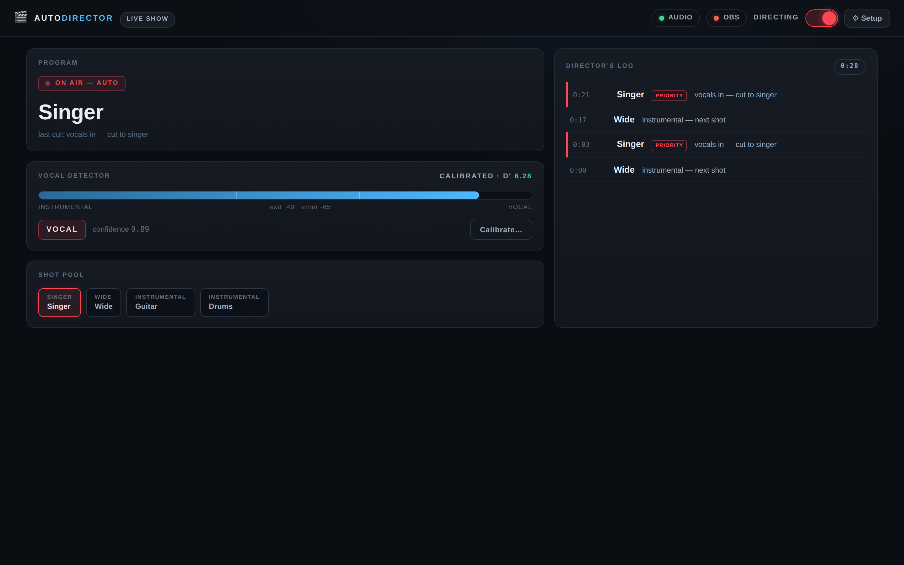
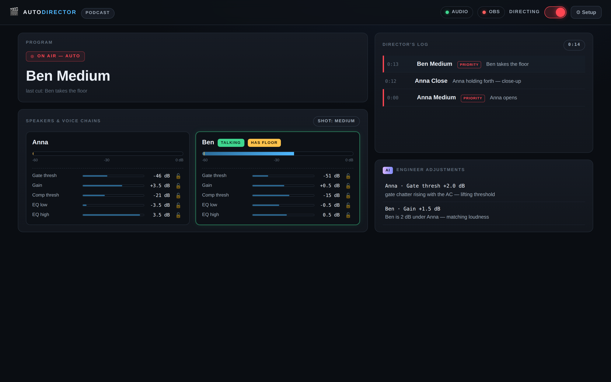

# AutoDirector 🎬

An automatic scene director for OBS Studio on macOS. It listens to your
show and cuts between your OBS scenes the way a human director would —
plus, in podcast mode, it rides your voice processing like a broadcast
engineer.

**v2 is a standalone app with a Control Room.** It captures audio itself
(real DSP on raw samples — not level meters), makes its decisions
locally, and drives OBS over the built-in obs-websocket. One checkbox in
OBS, no virtual cables for most setups.



## The Control Room

Launch the app and the **Control Room** opens in your browser — a
broadcast console for the director:

- **Program card** — what's on air right now, and why the director cut
  to it. Big DIRECTING switch (or press <kbd>D</kbd>) to grab manual
  control instantly; the badge flips to *PAUSED — MANUAL CONTROL*.
- **Vocal detector** (live) — the confidence gauge with the actual
  enter/exit thresholds marked, current VOCAL/INSTRUMENTAL state, and
  your calibration quality (d′) always visible.
- **Shot pool** (live) — your scenes at a glance, live one highlighted.
- **Speakers & voice chains** (podcast) — per-speaker VU meters with the
  measured room-noise floor marked, TALKING / HAS FLOOR tags, and every
  adaptive chain parameter as a live readout with a 🔒 freeze lock.
- **Director's log** — every cut with its timestamp, reasoning, and
  PRIORITY flag. If you don't like a decision, the log tells you which
  knob explains it.
- **AI engineer feed** — each adjustment Claude made, in dB, with its
  reason. Freeze any parameter to veto the machines.
- **Setup drawer** — guided configuration with a *Test connection*
  button that pulls your scene list straight out of OBS, device
  dropdowns, and per-speaker cards. Saving applies live.
- **Calibration modal** (live) — the 20-second teach-in, with countdowns
  and an honest verdict.



> The v1 OBS-script plugin lives frozen in `legacy/` and is deprecated:
> OBS scripts cannot access raw audio, which v2's features require.
> See `docs/ARCHITECTURE.md` for the full story.

## What it does

### 🎤 Live show mode — one mixed feed in, professional cutting out

Feed it the same mixed audio your show uses (your interface or mixer —
it opens the device *alongside* OBS; macOS allows shared access).

- **Learns your mix in 20 seconds.** A calibration wizard listens to ~10 s
  of the band without vocals and ~10 s with the singer, then builds a
  detector for *your* material. It reports its confidence (d′) honestly
  and automatically directs more conservatively when the mix is hard.
- **Vocals in → the singer scene.** Detection combines pitch salience,
  vibrato, syllabic modulation and more — real singing, not just "loud".
- **Main singer policy:** vocals mean the *main singer scene*, always.
  Backing vocals never drag the camera away. (Optionally enroll the main
  singer's pitch range for extra bias; it only nudges confidence, never
  vetoes.)
- **Instrumental sections** rotate your shots (wide first — the pull-out
  after a phrase reads best) with humanized, jittered timing.
- **Entrance anticipation:** when vocal evidence starts building, the
  rotation holds rather than burning a cut a beat before the singer
  comes in.

### 🎙 Podcast mode — per-speaker mics, shots *and* sound

Each speaker's mic is its own device/channel (keep mic sources
always-active in OBS so both voices are always in the broadcast mix —
scenes change the picture, not the audio).

- **Floor-holding direction:** follows the active speaker; holds through
  natural pauses; "mm-hm" never steals the shot; sustained interruptions
  do. Medium → close-up when someone holds forth (cutting on a natural
  micro-pause when possible), back out for variety, wide two-shot during
  rapid exchanges, and it parks on the wide during dead air.
- **Adaptive voice chain** per speaker, built from native OBS filters via
  obs-websocket: noise suppression → expander → *your VSTs (untouched)* →
  gain → compressor → 3-band EQ → limiter. The gate follows your room's
  noise floor (and only moves while you're silent), gain matches both
  speakers' loudness, EQ makes slow tilt corrections toward a natural
  voice curve. Every parameter is clamped and slew-limited — worst case
  is "slightly suboptimal", never an audible pump.
- **AI engineer review (optional):** every few minutes, Claude reviews
  the measured state (levels, tilt, gate chatter, clipping, noise labels)
  and returns bounded adjustments with reasons — applied through the same
  safety rails, logged to an audit file, and freezable per parameter.
  Requires an Anthropic API key; without one the local loops run alone.
- **Local audio classifier (optional):** a small on-device model (YAMNet
  ONNX, ~4 MB) identifies background noise by name (fan, hum, traffic…)
  and reinforces singing/speech detection. `scripts/fetch_models.sh`.

### 🧘 Relaxed switching (both modes)

Every decision passes through an evidence-based switcher: confidences are
smoothed, challengers need sustained proof plus a dwell time, every cut
has a cooldown, returning to a shot you just left costs extra evidence,
and a hard rate cap stops the director from ever chasing a chaotic feed.
Low-confidence cuts automatically extend the minimum shot length. The
result: fewer, more committed cuts — it decides where the action is,
then commits.

### 🛟 Fail-safe, always

If audio stalls, a device unplugs, or OBS disconnects: **AutoDirector
does nothing.** Cuts freeze, OBS is untouched, your show continues under
manual control, and it reconnects with backoff. Manual cuts you make are
respected — the director backs off for several seconds instead of
fighting you.

---

## Install

**Easiest — the .pkg installer** (build once on any Mac):

```bash
./scripts/build_pkg.sh          # → dist/AutoDirector.pkg
```

Double-click `AutoDirector.pkg` → it installs **AutoDirector.app** into
/Applications. Launch it; the Control Room opens in your browser and
walks you through setup. (Unsigned builds: right-click → Open the first
time, or set `APP_SIGN_ID` / `PKG_SIGN_ID` / `NOTARY_PROFILE` env vars
before building to sign and notarize.)

**Or as a Python package:**

```bash
pip3 install ./obs-auto-director
pip3 install 'obs-auto-director[classify]'   # + local audio classifier
autodirector app                             # engine + Control Room
```

**OBS side (once):** OBS → Tools → WebSocket Server Settings → Enable,
then paste the password in the Control Room's Setup drawer (use *Test
connection* — it should report your scene count).

## Quick start (CLI alternative)

```bash
autodirector app                          # Control Room + engine (default)
autodirector devices                      # list input device names
autodirector run --config myshow.json     # headless with explicit config
autodirector run --config myshow.json --dry-run  # print cuts, don't touch OBS
autodirector calibrate --config myshow.json      # terminal calibration wizard
```

`python3 demo.py mix` directs a synthetic song through the real pipeline
with no OBS or audio hardware — watch how it thinks before you wire
anything up.

## Audio routing on macOS

| Your setup | Do this |
|---|---|
| Band/mixer feed on an audio interface | Point `live.device` at the same interface OBS uses — CoreAudio shares input devices. Nothing to install. |
| Mix exists only inside OBS | OBS → Settings → Audio → Monitoring Device → **BlackHole 2ch** (free, notarized), monitor the relevant sources, set `live.device` to BlackHole. |
| Podcast, one USB mic per speaker | One `speakers[]` entry per device. Keep both mic sources always-active in OBS. |
| Podcast, both mics on one interface | Same `device` for both speakers with different `channel` numbers. |

## Config reference (config.example.json)

- `obs`: host/port/password for obs-websocket.
- `live`: `device`, `singer_scene`, `instrumental_scenes` (wide first),
  `calibration_file`, `sensitivity_bias` (±logits), dwell overrides.
- `podcast.speakers[]`: `name`, `device`/`channel`, `obs_source` (the OBS
  audio source the voice chain manages), `medium_scene`, `closeup_scene`.
- `podcast.voice_chain`: `enabled`, `target_speech_db`.
- `podcast.ai_review`: `enabled`, `api_key_env` (default
  `ANTHROPIC_API_KEY`), `model`, `interval_s`, `audit_log`.
- `classifier`: paths to the optional ONNX model + class map.

## Development

```bash
pip3 install numpy websockets pytest
python3 -m pytest tests/          # 96 tests: core, switcher, DSP on
                                  # synthetic audio, chain rails, AI loop,
                                  # obsws against a fake server, engines
                                  # end-to-end, 30-40 min soak shows
```

Layout: `autodirector/core` (directors, pacing, switcher — pure logic),
`dsp` (STFT front-end, vocal-in-mix, calibration), `chain` (rails,
measurement, fast loop, AI review), `classify` (optional tagger),
`io` (capture, obs-websocket), `app.py` (engines + CLI).

Design docs: `docs/ARCHITECTURE.md` (decision + reconciliation),
`docs/TEAM_REVIEW_SYNTHESIS.md` (the engineering review behind v2).

## Honest limitations

- One-channel vocal detection confirms an entrance in ~0.8–1.2 s (the
  price of hearing vocals *inside* a mix). It reads as deliberate, not
  late — and the entrance-anticipation hold prevents wasted cuts.
- Sections where *only* backing vocals sing will keep the singer scene —
  by design (v3 may add an optional separation model).
- Screamed vocals and vocal-range instrument solos are genuinely hard;
  calibration reports a low d′ and the director compensates by being
  more deliberate.
- AI review reads *measurements* (what an engineer reads off meters),
  not raw audio; the local classifier supplies the "what am I hearing"
  labels.

## License

MIT
