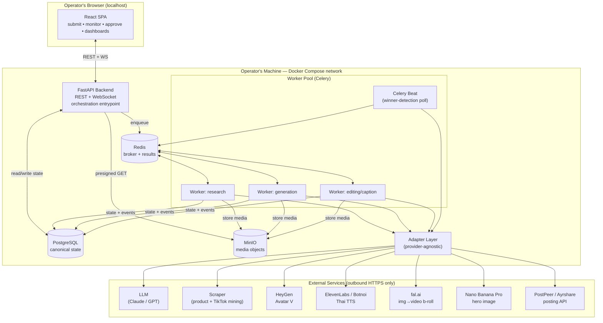
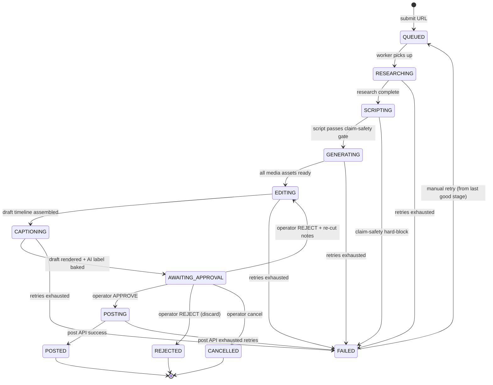
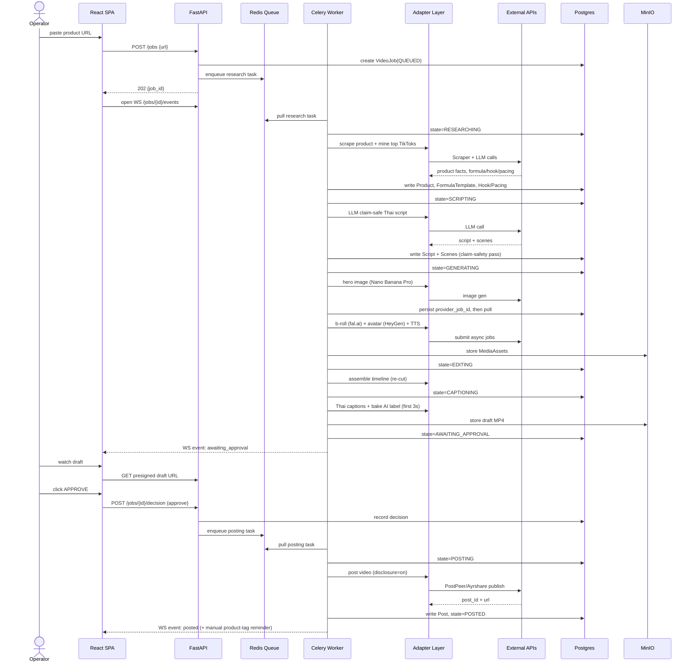

# 1. System Overview & Architecture

> **Project:** AutoUGC-TH — a locally-run, single-operator web app that turns one product URL into a post-ready, TikTok-Shop-compliant short vertical video for the Thai market.
> **This section is the architectural spine of the build spec.** The data model (§1.5) and adapter interfaces (§1.6) defined here are **canonical**: other sections reference these entity names, field names, and method signatures verbatim.

---

## 1.1 Executive Summary

AutoUGC-TH is a **local-first automation pipeline**. It runs entirely on the operator's own machine via Docker Compose, is accessed through a browser at `http://localhost`, and serves exactly one user: the operator. There is no multi-tenancy, no public exposure, and no cloud hosting of the app itself (only outbound calls to third-party AI/posting APIs).

Its job: given a **single product URL**, autonomously execute a 9-stage pipeline — product research → market/top-video mining → claim-safe Thai scripting → AI generation (reusable avatar talking-head + AI product b-roll) → creative re-cut → Thai captioning → **human approval** → auto-post → winner-detection feedback — and deliver a finished, TikTok-Shop-compliant vertical video at a target cost of **~$3 per finished video**.

### The Single-Approval UX Principle

The system is **fully automated except for exactly one human decision gate**. Everything upstream of the gate (research through captioning) runs unattended as background jobs. Everything downstream (posting, performance tracking) also runs unattended. The operator's *entire* required interaction with a given video is:

1. Receive a notification that a job reached `AWAITING_APPROVAL`.
2. Watch the rendered draft in the review UI.
3. Click **Approve** (proceed to post) or **Reject** (with optional re-cut instructions → re-enters `EDITING`).

This principle drives three architectural constraints:

- **The gate is a durable pause, not a blocking call.** A job can sit in `AWAITING_APPROVAL` for hours or days without holding a worker, a DB transaction, or an HTTP connection open. State lives in Postgres; workers are free.
- **Everything before the gate must be reproducible and inspectable**, because the human is judging the *output* of automated stages and may need to understand *why* a stage produced what it did (surfaced via the per-job event log).
- **One product-tagging caveat:** TikTok Shop product-tag attachment is **not** API-automatable. After auto-posting, the app surfaces a checklist step instructing the operator to attach the product tag manually in the TikTok app. This is a second, lightweight manual touch — but it is a *post-publish housekeeping task*, not a creative approval gate, and does not block the pipeline's completion state.

---

## 1.2 High-Level Architecture

### Components

| Component | Responsibility | Technology |
|---|---|---|
| **Frontend SPA** | Operator UI: submit URL, monitor jobs, review/approve drafts, view cost & performance dashboards | React + Vite + TypeScript |
| **FastAPI backend (API gateway)** | REST/WebSocket API, job orchestration entrypoint, auth (single-user), request validation, serves job state | Python 3.12 + FastAPI + Pydantic v2 |
| **Worker pool** | Executes long-running pipeline stages (research, generation, editing) as async tasks | Celery workers (Python) |
| **Job queue / broker + result backend** | Durable task queue, scheduling, retries | Redis |
| **Relational DB** | Canonical state: jobs, scripts, assets, posts, cost ledger, compliance records | PostgreSQL 16 |
| **Object / media storage** | Rendered videos, avatar frames, b-roll clips, hero images, captions | MinIO (S3-compatible), filesystem-backed volume |
| **External-service adapter layer** | Provider-agnostic wrappers for every third-party AI/posting API; the ONLY place vendor SDKs are imported | Python package `adapters/` inside backend |
| **Beat scheduler** | Cron-style trigger for the winner-detection feedback loop (poll post performance) | Celery Beat |

### Architecture Diagram



**Data-flow notes:**
- The SPA never talks to Redis, workers, or external services directly. The FastAPI backend is the single API surface; the adapter layer is the single external-egress surface.
- Workers write **all** durable state to Postgres and **all** media to MinIO. Redis holds only transient task/queue state and is treated as disposable.
- Real-time job progress reaches the SPA via a **WebSocket** channel from the backend, which fans out state changes it observes in Postgres (workers publish progress events; the backend relays them).

---

## 1.3 Recommended Tech Stack & Key Decisions

| Layer | Choice | Justification |
|---|---|---|
| Frontend framework | **React + Vite + TypeScript** | SPA is a local dashboard, not an SEO/SSR site. Vite gives fast HMR and a tiny, dependency-light build. Next.js's SSR/routing/server-component machinery is unneeded complexity for a single-user localhost tool. |
| UI components | **Tailwind CSS + shadcn/ui** | Fast to build a clean review/approval UI and dashboards; no design system to maintain. |
| Video review | Native `<video>` + HLS.js only if needed | Drafts are short MP4s served from MinIO via presigned URL; no adaptive streaming required. |
| Backend | **Python 3.12 + FastAPI + Pydantic v2** | Async-native, first-class typing, auto-generated OpenAPI for the SPA client, and Python is where every AI SDK lives. |
| ORM / migrations | **SQLAlchemy 2.x + Alembic** | Mature, typed, explicit migrations — essential because the ER model here is canonical and will evolve. |
| Job queue | **Celery + Redis** (see decision below) | |
| Database | **PostgreSQL 16** (see decision below) | |
| Object storage | **MinIO** (S3-compatible) | Lets us code against the S3 API from day one (boto3), so a future move to real S3 is a config change. Backed by a Docker volume for durable local persistence. |
| Config/secrets | **pydantic-settings + `.env`** | Single typed settings object; secrets never hard-coded (see §1.7). |
| Logging | **structlog** (JSON) | Structured, correlation-ID-aware logs for job observability (§1.8). |
| Containerization | **Docker Compose** | Locked decision. One `docker compose up` brings up the entire stack. |

### Decision A — SQLite vs PostgreSQL → **PostgreSQL**

The shared context permits SQLite for a pure-local single-user app. We **reject SQLite** and mandate Postgres:

- **Concurrent writers.** Multiple Celery workers write job state, media rows, and cost-ledger entries simultaneously. SQLite serializes writes with a single database-level lock and is prone to `database is locked` errors under concurrent worker load. Postgres handles concurrent writers natively.
- **Rich types & constraints.** The pipeline benefits from `JSONB` (research payloads, formula/hook/pacing structures, provider responses), native `ENUM`/`CHECK` for job states, arrays, and partial indexes — all first-class in Postgres, awkward or absent in SQLite.
- **Cost is zero here.** Postgres is one more Compose service on the operator's own machine. The single "advantage" of SQLite (no server process) is irrelevant when we are already running Compose.
- **Trade-off acknowledged:** Postgres adds ~1 container and a few hundred MB RAM. For a machine already running Redis + MinIO + worker containers doing GPU-adjacent AI orchestration, this is negligible. The reliability win under concurrency is decisive.

### Decision B — Celery+Redis vs Temporal → **Celery + Redis**

The shared context permits either Celery+Redis or Temporal. We **recommend Celery + Redis** for v1:

- **Operational simplicity for a local, single-user app.** Celery needs only a Redis container the stack already benefits from for caching/pub-sub. Temporal requires its own server + its own Postgres/Cassandra persistence + a UI service — a heavy footprint for a machine also running AI generation.
- **Our durability need is met by Postgres, not the queue.** The pipeline's true source of truth is the `VideoJob` state machine persisted in Postgres. We do **not** rely on the broker to remember where a job was. If Redis is wiped, an in-flight task is lost — but its `VideoJob` row still knows its last committed state, and a resume/retry can be triggered. This design (queue = disposable, DB = canonical) removes most of Temporal's value proposition (durable execution history) for our case.
- **Idempotency handles the hard part.** The genuinely hard problem — long-running external jobs (a 6-minute video render) crashing mid-flight — is solved with **idempotency keys + provider-job polling** (see §1.4), not with a workflow engine. We persist the external provider's job ID before waiting on it, so a worker restart re-attaches to the same remote job rather than paying to regenerate.
- **When to revisit:** if the pipeline grows to many interdependent long-lived workflows with complex compensation/saga logic, Temporal becomes justified. For a linear 9-stage pipeline with one human gate, it is over-engineering. **This is a documented, revisitable decision, not a permanent one.**

---

## 1.4 The Pipeline as a State Machine

Every `VideoJob` moves through an explicit finite set of states. State is the **canonical source of truth in Postgres**; the queue only *drives* transitions.

### Job States

| State | Meaning | Worker active? |
|---|---|---|
| `QUEUED` | Accepted, awaiting a worker | No |
| `RESEARCHING` | Stage 1+2: product research from URL + top-video mining & formula/hook/pacing extraction | Yes |
| `SCRIPTING` | Stage 3: claim-safe Thai script + scene breakdown generated & passed through claim-safety gate | Yes |
| `GENERATING` | Stage 4: hero image → b-roll (fal.ai) + avatar talking-head (HeyGen) + Thai TTS (ElevenLabs/Botnoi) | Yes (long) |
| `EDITING` | Stage 5: creative re-cut / assembly of avatar + b-roll into a draft timeline | Yes |
| `CAPTIONING` | Stage 6: burn Thai captions + bake "AI-generated" label into first 3s | Yes |
| `AWAITING_APPROVAL` | Stage 7: **the single human gate.** Draft rendered; job paused indefinitely | **No — durable pause** |
| `POSTING` | Stage 8: auto-post via posting API (sets disclosure toggle, uploads video) | Yes |
| `POSTED` | Published successfully; awaiting manual product-tag + performance tracking | No |
| `FAILED` | A stage exhausted retries or hit a hard error; terminal until manually retried | No |
| `REJECTED` | Operator rejected at the gate without re-cut instructions; terminal | No |
| `CANCELLED` | Operator cancelled the job before completion; terminal | No |

### Transitions & the Approval Gate



**The gate is the only inbound-human transition.** `AWAITING_APPROVAL` holds no worker and no open connection. The transition out of it is triggered by an operator REST action (`POST /jobs/{id}/decision`), which enqueues the next task. A `REJECT + re-cut notes` decision loops back to `EDITING` (cheap — no regeneration), preserving the expensive generation outputs.

### Retry & Idempotency Rules for Long-Running External Jobs

The `GENERATING` stage is the expensive, failure-prone one (each render can be minutes long and costs real money). Rules:

1. **Idempotency key per external call.** Every adapter call carries a deterministic `idempotency_key = f"{job_id}:{stage}:{asset_role}:{attempt_input_hash}"`. The adapter passes it to providers that support idempotency; for those that don't, we use it to dedupe locally.
2. **Persist the provider job ID *before* waiting.** For async providers (HeyGen, fal.ai), the adapter's `submit()` returns a `provider_job_id` which is written to the `MediaAsset` row **and committed** before any polling begins. If the worker crashes, the retry sees an existing `provider_job_id` and **re-attaches via `poll()`** instead of resubmitting — this prevents double-billing.
3. **Poll, don't block.** Long external jobs are polled with exponential backoff via a Celery task that re-enqueues itself (`self.retry(countdown=...)`) until the provider job completes, fails, or hits a max-wait ceiling. No worker sits blocked on a socket.
4. **Stage-level retry budget.** Each stage has a bounded automatic retry count (default 3) with exponential backoff; on exhaustion the job → `FAILED` with the failing stage recorded. A manual retry re-enters `QUEUED` and **resumes from the last successfully completed stage**, reusing already-generated `MediaAsset`s (checked by presence of a completed asset with the matching `idempotency_key`).
5. **Idempotent stage functions.** Every stage checks "is my output already present and valid?" before doing work, so a re-run is safe and cheap. Media already produced is never regenerated.
6. **Cost guard is transactional with generation.** Before each billable adapter call, the worker checks the job's running cost against the per-video budget (§1.8); if the next call would breach it, the job → `FAILED` with reason `budget_exceeded` rather than overspending.

### End-to-End Sequence (URL → Posted)



---

## 1.5 Data Model (CANONICAL)

This ER model is the **single source of truth** for entity and field names across the entire spec. Types are given in Postgres terms. All tables have `id UUID PK DEFAULT gen_random_uuid()`, `created_at`, `updated_at TIMESTAMPTZ`.

```mermaid
erDiagram
    PRODUCT ||--o{ VIDEO_JOB : "sourced by"
    VIDEO_JOB ||--|| SCRIPT : "has"
    SCRIPT ||--o{ SCENE : "contains"
    VIDEO_JOB ||--o{ MEDIA_ASSET : "produces"
    VIDEO_JOB }o--|| AVATAR : "uses"
    VIDEO_JOB }o--|| VOICE_PROFILE : "uses"
    VIDEO_JOB }o--o| FORMULA_TEMPLATE : "applies"
    VIDEO_JOB }o--o| HOOK_TEMPLATE : "applies"
    VIDEO_JOB }o--o| PACING_TEMPLATE : "applies"
    VIDEO_JOB ||--o| POST : "results in"
    POST ||--o{ PERFORMANCE_RECORD : "tracked by"
    VIDEO_JOB ||--o{ COMPLIANCE_RECORD : "audited by"
    AVATAR ||--o{ CONSENT_RECORD : "governed by"
    VIDEO_JOB ||--o{ COST_LEDGER : "billed to"

    PRODUCT {
        uuid id PK
        text source_url
        text title
        text brand
        numeric price
        text currency
        jsonb attributes "specs, features, images[]"
        jsonb raw_scrape "provider payload"
        text scraper_provider
        timestamptz scraped_at
    }

    VIDEO_JOB {
        uuid id PK
        uuid product_id FK
        uuid avatar_id FK
        uuid voice_profile_id FK
        uuid formula_template_id FK "nullable"
        uuid hook_template_id FK "nullable"
        uuid pacing_template_id FK "nullable"
        job_state state "ENUM"
        text last_completed_stage
        int retry_count
        numeric cost_budget_usd "default 5.00"
        numeric cost_accrued_usd
        text draft_asset_key "MinIO key"
        jsonb decision "approve/reject + notes"
        text failure_reason
        timestamptz approved_at
    }

    SCRIPT {
        uuid id PK
        uuid video_job_id FK
        text language "th"
        text full_text
        jsonb hook "opening line + type"
        boolean claim_safety_passed
        jsonb claim_safety_report "flagged phrases"
        text llm_provider
        text llm_model
    }

    SCENE {
        uuid id PK
        uuid script_id FK
        int sequence_no
        text scene_type "avatar | broll"
        text spoken_text_th
        text visual_direction
        numeric duration_sec
        uuid media_asset_id FK "nullable"
    }

    MEDIA_ASSET {
        uuid id PK
        uuid video_job_id FK
        text role "hero_image | broll | avatar_clip | tts_audio | draft | final"
        text storage_key "MinIO object key"
        text mime_type
        text provider
        text provider_job_id "for re-attach"
        text idempotency_key
        text status "pending|processing|ready|failed"
        numeric duration_sec
        jsonb meta "resolution, seed, prompt"
        numeric cost_usd
    }

    AVATAR {
        uuid id PK
        text label "operator twin"
        text provider "heygen"
        text provider_avatar_id "reused forever"
        text status "active|retired"
    }

    VOICE_PROFILE {
        uuid id PK
        text label
        text provider "elevenlabs|botnoi"
        text provider_voice_id "reused forever"
        text language "th"
        text model "multilingual_v2"
    }

    FORMULA_TEMPLATE {
        uuid id PK
        text name
        jsonb structure "beat-by-beat formula"
        text source "mined tiktok id/url"
        numeric win_score "from feedback loop"
    }

    HOOK_TEMPLATE {
        uuid id PK
        text name
        text pattern_th
        text hook_type
        numeric win_score
    }

    PACING_TEMPLATE {
        uuid id PK
        text name
        jsonb cut_profile "cuts/sec, scene lengths"
        numeric avg_scene_sec
        numeric win_score
    }

    POST {
        uuid id PK
        uuid video_job_id FK
        text platform "tiktok"
        text posting_provider "postpeer|ayrshare"
        text external_post_id
        text post_url
        boolean ai_disclosure_set
        boolean product_tag_attached "manual step"
        text status "published|failed"
        timestamptz posted_at
    }

    PERFORMANCE_RECORD {
        uuid id PK
        uuid post_id FK
        timestamptz captured_at
        bigint views
        bigint likes
        bigint comments
        bigint shares
        numeric ctr
        numeric conversion "if available"
        boolean is_winner "feedback flag"
    }

    COMPLIANCE_RECORD {
        uuid id PK
        uuid video_job_id FK
        text check_type "ai_label|disclosure|claim_safety"
        boolean passed
        jsonb detail
        timestamptz checked_at
    }

    CONSENT_RECORD {
        uuid id PK
        uuid avatar_id FK
        text consenter_name
        text consent_type "avatar_likeness|voice_clone"
        text document_key "signed doc in MinIO"
        timestamptz consented_at
    }

    COST_LEDGER {
        uuid id PK
        uuid video_job_id FK
        text stage
        text provider
        text line_item
        numeric amount_usd
        jsonb usage "tokens, seconds, credits"
        timestamptz incurred_at
    }
```



**Notes on canonical fields:**
- `VIDEO_JOB.state` is a Postgres `ENUM` matching §1.4 exactly.
- `MEDIA_ASSET.provider_job_id` + `idempotency_key` are the backbone of the idempotency/re-attach rules (§1.4).
- `AVATAR.provider_avatar_id` and `VOICE_PROFILE.provider_voice_id` are stored **once** and reused for every job (locked decision).
- `COMPLIANCE_RECORD` and `CONSENT_RECORD` together satisfy the audit-log + avatar-consent requirements.
- `COST_LEDGER` is append-only; `VIDEO_JOB.cost_accrued_usd` is a denormalized running sum maintained transactionally with each ledger insert.

---

## 1.6 External Service Adapter Interfaces (Provider-Agnostic)

Model prices and availability shift constantly, so **every external provider sits behind an abstract interface** in the `adapters/` package. Business logic (workers/stages) depends only on these interfaces; concrete implementations (`HeyGenAvatarProvider`, `FalVideoGenProvider`, etc.) are selected via config. This is the only layer allowed to import vendor SDKs.

Common patterns:
- Async submit/poll for long jobs; every method takes an `idempotency_key`.
- Every method returns a `ProviderResult` carrying `cost_usd` + `usage` so the cost ledger is populated uniformly.

```python
# adapters/base.py
from typing import Protocol, Any
from dataclasses import dataclass

@dataclass
class ProviderResult:
    ok: bool
    data: dict[str, Any]
    cost_usd: float
    usage: dict[str, Any]           # tokens / seconds / credits
    provider_job_id: str | None = None   # set for async jobs
    error: str | None = None


class LLMProvider(Protocol):
    def complete(self, *, prompt: str, system: str | None,
                 model: str, max_tokens: int,
                 idempotency_key: str) -> ProviderResult: ...
    # used for research synthesis, formula/hook extraction, Thai scripting,
    # and the claim-safety gate.


class ScraperProvider(Protocol):
    def scrape_product(self, *, url: str,
                       idempotency_key: str) -> ProviderResult: ...
    def mine_top_videos(self, *, query: str, market: str, limit: int,
                        idempotency_key: str) -> ProviderResult: ...


class TTSProvider(Protocol):
    def synthesize(self, *, text: str, voice_id: str, language: str,
                   model: str, idempotency_key: str) -> ProviderResult: ...
    # returns audio object key + duration in data


class AvatarProvider(Protocol):
    def submit_talking_head(self, *, avatar_id: str, audio_key: str,
                            script_text: str, aspect: str,
                            idempotency_key: str) -> ProviderResult: ...
    def poll(self, *, provider_job_id: str) -> ProviderResult: ...


class VideoGenProvider(Protocol):
    def generate_hero_image(self, *, prompt: str, refs: list[str],
                            idempotency_key: str) -> ProviderResult: ...
    def submit_image_to_video(self, *, image_key: str, prompt: str,
                              model: str, seconds: float, aspect: str,
                              idempotency_key: str) -> ProviderResult: ...
    def poll(self, *, provider_job_id: str) -> ProviderResult: ...


class PostingProvider(Protocol):
    def publish(self, *, video_key: str, caption: str, platform: str,
                ai_disclosure: bool, schedule_at: str | None,
                idempotency_key: str) -> ProviderResult: ...
    def fetch_metrics(self, *, external_post_id: str) -> ProviderResult: ...
    # fetch_metrics powers the winner-detection feedback loop.
```

**Registry / selection.** A factory reads `*_PROVIDER` env vars and returns the configured implementation:

```python
# adapters/registry.py
def get_video_gen_provider() -> VideoGenProvider:
    return {
        "fal": FalVideoGenProvider,
    }[settings.VIDEOGEN_PROVIDER]()
```

Swapping Kling → Veo → Seedance is a `model=` argument; swapping the whole vendor is one env var + one new class. No stage code changes.

---

## 1.7 Local Deployment

### Docker Compose Service Layout

```yaml
# docker-compose.yml (abridged — canonical service names)
services:
  frontend:      # React build served by nginx (or vite preview)
    ports: ["3000:80"]
    depends_on: [backend]

  backend:       # FastAPI (uvicorn)
    ports: ["8000:8000"]
    env_file: [.env]
    depends_on: [db, redis, minio]
    volumes: ["./backend:/app"]

  worker:        # Celery worker pool (scale with --scale worker=N)
    command: celery -A app.worker worker -Q default,generation -c 4
    env_file: [.env]
    depends_on: [db, redis, minio]

  beat:          # Celery Beat — winner-detection polling
    command: celery -A app.worker beat
    env_file: [.env]
    depends_on: [redis]

  db:            # PostgreSQL 16
    image: postgres:16
    environment: [POSTGRES_DB, POSTGRES_USER, POSTGRES_PASSWORD]
    volumes: ["pgdata:/var/lib/postgresql/data"]
    ports: ["5432:5432"]

  redis:         # broker + result backend
    image: redis:7
    volumes: ["redisdata:/data"]

  minio:         # S3-compatible media storage
    image: minio/minio
    command: server /data --console-address ":9001"
    environment: [MINIO_ROOT_USER, MINIO_ROOT_PASSWORD]
    volumes: ["mediadata:/data"]
    ports: ["9000:9000", "9001:9001"]

volumes:
  pgdata:      # DB persistence
  mediadata:   # media persistence
  redisdata:   # queue durability (best-effort)
```

### Ports

| Service | Port | Purpose |
|---|---|---|
| frontend | `3000` | Operator UI (browser entrypoint) |
| backend | `8000` | REST + WebSocket + OpenAPI docs at `/docs` |
| db (Postgres) | `5432` | (local debugging only) |
| minio API | `9000` | S3 API for media |
| minio console | `9001` | Bucket inspection UI |

### `.env` Config & Secrets Management

**All secrets live in a git-ignored `.env`** (a committed `.env.example` documents every key). The backend loads them into a single typed `Settings` object via `pydantic-settings`; **no key is ever hard-coded**, and adapters read keys only from `settings`.

```dotenv
# .env.example
# --- Core ---
POSTGRES_DB=autougc
POSTGRES_USER=autougc
POSTGRES_PASSWORD=change-me
DATABASE_URL=postgresql+psycopg://autougc:change-me@db:5432/autougc
REDIS_URL=redis://redis:6379/0
MINIO_ROOT_USER=minio
MINIO_ROOT_PASSWORD=change-me
MINIO_ENDPOINT=http://minio:9000
MEDIA_BUCKET=autougc-media

# --- Provider selection (swap without code changes) ---
LLM_PROVIDER=anthropic
SCRAPER_PROVIDER=apify
AVATAR_PROVIDER=heygen
TTS_PROVIDER=elevenlabs
VIDEOGEN_PROVIDER=fal
POSTING_PROVIDER=postpeer

# --- External API keys (secrets) ---
ANTHROPIC_API_KEY=
SCRAPER_API_KEY=
HEYGEN_API_KEY=
ELEVENLABS_API_KEY=
FAL_API_KEY=
NANOBANANA_API_KEY=
POSTPEER_API_KEY=

# --- Reused-forever identities ---
HEYGEN_AVATAR_ID=
ELEVENLABS_VOICE_ID=

# --- Guards ---
PER_VIDEO_BUDGET_USD=5.00
```

Secrets never enter Postgres, logs (structlog redacts known key patterns), or the frontend bundle. The frontend receives only presigned URLs and public config.

### Starting It & First-Run Bootstrap

```bash
cp .env.example .env        # then fill in API keys + avatar/voice IDs
docker compose up -d        # start the whole stack
```

An idempotent **bootstrap** runs on backend startup (or via `docker compose run backend python -m app.bootstrap`):

1. `alembic upgrade head` — apply DB migrations.
2. Ensure the MinIO `MEDIA_BUCKET` exists (create if missing).
3. Seed the singleton `AVATAR` + `VOICE_PROFILE` rows from `HEYGEN_AVATAR_ID` / `ELEVENLABS_VOICE_ID` if not already present.
4. Prompt (one-time, in UI) to upload the signed **consent document** → `CONSENT_RECORD`, blocking generation until present.
5. Health-check every configured provider (cheap ping) and report readiness on a `/health` dashboard.

Operator then opens `http://localhost:3000` and pastes a product URL.

---

## 1.8 Cross-Cutting Concerns

### Per-Job Cost Ledger & Budget Guard
- Every billable adapter call returns `cost_usd` in its `ProviderResult`. The worker writes a `COST_LEDGER` row (stage, provider, line item, amount, usage) **in the same transaction** that increments `VIDEO_JOB.cost_accrued_usd`.
- **Budget guard:** before each billable call, the worker checks `cost_accrued_usd + estimated_next_cost ≤ cost_budget_usd` (default `$5.00`, target spend ~$3). A projected breach transitions the job → `FAILED` with `failure_reason=budget_exceeded` rather than overspending. The dashboard shows live per-job and aggregate spend.

### Structured Logging
- **structlog** emits JSON logs, every line tagged with `job_id`, `stage`, `provider`, and a request/trace `correlation_id`. Secrets are redacted by a processor. Logs go to stdout (captured by `docker compose logs`).

### Job Observability
- A durable **job event log** (append-only, one row per state change / significant sub-step) backs the SPA's real-time timeline via WebSocket, so the operator can see *exactly* which stage a job is in and why it stalled or failed.
- Celery task metadata (attempt count, next retry time) is surfaced per job. `/health` shows queue depth and worker liveness.

### Secret Handling
- Secrets only in `.env` → typed `Settings`; never in DB, logs, frontend, or committed files. `.env` is git-ignored; `.env.example` is the documented contract.

---

## 1.9 Non-Functional Requirements & Acceptance Criteria

| # | Requirement | Acceptance Criteria |
|---|---|---|
| NFR-1 | **Local-only, single-user** | Entire stack runs via `docker compose up` on one machine; no component requires external hosting of the app. Accessed at `localhost`. |
| NFR-2 | **Single approval gate** | A job pauses at `AWAITING_APPROVAL` holding no worker/connection; can resume correctly after ≥24h idle and after a full stack restart. |
| NFR-3 | **Durable state** | Killing all workers + Redis mid-pipeline loses no committed progress; a manual retry resumes from `last_completed_stage` without regenerating completed media. |
| NFR-4 | **Idempotent external calls** | A worker crash during `GENERATING` re-attaches to the existing `provider_job_id` and does **not** double-bill; verified by ledger showing one charge per asset. |
| NFR-5 | **Cost target & guard** | Median finished-video cost ≤ ~$3; no job ever exceeds its `cost_budget_usd`; breach → `FAILED(budget_exceeded)`. |
| NFR-6 | **Provider swappability** | Changing any `*_PROVIDER` env var (e.g. fal → alternate) requires zero changes to stage/worker code; interface contract (§1.6) holds. |
| NFR-7 | **Compliance baked in** | Every `POSTED` video has the "AI-generated" label in its first 3s, `ai_disclosure_set=true`, a passing claim-safety `COMPLIANCE_RECORD`, and a linked `CONSENT_RECORD` for the avatar. |
| NFR-8 | **Observability** | Any job's current state, full event timeline, and accrued cost are visible in the UI within 2s of a change; failures show the failing stage + reason. |
| NFR-9 | **Persistence across restarts** | `docker compose down && up` preserves DB (`pgdata`), media (`mediadata`), avatar/voice identities, and all historical jobs/posts/performance. |
| NFR-10 | **Performance** | A typical end-to-end run (URL → `AWAITING_APPROVAL`) completes unattended, bounded by external provider latency; the app adds no blocking waits (all long jobs polled, never held open). |
