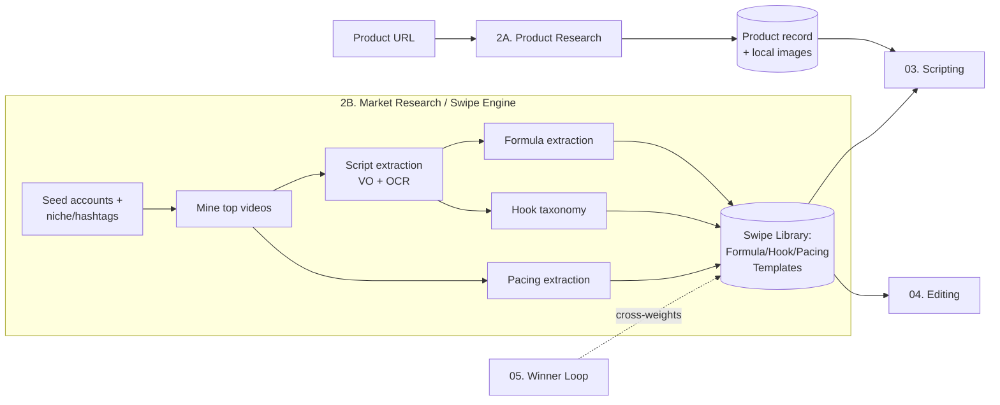
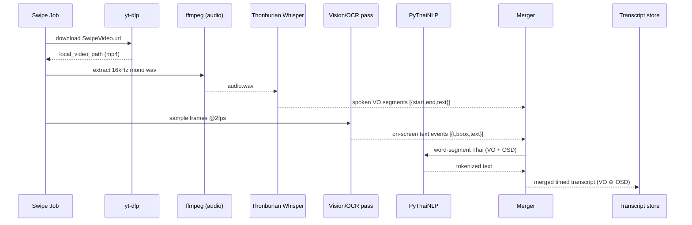
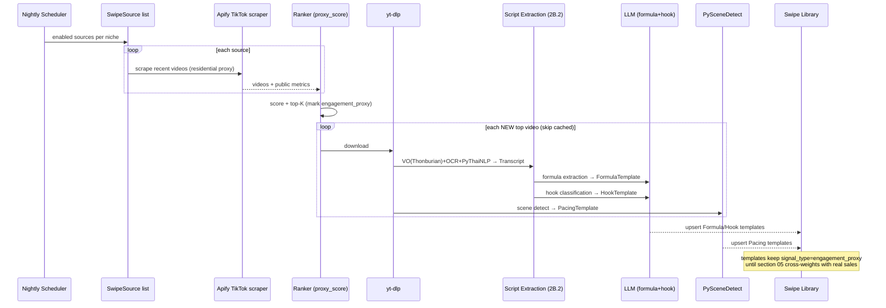

# 2. Research Modules — Product Research + Market/Competitor Mining

> **Section owner:** Intelligence layer. This section defines how AutoUGC-TH turns (a) a single product URL into a normalized `Product` record, and (b) a niche/seed-account list into a reusable "swipe library" of `FormulaTemplate`, `HookTemplate`, and `PacingTemplate` records that downstream sections (03 scripting, 04 editing, 05 winner-loop) consume.
>
> **Entities referenced** (canonical definitions in section 01): `Product`, `VideoJob`, `FormulaTemplate`, `HookTemplate`, `PacingTemplate`, plus two entities introduced here and ratified in 01: `SwipeVideo`, `SwipeSource`.
>
> **Runtime:** all services run under Docker Compose on `localhost`. Python 3.11 / FastAPI, async job queue (assume `arq` or Celery per section 01), Postgres, local media on a mounted `./media` volume. Cost target ≈ $3/video — every external API call in this section is metered and cached.

---

## 2.0 Module Map & Placement in the Pipeline



Product Research runs **per `VideoJob`** (synchronous-ish, blocks the job until a `Product` exists or manual upload is requested). The Swipe Engine runs **offline / scheduled** (nightly refresh) and per-niche, independent of any single job; jobs read a warm library.

---

# 2A. Product Research

Goal: given `Product.source_url`, produce a fully populated normalized `Product` with images downloaded to local storage, or degrade to a manual-upload flow. Never let a scraper failure hard-fail the job.

## 2A.1 Domain Router

A single entry point classifies the URL host and dispatches to a platform adapter, with Firecrawl generic scrape as the universal fallback.

```python
# research/product/router.py
ADAPTER_TABLE = [
    (r"(^|\.)tiktok\.com$",        "tiktok_shop"),   # incl. shop.tiktok, vt.tiktok short links
    (r"(^|\.)amazon\.",            "amazon"),        # amazon.com, .co.th, etc.
    (r"(^|\.)aliexpress\.",        "aliexpress"),
    (r"__SHOPIFY__",               "shopify"),       # detected, not host-matched (see below)
]

async def route(url: str) -> "ProductAdapter":
    host = urlparse(url).host.lower()
    if await _is_shopify(url):            # cheap probe: GET {url}.json → 200 + JSON w/ "product"
        return ShopifyAdapter(url)
    for pattern, name in ADAPTER_TABLE:
        if re.search(pattern, host):
            return ADAPTERS[name](url)
    return FirecrawlAdapter(url)          # generic fallback
```

`_is_shopify(url)`: normalize the URL to its product path, append `.json`, issue a `HEAD`/`GET`; if it returns JSON containing a top-level `product` object, treat as Shopify regardless of custom domain (most Shopify stores use custom domains, so host-matching alone misses them).

Every adapter implements the same interface (§2A.4). Any adapter that raises `AdapterError` is caught by the router, which then **retries once via `FirecrawlAdapter`** before surfacing a degraded result.

## 2A.2 Per-Platform Adapters

| Platform | Primary mechanism | Exact call | Fragility / constraints | Fallback |
|---|---|---|---|---|
| **TikTok Shop** | Apify actor (TikTok Shop / product scraper) via Apify API | `POST https://api.apify.com/v2/acts/{actorId}/run-sync-get-dataset-items?token=…` with `{ "productUrls": [url], "proxyConfiguration": {"useApifyProxy": true, "apifyProxyGroups": ["RESIDENTIAL"]} }` | **Highly fragile** — TikTok markup + anti-bot change often; actors break with no notice. **Requires residential proxies** (datacenter IPs get blocked/CAPTCHA'd). Rate-limited; runs can take 30–120s. Short `vt.tiktok.com` links must be resolved first. | Firecrawl `/scrape` on the resolved product page |
| **Amazon** | Rainforest API (`type=product`) | `GET https://api.rainforestapi.com/request?api_key=…&type=product&amazon_domain=amazon.co.th&asin={asin}` (or `&url=`) | Use Rainforest, **not Amazon PA-API**: PA-API requires an approved Associate account with qualifying sales and throttles hard/ deauthorizes low-traffic keys — unusable for ad-hoc single-product lookups. Rainforest bills per request (~$0.003–0.01) — count toward the $3 budget. | Firecrawl `/scrape` |
| **AliExpress** | Apify AliExpress actor **or** ScrapFly product API | Apify: same `run-sync-get-dataset-items` pattern. ScrapFly: `GET https://api.scrapfly.io/scrape?key=…&url={url}&asp=true&render_js=true&country=th` | JS-rendered, aggressive anti-scrape; `asp=true` (anti-scraping protection) + JS render needed. Region/currency varies by `country`. | Firecrawl `/scrape` |
| **Shopify** | Native product JSON | `GET {product_url}.json` → `{ "product": { title, body_html, variants[], images[], … } }` | No key needed, very stable. Some stores disable `.json` (429/404) → fall through. Price lives in `variants[].price` (string, in store currency; check `/meta.json` or `Shopify.currency` for code). | Firecrawl `/scrape` |
| **Generic (fallback)** | Firecrawl `/scrape` → markdown | `POST https://api.firecrawl.dev/v1/scrape` body `{ "url": url, "formats": ["markdown","json","links"], "onlyMainContent": true, "waitFor": 2500, "timeout": 30000 }` | Returns clean markdown + optionally a structured `json` extraction (pass a `jsonOptions.schema` matching our normalized schema to have Firecrawl's extractor fill fields). Best-effort; may miss price/attributes on exotic layouts. | — (terminal fallback → manual upload) |

**Firecrawl structured-extraction shortcut:** the generic adapter passes our normalized schema as `jsonOptions.schema` so Firecrawl's LLM extractor returns `{title, bullets, description, price, currency, images, attributes, category}` directly, avoiding a second LLM pass. Markdown is retained as a raw fallback for the scripting LLM.

## 2A.3 Normalized Product Schema

All adapters map into this shape (a subset of the section-01 `Product` entity; storage columns per 01).

```jsonc
{
  "title":       "string",             // required
  "bullets":     ["string"],           // marketing bullet points; [] if none
  "description": "string",             // long-form; may be markdown
  "images":      ["/media/products/{job_id}/img_00.jpg"],  // LOCAL paths after download
  "source_images": ["https://…"],      // original remote URLs (audit / re-fetch)
  "price":       12.34,                // numeric; null if unknown
  "currency":    "THB",                // ISO 4217; default THB, infer from domain/locale
  "attributes":  { "color": "…", "size": "…", "material": "…" }, // free-form k/v
  "category":    "beauty.skincare",    // dotted taxonomy (see §2A.5)
  "tier":        "mid",                // budget | mid | premium (§2A.5)
  "voice_gender":"female",             // female | male | neutral (§2A.6)
  "source_url":  "https://…",
  "source_platform": "tiktok_shop",    // which adapter produced this
  "scrape_status":   "ok",             // ok | degraded | manual
  "scraped_at":  "2026-07-29T12:00:00Z"
}
```

**Image download is mandatory and immediate.** As soon as image URLs are known, the adapter enqueues downloads to `/media/products/{job_id}/`. Rationale: source CDNs expire signed URLs, hotlink-protect, or rate-limit; the editor (04) needs stable local files. Downloader rules:

- Concurrency-limited (e.g. 4), per-host politeness, 15s timeout, retry ×2 with backoff.
- Validate content-type is an image and that bytes decode (Pillow `Image.verify()`); reject HTML error pages served as `.jpg`.
- Store original + a normalized 1080-wide copy. Record `width/height`; discard images below a minimum (e.g. < 300px on the short side — likely icons/badges).
- De-dupe by perceptual hash (`imagehash.phash`) to drop repeated hero shots.

## 2A.4 Adapter Interface

```python
# research/product/base.py
class ProductAdapter(Protocol):
    platform: str
    async def fetch(self) -> "RawProduct": ...      # raw platform payload → dict
    def normalize(self, raw: "RawProduct") -> "NormalizedProduct": ...

class AdapterError(Exception):
    """Recoverable: router should try Firecrawl fallback."""

class HardBlockError(AdapterError):
    """CAPTCHA / auth wall / geo-block — fallback unlikely to help; go manual faster."""
```

Router orchestration:

```python
async def research_product(job: VideoJob) -> Product:
    adapter = await route(job.source_url)
    try:
        norm = adapter.normalize(await adapter.fetch())
    except HardBlockError:
        norm = await try_firecrawl_or_none(job.source_url)   # one quick shot
    except AdapterError:
        norm = await try_firecrawl_or_none(job.source_url)
    if norm is None or _too_sparse(norm):        # no title OR no usable image
        return await enter_manual_upload(job)    # sets Product.scrape_status="manual"
    await download_images(norm, job.id)
    if not norm.images:                          # scraped fine but images unusable
        norm.scrape_status = "degraded"
        await request_manual_images(job)         # non-blocking: approval-gate can supply
    return await persist_product(norm, job)
```

## 2A.5 Tier & Category Detection

**Category:** classify into a fixed dotted taxonomy (`beauty.skincare`, `beauty.makeup`, `fashion.apparel`, `home.kitchen`, `electronics.accessories`, `supplements`, `mom_baby`, …). Method: cheap LLM classification over `{title, bullets, category-breadcrumb-if-any}` constrained to the enum, with a keyword-map fast-path first (avoid an LLM call when the platform already gives a clean category string). Category selects which **niche** of the swipe library to draw templates from (§2B).

**Tier** (`budget | mid | premium`): drives tone, avatar wardrobe, and pacing. Derived from price bucketed **within the detected category** (a ฿1,500 lipstick is premium; a ฿1,500 blender is budget), nudged by language cues in title/bullets (e.g. "ของแท้/พรีเมียม/luxury" → up; "ราคาส่ง/ถูก" → down). Store the numeric price percentile used, for auditability.

## 2A.6 `voice_gender` Derivation

`voice_gender ∈ {female, male, neutral}` selects the avatar/TTS voice in section 03. Heuristic cascade, first hit wins:

1. **Explicit product gender-target** in title/attributes ("for men", "สำหรับผู้ชาย", men's grooming) → matching gender.
2. **Category default map** (skincare/makeup/mom_baby → female-leaning; men's grooming/gadgets/tools → male-leaning) — a soft prior only.
3. **Swipe-library evidence:** what gender of creator dominates top-performing videos for this category (from `SwipeVideo` metadata) → strongest signal, overrides the category prior when confident.
4. Fallback → `neutral`.

Store as a suggestion with a confidence score; the human approval gate (section 03/UI) can override. Never hard-lock it from a single weak signal.

## 2A.7 Error Handling & Graceful Degradation

| Failure | Detection | Response |
|---|---|---|
| Actor/API broke (schema drift, 5xx, empty dataset) | Empty/invalid payload, JSON schema validation fail | `AdapterError` → Firecrawl fallback → if still sparse, manual upload |
| CAPTCHA / login wall / geo-block | Known marker strings, 403/451, challenge HTML | `HardBlockError` → skip straight to Firecrawl once, then manual |
| Missing images (scrape ok, images 404/expired/too small) | Download validation fails, `images == []` | `scrape_status="degraded"`; request manual images at the approval gate; text fields still power scripting |
| Partial fields (no price/attrs) | `_too_sparse` allows if title+images present | Proceed `degraded`; scripting tolerates null price |
| Total failure | `norm is None` | `enter_manual_upload`: UI collects title + images + optional price; `scrape_status="manual"` |

`_too_sparse(norm)` ⇔ **no title** OR **no usable image after download**. Text-only or image-only both trigger a targeted manual top-up rather than a full restart.

## 2A.8 Caching (Product)

- Key: `sha256(normalized_source_url)`. Normalize URL (strip tracking params, resolve short links) before hashing.
- TTL 7 days for full `Product` payload (price may drift; short enough to re-check). Images cached indefinitely on disk once downloaded.
- Cache hit → clone `Product` for the new `VideoJob`, re-symlink/copy local images, skip all external calls (protects the $3 budget on re-runs of the same product).
- Store `raw_payload` compressed for re-normalization if the schema mapper improves (no re-scrape needed).

---

# 2B. Market Research / "Swipe" Engine

Goal: build and maintain a **swipe library** — structured, reusable patterns mined from top-performing Thai UGC videos — that the scripting and editing stages remix into original content.

## 2B.0 ⚠️ Engagement Proxy, NOT a Sales Signal (read this first)

**Public TikTok data exposes only views / likes / shares / comments / saves. Actual sales and conversion are private to the seller.** Therefore:

- "Best performing" in this module means **highest engagement**, which is a *proxy* for what resonates, **not proof it sells**. A video can rack up views and sell nothing.
- Every ranking, template weight, and "top video" label in 2B carries an explicit `signal_type = "engagement_proxy"` marker and is surfaced as such in the UI. Do not let downstream copy imply these are proven sellers.
- The **real** signal is the operator's **own posted results** (views → clicks → orders on *their* TikTok Shop). Section 05 (Winner Loop) feeds that back and **cross-weights** the library: templates correlated with the operator's actual sales get boosted; engagement-only templates get discounted. The schemas below reserve fields (`operator_win_score`, `proxy_score`) precisely so 05 can populate them without migration.

Design mandate: **treat 2B's rankings as hypotheses to be validated by 05, never as ground truth.**

## 2B.1 Sourcing Top Videos

Inputs per niche (category from §2A.5):

- **Seed accounts** — a configurable, operator-editable list of proven Thai UGC/review creators, e.g. `@nimpara_`, `@mamiew_review108`. Stored as `SwipeSource(type="account")`.
- **Hashtags / keywords** — niche tags (e.g. `#รีวิวสกินแคร์`, `#ครีมกันแดด`), stored as `SwipeSource(type="hashtag" | "keyword")`.

Mechanism: **Apify TikTok scrapers** (profile scraper for accounts, hashtag/search scraper for tags). Same `run-sync-get-dataset-items` + residential-proxy pattern as 2A. For each source pull recent videos, then **sort by an engagement score** and keep the top-K.

```python
# proxy engagement score — normalize by recency and follower reach where available
proxy_score = (
    w_v*log1p(views) + w_l*log1p(likes) + w_s*log1p(shares)
    + w_c*log1p(comments) + w_sv*log1p(saves)
) * recency_decay(posted_at)          # halve weight ~every 45 days
# engagement RATE (likes/views etc.) is preferred over raw counts when views are known,
# to avoid over-rewarding mega-viral flukes.
```

Filters before ingest: language must be Thai (skip if not), duration in a UGC band (≈ 8–90s), must have audio, exclude obvious duets/stitches and slideshows if we only want single-creator VO videos (configurable). De-dupe by TikTok video id.

### `SwipeSource` schema

| field | type | notes |
|---|---|---|
| id | uuid | |
| type | enum | `account` \| `hashtag` \| `keyword` |
| handle | text | `@nimpara_`, `#ครีมกันแดด`, etc. |
| niche | text | dotted category this source informs |
| enabled | bool | operator toggle |
| last_scraped_at | ts | |
| added_by | enum | `seed` \| `operator` \| `auto_discovered` |

### `SwipeVideo` schema

| field | type | notes |
|---|---|---|
| id | uuid | |
| tiktok_id | text unique | de-dupe key |
| source_id | fk → SwipeSource | |
| niche | text | |
| author_handle | text | |
| author_gender | enum? | inferred; feeds §2A.6 signal 3 |
| url | text | |
| local_video_path | text | yt-dlp output |
| duration_s | float | |
| posted_at | ts | |
| views / likes / shares / comments / saves | int | public metrics |
| proxy_score | float | §2B.1; `signal_type=engagement_proxy` |
| operator_win_score | float? | populated by section 05; null until then |
| transcript_id | fk → Transcript | §2B.2 |
| scene_data_id | fk → SceneAnalysis | §2B.5 |
| processed_stages | jsonb | `{download,transcribe,ocr,merge,formula,hook,pacing}` bitmap for idempotent reruns |
| created_at | ts | |

## 2B.2 Script Extraction Pipeline (VO + on-screen text)

A large fraction of Thai UGC "script" is **burned-in on-screen captions**, not spoken. We must capture **both** and merge them into one timed transcript.



Steps & tools:

1. **Download** — `yt-dlp {url} -o {local_video_path}` (no watermark where the extractor supports it). Respect a per-account rate limit.
2. **Audio extract** — `ffmpeg -i in.mp4 -ac 1 -ar 16000 audio.wav`.
3. **Thai transcription** — **Thonburian Whisper** (`biodatlab/whisper-th-medium-combined`, or `biodatlab/distill-whisper-th-large-v3` for faster/cheaper inference) via 🤗 Transformers `pipeline("automatic-speech-recognition", …, return_timestamps=True)`. Produces spoken-VO segments with timestamps. Run on GPU if available; these models are Thai-fine-tuned Whisper and materially beat vanilla Whisper on Thai.
4. **On-screen caption OCR** — sample frames (≈2 fps, or on scene-cut boundaries from §2B.5 to cut cost), run a **Thai-capable OCR / vision pass** on each frame (e.g. an OCR engine with Thai support, or a vision-LLM frame caption for stylized text). Dedupe consecutive identical strings into timed *text events* `{t_start, t_end, text, bbox}`. Filter UI chrome (usernames, "ปักตะกร้า"/cart CTAs are kept — they're script!, but skip TikTok watermark/handle overlays by position).
5. **Thai word segmentation** — Thai has **no spaces between words**; run **PyThaiNLP** `word_tokenize(text, engine="newmm")` on both VO and OSD text so downstream tokenization, dedup, and LLM prompting are clean. Also used for later keyword/claim analysis.
6. **Merge** — interleave VO segments and OSD events on a single timeline into a `Transcript`:

```jsonc
{
  "video_id": "…",
  "language": "th",
  "segments": [
    { "t_start": 0.0, "t_end": 1.4, "source": "osd", "text": "ผิวโทรมมาก?", "bbox": [.,.,.,.] },
    { "t_start": 0.3, "t_end": 3.2, "source": "vo",  "text": "เมื่อก่อนหน้าฉันเป็นสิวหนักมาก" },
    { "t_start": 3.2, "t_end": 6.0, "source": "vo",  "text": "จนได้ลองตัวนี้…" },
    { "t_start": 3.4, "t_end": 6.0, "source": "osd", "text": "ก่อน / หลัง 7 วัน" }
  ],
  "vo_text": "…full spoken transcript…",
  "osd_text": "…concatenated on-screen text…",
  "merged_text": "…time-ordered union, labeled…"
}
```

Cost controls: OCR only on scene-cut frames + a 2fps cap; skip OCR entirely if a first cheap pass finds no text regions; cache by `tiktok_id`.

## 2B.3 Formula Extraction → `FormulaTemplate`

Feed N merged transcripts (per niche) to an LLM to cluster and extract **repeatable narrative structures** — the unprotectable skeleton (problem→agitate→demo→proof→CTA, claim cadence, beat ordering) — never verbatim copy.

### `FormulaTemplate` schema

| field | type | notes |
|---|---|---|
| id | uuid | |
| niche | text | |
| name | text | e.g. "Problem-Agitate-Demo-Proof-CTA" |
| beats | jsonb | ordered `[{beat, purpose, typical_duration_s, example_moves}]` |
| claim_cadence | jsonb | when/ how claims land (e.g. "hard benefit by 3s, proof by mid, urgency at CTA") |
| avg_length_s | float | |
| tone | text[] | e.g. `["ปากตลาด/relatable","urgent"]` |
| support_count | int | how many source videos exhibit it |
| proxy_score | float | mean engagement proxy of supporting videos |
| operator_win_score | float? | filled by §05 |
| signal_type | const | `"engagement_proxy"` |
| example_video_ids | uuid[] | provenance (for audit, NOT for copying) |
| created_at / refreshed_at | ts | |

### Formula-extraction LLM prompt (system sketch)

```
SYSTEM:
You analyze Thai short-form product videos to extract REUSABLE, NON-COPYRIGHTABLE
structural formulas. You are given N transcripts (spoken VO + on-screen text, timed).

Your job:
1. Identify recurring high-level BEAT STRUCTURES across videos (e.g. Hook → Problem →
   Agitate → Demonstration → Proof/Result → CTA). Cluster similar structures.
2. For each formula, output ordered beats with: purpose, typical duration, and the
   GENERIC MOVE used (describe the tactic abstractly, e.g. "show before/after split
   screen", NOT the specific words).
3. Note claim cadence (when benefit claims and urgency land on the timeline).

HARD RULES:
- Output STRUCTURE and TACTICS only. NEVER reproduce, quote, or lightly paraphrase any
  source sentence. If you catch yourself copying a phrase, abstract it.
- Do not invent formulas unsupported by ≥{min_support} videos.
- Thai text is pre-tokenized; treat provided segmentation as authoritative.
Return JSON matching FormulaTemplate.beats / claim_cadence.
```

Clustering: embed transcripts (or beat-labeled sequences), group, then one extraction call per cluster; `support_count` = cluster size.

## 2B.4 Hook Taxonomy → `HookTemplate`

**Highest-leverage feature.** Isolate the **first ~1.5s** (opening spoken line + opening on-screen text + opening visual) of each top video and have an LLM classify it into a hook type, building a reusable hook bank.

### `HookTemplate` schema

| field | type | notes |
|---|---|---|
| id | uuid | |
| niche | text | |
| hook_type | enum-ish text | `question`, `bold_claim`, `problem_callout`, `before_after_tease`, `negativity/warning` ("อย่าซื้อถ้า…"), `curiosity_gap`, `social_proof`, `price_shock`, `POV`, `unboxing`, … (extensible) |
| opening_line_pattern | text | ABSTRACT template w/ slots, e.g. "ใครที่ {problem} ห้ามพลาด" — pattern, not a copied line |
| visual_pattern | text | e.g. "extreme close-up on skin", "hold product to camera" |
| osd_pattern | text | on-screen text style at t≈0 (big bold question, countdown, price tag) |
| duration_s | float | measured hook length (~1–2s) |
| support_count | int | |
| proxy_score | float | mean engagement of source hooks |
| operator_win_score | float? | §05 |
| signal_type | const | `"engagement_proxy"` |
| example_video_ids | uuid[] | provenance |

### Hook-classification LLM prompt (system sketch)

```
SYSTEM:
You classify the OPENING HOOK (first ~1.5 seconds) of Thai product videos.
Input per item: {opening_vo_text, opening_osd_text, opening_visual_description, t_end}.

Tasks:
1. Assign ONE primary hook_type from the provided enum (extend only if clearly none fit;
   propose the new type name explicitly).
2. Produce an ABSTRACT opening_line_pattern with {slots} — a reusable template, never the
   verbatim source line. Slots must be generic ({problem},{benefit},{timeframe},{price}).
3. Describe visual_pattern and osd_pattern generically.

HARD RULES:
- Templates are patterns with slots, NOT copied sentences. Strip all product-specific and
  brand-specific wording.
- One hook = one primary type; note a secondary type only if strongly present.
Return JSON matching HookTemplate fields.
```

The opening window is cut using the merged transcript's first segments plus one representative frame description (from the OCR/vision pass) at t≈0.5s.

## 2B.5 Pacing / Edit Template → `PacingTemplate`

Run **PySceneDetect** on each top video to recover the edit rhythm, then map beats onto the timeline for the editor (section 04) to imitate.

```python
from scenedetect import detect, ContentDetector
scenes = detect(local_video_path, ContentDetector(threshold=27.0))
# → list of (start_timecode, end_timecode); derive shot_count and per-shot durations
```

Cross-reference scene cuts with the merged transcript to label **where hook / demo / proof / CTA fall** on the timeline (align formula beats §2B.3 to scene boundaries).

### `PacingTemplate` schema

| field | type | notes |
|---|---|---|
| id | uuid | |
| niche | text | |
| total_duration_s | float | |
| shot_count | int | |
| avg_shot_len_s | float | |
| cut_rhythm | jsonb | `[{idx,start,end,dur}]` per shot |
| beat_map | jsonb | `[{beat:"hook",t:[0,1.5]},{beat:"demo",t:[6,14]},{beat:"cta",t:[24,28]}]` |
| hook_end_s / cta_start_s | float | quick-access anchors |
| shots_per_10s | float | density metric editor can match |
| support_count | int | |
| proxy_score | float | |
| operator_win_score | float? | §05 |
| signal_type | const | `"engagement_proxy"` |
| example_video_ids | uuid[] | |

The editor consumes `beat_map` + `cut_rhythm` as a **beat map** (target durations per section, target cut density) — it does **not** copy actual footage.

## 2B.6 Swipe Engine Sequence (end-to-end)



## 2B.7 Module Interfaces (Swipe Engine)

```python
# research/swipe/service.py
async def refresh_niche(niche: str, top_k: int = 30) -> RefreshReport: ...
async def get_templates(niche: str, kind: Literal["formula","hook","pacing"],
                        limit: int = 10) -> list[Template]:
    """Ranked by combined score: proxy_score blended with operator_win_score
       when available (section 05 supplies the blend weight)."""
async def process_video(video: SwipeVideo) -> None:   # idempotent per processed_stages
```

Section 03 (scripting) calls `get_templates(product.category, "formula"/"hook")`; section 04 (editing) calls `get_templates(product.category, "pacing")`.

## 2B.8 IP / Legal Guardrail (mandatory, enforced in code)

Copyright protects **specific expression**, not **ideas, structures, or facts**. The system is built to stay on the safe side of that line:

1. **Learn patterns, generate original copy.** Every template stores **abstracted structure/tactics with slots**, never source sentences. Extraction prompts (§2B.3–4) forbid verbatim/near-verbatim reproduction and require slot-abstraction.
2. **No verbatim reproduction — enforced.** Before any generated script (section 03) is finalized, run a **similarity gate**: n-gram / embedding similarity of the generated Thai copy against the `Transcript` corpus of the templates used. If any span exceeds a threshold (e.g. ≥ 7-gram overlap or high cosine on a sentence), **regenerate that span**. Log the check on the `VideoJob`.
3. **Provenance, not reuse.** `example_video_ids` exist for auditing/debugging only; source transcripts and downloaded videos are never surfaced into output and are subject to retention limits.
4. **Per-video variation (anti-duplicate).** TikTok suppresses duplicate/unoriginal content. Enforce variation *across the operator's own outputs*: vary hook selection, opening line slots, shot order, VO wording, and music per video; keep a rolling hash of recently produced scripts and reject a new script that is too similar to the operator's last M videos. This is separate from (2) — (2) protects against copying competitors; (4) protects against self-duplication.
5. **Trademark/claims hygiene** (defense-in-depth): strip competitor brand names lifted from OSD; route health/beauty efficacy claims through the compliance checks defined in the TikTok-Shop-compliance section.

## 2B.9 Caching & Idempotency (Swipe)

- **Video-level:** keyed by `tiktok_id`. `processed_stages` bitmap makes `process_video` resumable — never re-download / re-transcribe / re-OCR / re-scene-detect a completed stage.
- **Transcript & scene data** persisted; re-running formula/hook extraction after a prompt improvement reuses them (LLM-only re-run, no re-scrape).
- **LLM cache:** key on `hash(prompt + model + inputs)` so re-runs over an unchanged cluster are free.
- **Source-level throttle:** skip re-scraping a `SwipeSource` whose `last_scraped_at` is within the refresh window unless forced.
- Retention: raw downloaded videos are the largest artifact — keep only until all extraction stages complete + a short grace window (configurable), then delete the mp4 and keep transcripts/scene-data/templates. Protects disk and reduces IP surface.

## 2B.10 Scheduled "Refresh the Swipe Library" Job

- **Cadence:** nightly per active niche (off-peak). Configurable; a manual "refresh now" trigger exists in the operator UI.
- **Behavior:** for each enabled `SwipeSource`, pull recent videos, re-rank, take new top-K, process only **new** videos, upsert templates, and **decay** `proxy_score` of stale templates (recency weighting) so the library tracks current trends.
- **Auto-discovery (optional):** promising creators repeatedly surfacing under niche hashtags can be proposed as `SwipeSource(added_by="auto_discovered", enabled=false)` for operator approval — never auto-enabled.
- **Budget guard:** hard caps on Apify runs, yt-dlp downloads, OCR frames, and LLM calls per refresh; the job stops and reports when a cap is hit rather than blowing the cost target.
- **Reporting:** each run emits a `RefreshReport` (sources scraped, new videos, templates created/updated, spend, failures).

## 2B.11 Acceptance Criteria & Tests

**Product Research (2A)**
- [ ] Router dispatches each of TikTok Shop / Amazon / AliExpress / Shopify / generic URLs to the correct adapter; Shopify detected via `.json` probe even on a custom domain.
- [ ] Each adapter returns a schema-valid `NormalizedProduct`; contract tests run against **recorded fixtures** (VCR-style) so CI doesn't hit live scrapers.
- [ ] Images are downloaded to `/media/products/{job_id}/`, validated as real images, deduped; sub-min-size and HTML-as-image are rejected.
- [ ] Simulated actor failure → Firecrawl fallback → manual upload path all reachable; `scrape_status` set correctly (`ok`/`degraded`/`manual`).
- [ ] CAPTCHA/403 fixture yields `HardBlockError` and fast manual path, not a hang.
- [ ] `tier` and `voice_gender` derivation deterministic on fixtures; `voice_gender` overridable.
- [ ] Cache hit on same normalized URL performs **zero** external calls.

**Swipe Engine (2B)**
- [ ] Given a fixture Apify dataset, ranker produces stable top-K by `proxy_score`; **every** output row/template carries `signal_type="engagement_proxy"`.
- [ ] Script pipeline on a sample Thai video yields a merged transcript containing **both** VO and OSD segments; PyThaiNLP tokenization present; Thai WER on a labeled clip below an agreed threshold.
- [ ] `process_video` is idempotent — re-running skips completed `processed_stages`.
- [ ] Formula/Hook/Pacing extraction produce schema-valid records with `support_count ≥ min_support`; PySceneDetect shot_count within tolerance of a hand-labeled clip.
- [ ] **IP guardrail test (critical):** feed a transcript, generate copy, assert the similarity gate blocks/regenerates any near-verbatim span (≥7-gram overlap); assert templates contain no full source sentences.
- [ ] **Anti-self-duplication test:** two consecutive generations for the same product differ beyond the variation threshold.
- [ ] Nightly refresh: only new videos processed; stale `proxy_score` decays; budget cap halts the run and emits a `RefreshReport`.
- [ ] Reserved `operator_win_score` fields exist and are null pre-05, and `get_templates` blends them in once populated (mock 05 input).

---

## File confirmation

**File written:** `/home/user/skills/spec/02-research-modules.md`

**3-line summary:**
1. **2A Product Research** — a domain router dispatches a product URL to platform adapters (TikTok Shop/Apify+residential proxies, Amazon/Rainforest not PA-API, AliExpress/Apify+ScrapFly, Shopify `.json`, generic Firecrawl fallback), normalizes to a fixed `Product` schema, immediately downloads/validates images locally, derives tier + `voice_gender`, and degrades gracefully to manual upload on scraper/CAPTCHA/image failures.
2. **2B Swipe Engine** — mines top Thai videos from seed accounts + hashtags via Apify, extracts a merged VO+OCR timed script (yt-dlp → Thonburian Whisper → Thai OCR → PyThaiNLP → merge), and distills reusable `FormulaTemplate` / `HookTemplate` / `PacingTemplate` (PySceneDetect) records via LLM, all with schemas, prompts, Mermaid pipelines, caching, and a nightly refresh job.
3. **Honesty + legal are load-bearing:** all rankings are explicitly `signal_type="engagement_proxy"` (public engagement ≠ private sales) with reserved `operator_win_score` fields for section 05's real-sales cross-weighting, and an enforced IP guardrail learns only unprotectable structure, blocks verbatim reproduction via a similarity gate, and enforces per-video variation against self-duplication.
