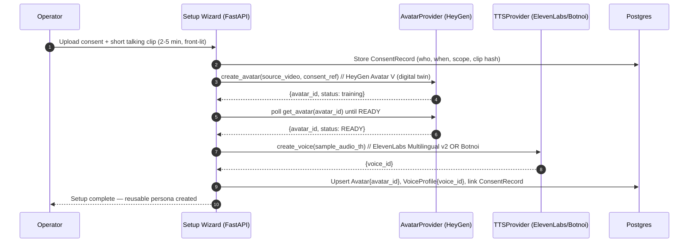
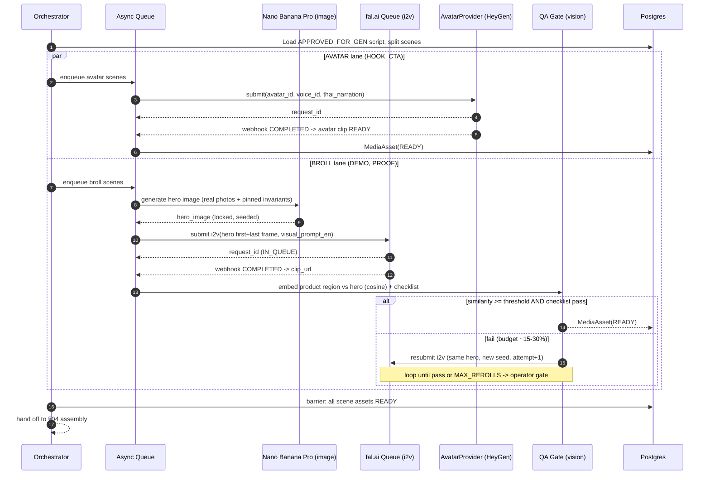

# 3. Scripting & Generation Module

> **Scope.** This module turns a normalized product + chosen templates (from §02) into a validated, claim-safe Thai script, then renders it into scene-level media assets using a **hybrid avatar + product-b-roll** strategy. It sits between §02 (template selection) and §04 (assembly/render). It references the canonical data model and the provider-agnostic adapter interfaces defined in §01 (`LLMProvider`, `AvatarProvider`, `VideoGenProvider`, `TTSProvider`). Legal/claim rules are owned by §06; this module **enforces** them at generation time.

**Load-bearing decisions in this module (do not silently change):**

1. **Two-language split** — Thai *only* in narration/on-screen text; English *only* in visual prompts. (§3A)
2. **Claim-safety gate is fail-closed** — no verified/approved claim, no claim in the script. (§3A)
3. **Avatar carries HOOK + CTA; product b-roll carries DEMO. The avatar never touches the product.** (§3B)
4. **Everything is async** — every gen call goes through the fal.ai-style Queue pattern; scenes fan out in parallel. (§3D)
5. **Product-consistency QA gate with budgeted reroll (~15–30%).** (§3D)

---

## 3A. Claim-safe Thai scripting

### 3A.1 Inputs / outputs

**Input** (assembled by the job orchestrator):

```jsonc
{
  "product": { /* NormalizedProduct from §01 */
    "title_th": "…", "brand": "…",
    "attributes": [ {"key":"volume_ml","value":"30"}, {"key":"finish","value":"matte"} ],
    "approved_claims": [ /* merchant-supplied, pre-verified — may be empty */ ],
    "images": [ {"asset_id":"…","url":"file:///media/…","is_primary":true} ],
    "category": "cosmetics/lip",
    "price_thb": 259
  },
  "formula_template": { /* FormulaTemplate from §02 */
    "id":"problem_solution_v3",
    "scene_plan":[
      {"role":"HOOK","target_s":3,"asset_type":"AVATAR"},
      {"role":"DEMO","target_s":8,"asset_type":"BROLL"},
      {"role":"PROOF","target_s":6,"asset_type":"BROLL"},
      {"role":"CTA","target_s":4,"asset_type":"AVATAR"}
    ]
  },
  "hook_template": { "id":"pov_you_just_found","pattern_th":"POV: เธอเพิ่งเจอ…" },
  "operator_flags": {
    "operator_verified_experience": false,   // true only if a human operator attests first-person use
    "register": "tiktok_casual"              // colloquial TikTok register
  },
  "global_invariants": {                       // pinned into EVERY visual prompt (see 3A.3)
    "product_desc_en":"a 30ml frosted-glass lip serum bottle with a gold cap, brand label 'XYZ'",
    "set_desc_en":"clean pastel-pink vanity, soft morning window light",
    "style_en":"authentic UGC iPhone look, shallow depth of field, 9:16 vertical"
  }
}
```

**Output** — a **structured JSON script** validated against the schema in §3A.4 before it is persisted as the `Script` + `Scene[]` records (§01). A script that fails schema validation **or** the claim-safety gate is never persisted as `APPROVED_FOR_GEN`; it is stored as `DRAFT_REJECTED` with the failing reasons.

### 3A.2 The two-language rule (by design)

| Field | Language | Rationale |
|---|---|---|
| `thai_narration` | **Thai** | Spoken VO + drives lip-sync. Must be natural colloquial Thai. |
| `on_screen_text_th` | **Thai** | Burned-in captions/hooks. |
| `visual_prompt_en` | **English** | Video/image models (Kling, Veo, Seedance, Nano Banana) are trained predominantly on English captions and follow English prompts far more reliably. |

The generator produces both languages in a **single structured call** so scenes stay aligned. Never machine-translate the visual prompt from Thai; generate it natively in English.

### 3A.3 Global-invariant pinning

Every `visual_prompt_en` MUST be composed as:

```
{global_invariants.product_desc_en}. {scene-specific action}.
Setting: {global_invariants.set_desc_en}. Style: {global_invariants.style_en}.
```

This is enforced in code (not left to the LLM): the LLM emits only the **scene-specific action clause**; the orchestrator concatenates the pinned invariants around it. This guarantees the *same* product/set/style description reaches every scene's image + video model, which is the single biggest lever on cross-scene product consistency.

### 3A.4 Script JSON schema

```json
{
  "$schema": "https://json-schema.org/draft/2020-12/schema",
  "$id": "autougc.th/script.schema.json",
  "title": "Script",
  "type": "object",
  "additionalProperties": false,
  "required": ["script_id","video_job_id","language","total_duration_s","scenes","claim_audit"],
  "properties": {
    "script_id": {"type":"string","format":"uuid"},
    "video_job_id": {"type":"string","format":"uuid"},
    "language": {"const":"th"},
    "formula_template_id": {"type":"string"},
    "hook_template_id": {"type":"string"},
    "total_duration_s": {"type":"number","minimum":8,"maximum":60},
    "scenes": {
      "type":"array","minItems":2,"maxItems":8,
      "items": {
        "type":"object","additionalProperties": false,
        "required": ["scene_id","order","role","thai_narration","visual_prompt_en",
                     "on_screen_text_th","duration_s","asset_type"],
        "properties": {
          "scene_id": {"type":"string","format":"uuid"},
          "order": {"type":"integer","minimum":0},
          "role": {"enum":["HOOK","DEMO","PROOF","CTA"]},
          "thai_narration": {"type":"string","minLength":0,"maxLength":180},
          "visual_prompt_en": {"type":"string","minLength":10,"maxLength":900},
          "on_screen_text_th": {"type":"string","maxLength":80},
          "duration_s": {"type":"number","minimum":1.5,"maximum":15},
          "asset_type": {"enum":["AVATAR","BROLL"]},
          "product_focus": {"type":"boolean","default":false}
        },
        "allOf": [
          { "if": {"properties":{"asset_type":{"const":"AVATAR"}}},
            "then": {"properties":{"role":{"enum":["HOOK","CTA"]}}} },
          { "if": {"properties":{"asset_type":{"const":"BROLL"}}},
            "then": {"properties":{"role":{"enum":["DEMO","PROOF"]}}} }
        ]
      }
    },
    "claim_audit": {
      "type":"object","additionalProperties": false,
      "required": ["passed","checked_at","findings"],
      "properties": {
        "passed": {"type":"boolean"},
        "checked_at": {"type":"string","format":"date-time"},
        "findings": {
          "type":"array",
          "items": {
            "type":"object",
            "required": ["scene_id","span","category","verdict"],
            "properties": {
              "scene_id": {"type":"string"},
              "span": {"type":"string"},
              "category": {"enum":["EFFICACY","HEALTH","WHITENING","FIRST_PERSON_EXPERIENCE","SUPERLATIVE","OK"]},
              "verdict": {"enum":["ALLOW","BLOCK","REWRITE"]}
            }
          }
        }
      }
    }
  }
}
```

> The `allOf`/`if-then` blocks encode load-bearing decision #3 **at the schema level**: an AVATAR scene can only be HOOK or CTA; a BROLL scene can only be DEMO or PROOF. A malformed script is rejected before it can reach the renderer.

### 3A.5 LLM choice & structured output

- **Primary: Claude (Anthropic).** Chosen for controllability, instruction-following, and reliable **tool-use / structured output** — we force the model to return the script via a single tool (`emit_script`) whose `input_schema` is the schema above, so we get schema-valid JSON without post-hoc parsing. Claude also handles the bilingual constraint (English prompts, Thai VO) in one pass with strong claim-instruction adherence, which matters for the claim gate.
- **Alternative: Typhoon 2 (SCB10X, Thai-native).** Preferred when we want maximally idiomatic colloquial Thai VO / TikTok slang and are willing to run a **two-stage** flow (Typhoon writes Thai narration + on-screen text; Claude or a template composes the English visual prompts) and enforce structure via constrained decoding / JSON grammar. Use Typhoon behind the same `LLMProvider` adapter (§01) so the choice is a config flag, not a code change.

**Recommendation:** ship **Claude as primary** for a single-call, schema-valid, claim-controlled path; keep Typhoon 2 as a pluggable `LLMProvider` for a "native Thai voice" quality experiment. Do not mix within one script.

**Colloquial-register prompting.** The system prompt instructs: casual spoken Thai (พูดแบบเพื่อนคุยกัน), particle use (นะ/เลย/อ่ะ), short sentences, no formal/written register, no English loan-formality — but keep sentences short and un-rushed for lip-sync (see §3D.6).

### 3A.6 CLAIM-SAFETY GATE (critical, fail-closed)

The gate runs **after** the LLM emits a script and **before** the script is marked `APPROVED_FOR_GEN`. It is a hard blocker, not an advisory.

**What is forbidden unless explicitly authorized:**

| Category | Rule |
|---|---|
| `FIRST_PERSON_EXPERIENCE` ("ฉันใช้แล้วดี", "it worked for me", "หน้าใสขึ้นเอง") | **BLOCKED** unless `operator_flags.operator_verified_experience == true`. The model cannot invent lived experience. |
| `EFFICACY` (works, cures, fixes, "เห็นผลใน 7 วัน") | **BLOCKED** unless the exact claim is present in `product.approved_claims`. |
| `HEALTH` (medical/therapeutic effect) | **BLOCKED** unless in `approved_claims` **and** §06 category allows it. |
| `WHITENING` ("ขาวขึ้น", "ผิวขาวใส") | **BLOCKED** unless in `approved_claims` (Thai FDA/OCPB-sensitive). |
| `SUPERLATIVE` ("ดีที่สุด", "อันดับ 1", "ที่สุดในไทย") | **BLOCKED** — OCPB unsubstantiated-superiority risk. |
| Attribute-level ("30ml", "เนื้อแมตต์", "กลิ่นวานิลลา") | **ALLOWED** — these are describable product facts. |
| Merchant `approved_claims` verbatim | **ALLOWED** — pre-verified in §06/onboarding. |

**How the gate works (defense in depth — three layers, any BLOCK fails the whole script):**

1. **Prompt-level (prevention).** The system prompt hard-forbids the categories above and instructs the model to restrict itself to attributes + `approved_claims`, and to only use first-person experience if `operator_verified_experience` is true. Cheapest layer; not trusted alone.
2. **Lexicon/regex screen (deterministic).** A maintained Thai + English lexicon of efficacy/health/whitening/superlative/first-person trigger phrases (owned by §06, imported here) runs over every `thai_narration` and `on_screen_text_th`. Any hit → candidate finding.
3. **LLM-judge classifier (semantic).** A second, independent LLM call classifies each sentence into the categories above (catches paraphrase the regex misses). Runs with temperature 0 and returns per-span verdicts.

**Fail-safe / resolution:**

- Any span with `verdict == BLOCK` and no authorization → **the whole script is rejected** (`claim_audit.passed=false`), the job moves to `NEEDS_REWRITE`, and the generator is re-invoked **once** with the offending spans fed back as negative constraints ("rewrite scene X to remove the efficacy claim; use only attributes").
- If the retry still contains a blocked, unauthorized claim → **hard stop**: the job halts at the **operator approval gate** (the single human gate in the product) with the flagged spans surfaced. No media is generated for a script that fails the gate. **Fail-closed: absence of authorization is treated as "not allowed," never "allowed by default."**
- The `claim_audit` object is persisted with the script for audit/traceability (required by §06).

**Prompt template — script generation (system):**

```
You are a Thai UGC short-video scriptwriter for TikTok Shop.
OUTPUT: call the tool `emit_script` with schema-valid JSON. Never write prose.

LANGUAGE RULES (hard):
- thai_narration + on_screen_text_th: natural, colloquial spoken Thai (TikTok register: {register}).
  Short un-rushed sentences (<= ~12 words). No formal/written Thai.
- visual_prompt_en: ENGLISH ONLY. Describe only the scene-specific ACTION clause
  (the system pins product/set/style around it — do NOT restate them).

STRUCTURE (from formula_template):
{scene_plan}  // roles, target durations, AVATAR|BROLL per scene
- AVATAR scenes = HOOK or CTA only, talking head, NO product in hand.
- BROLL scenes  = DEMO or PROOF only, product-focused, no human hands manipulating unless in plan.

CLAIM RULES (hard — you will be audited and rejected):
- Use ONLY these product attributes: {attributes}
- Use ONLY these approved claims verbatim: {approved_claims}
- FORBIDDEN unless explicitly permitted below: efficacy, health, whitening,
  superlatives ("best/#1"), and first-person experience ("I used it / it worked for me").
- operator_verified_experience = {operator_verified_experience}
  (if false, you MUST NOT write any first-person lived-experience statement.)
Hook to open with: {hook_template.pattern_th}
```

---

## 3B. Hybrid generation strategy (the core quality decision)

**Rule (load-bearing):**

> **The AVATAR (talking-head digital twin) carries the HOOK and the CTA. The PRODUCT B-ROLL carries the DEMO (and PROOF). The avatar NEVER manipulates the product.**

**Why this is the whole ballgame in 2026:**

- **In-hand product manipulation is unsolved.** Current avatar/video models cannot reliably render a specific real product being held, opened, applied, or swatched by a synthetic human — the label morphs, the geometry warps, fingers merge. Any shot of "avatar using the product" reads as fake and can also *fabricate a usage claim* (§3A.6).
- **Thai lip-sync is a tell.** Thai has tones and vowel shapes that avatar lip-sync approximates poorly; the longer and faster the Thai sentence, the worse it looks. We minimize avatar screen-time to believable talking-head moments and keep sentences short (§3D.6).
- **Product fidelity lives in b-roll.** DEMO/PROOF are generated from the *real scraped product photos* through a locked hero image (§3D.2), which is where we can actually hold the product identity stable.

**Consequences encoded elsewhere:**
- Schema (`§3A.4`) forbids AVATAR+DEMO / BROLL+HOOK combinations.
- The DEMO scene's `visual_prompt_en` describes the product and (optionally) disembodied hands within the frozen-frame checklist limits (§3D.4), never the avatar.
- Assembly (§04) inter-cuts avatar HOOK → b-roll DEMO/PROOF → avatar CTA.

---

## 3C. One-time avatar/voice setup (reused forever)

This is a **setup wizard run once per operator/brand persona**, not per video. Its outputs (`avatar_id`, `voice_id`, `ConsentRecord`) are stored on the `Avatar` and `VoiceProfile` records (§01) and **every subsequent video reuses the same IDs** — this is a major cost and consistency lever.

### 3C.1 Wizard flow



### 3C.2 Records

- **`ConsentRecord`** (required before any avatar is created): `subject_name`, `signed_at`, `scope` (e.g., "AI likeness for AutoUGC-TH marketing"), `source_clip_sha256`, `revocable: true`. If consent is revoked, the linked `avatar_id` is disabled and blocks all future jobs referencing it. **No avatar is created without a stored ConsentRecord.**
- **`Avatar`**: `{avatar_id, provider:"heygen", status, consent_record_id, created_at}`.
- **`VoiceProfile`**: `{voice_id, provider:"elevenlabs"|"botnoi", language:"th", model:"eleven_multilingual_v2", created_at}`.

### 3C.3 Provider notes

- **Avatar:** HeyGen **Avatar V / digital-twin** created from the operator's recorded clip → returns a reusable `avatar_id`. Behind `AvatarProvider` (§01) so it can be swapped.
- **Voice:** **ElevenLabs Multilingual v2** (`eleven_multilingual_v2`) instant voice clone from a Thai sample → `voice_id`; or **Botnoi** for a Thai-native TTS voice. Behind `TTSProvider` (§01). For the avatar path, prefer letting the avatar provider consume the `voice_id` directly (audio-driven) so lip-sync matches the exact VO.

---

## 3D. Per-video generation pipeline

### 3D.1 Overview

Given an `APPROVED_FOR_GEN` script, the orchestrator splits it into scenes and **fans out all scene jobs in parallel** through the async Queue pattern. Two scene lanes:

- **AVATAR lane (HOOK, CTA):** one `AvatarProvider` call per scene using the reused `avatar_id` + `voice_id` + `thai_narration`.
- **BROLL lane (DEMO, PROOF):** two-step per scene — (1) **lock a hero image** with Nano Banana Pro from real product photos, (2) **image-to-video** via fal.ai (Kling 3.0 / Veo 3.1 / Seedance) using the hero image + `visual_prompt_en` + first/last-frame conditioning. Then the **product-consistency QA gate** (§3D.4) decides accept vs. reroll.

### 3D.2 B-roll step 1 — locked HERO IMAGE (Nano Banana Pro)

Purpose: collapse the variance of "what does the product look like" into **one canonical, generation-friendly still** derived from the *real scraped photos*, then reuse that exact still to seed the video. This is what makes the DEMO clip's product match reality.

```
NanoBananaPro.generate_image(
  reference_images = product.images[* up to 3 best],   // REAL scraped photos
  prompt = "{global_invariants.product_desc_en}. Product hero on {set_desc_en}. "
           "{scene action, e.g. 'bottle standing, cap beside it, single dewy droplet on applicator'}. "
           "Style: {style_en}. Preserve label text, color, and proportions exactly.",
  aspect_ratio = "9:16",
  seed = job.hero_seed   // fixed per job so PROOF + DEMO share product identity
)
-> hero_image_asset (MediaAsset, kind=IMAGE, role=HERO)
```

The hero image is **persisted and content-addressed**; if a b-roll clip must be rerolled, we re-condition from the *same* hero image (do not regenerate the hero on reroll unless the hero itself failed QA).

### 3D.3 B-roll step 2 — image-to-video (fal.ai Queue)

```
VideoGenProvider.submit(                       // -> fal.ai queue submit
  model = "fal-ai/kling-video/v3/image-to-video"   // or veo-3.1 (Ingredients/Frames-to-video) / seedance
  input = {
    image_url:      hero_image_asset.url,       // first-frame / start conditioning
    tail_image_url: hero_image_asset.url,       // last-frame conditioning -> product returns to canonical pose
    prompt:         scene.visual_prompt_en,     // English, invariants pre-pinned
    duration:       ceil(scene.duration_s),
    aspect_ratio:   "9:16"
  },
  webhook_url = f"{BASE}/webhooks/falai?scene_id={scene_id}&attempt={n}"
)
```

**First/last-frame ("Frames-to-video" / Veo "Ingredients") conditioning is required** for product scenes: pinning both endpoints to the hero image keeps the product from drifting mid-clip and returns it to a clean pose for cuts.

### 3D.4 ASYNC pattern (submit → webhook/poll → result)

Every generation call (avatar, hero image, image-to-video) is a **long-running job**. Never block a request thread. Pattern (fal.ai Queue API shape; `AvatarProvider`/`VideoGenProvider` normalize to it):

```
POST  {model}          -> { request_id, status_url, response_url }   # submit, returns immediately
# preferred: webhook fires on completion -> handler fetches response_url
# fallback: poll GET {status_url}  every ~5s (expo backoff, cap 30s)  -> IN_QUEUE|IN_PROGRESS|COMPLETED|FAILED
GET   {response_url}   -> { video_url | image_url, timings, ... }     # on COMPLETED
```

**Orchestration:**
- Enqueue every scene job onto the async queue (§01) → each submits to the provider and records `request_id` + `status_url` on a `GenAttempt` row.
- **Fan out all scenes in parallel.** The job is a DAG: hero-image → i2v per BROLL scene; avatar scenes independent. Barrier: all scene assets `READY` (post-QA) before §04 assembly.
- **Webhook-first, poll-fallback.** If no webhook within `soft_timeout` (e.g. 90s image / 8min video), a reconciler polls `status_url`. Idempotent: webhook and poll both funnel into the same `on_result(request_id)` handler guarded by a unique constraint so a result is processed once.

### 3D.5 PRODUCT-CONSISTENCY QA GATE (+ reroll budget)

After each b-roll clip completes, run an **automated vision check** before accepting it:

1. Sample N frames (e.g., first/mid/last).
2. Detect + crop the **product region** (detector or the hero's known bbox).
3. **Embed** the product crop (CLIP/DINO image embedding) and **cosine-compare** to the hero image's product embedding.
4. **Accept** if `min(frame_similarity) >= THRESHOLD` (start `0.85`, tune). **Reroll** otherwise.

**Frozen-frame QA checklist (a clip must pass ALL):**

- [ ] Exactly **one** hero product visible (no duplicated/ghost bottles).
- [ ] **≤ 2 hands** in frame; no extra/merged fingers.
- [ ] **No morphing label** — brand text stable and legible across sampled frames.
- [ ] **No baked-in text** the model hallucinated (all text is added in §04).
- [ ] Product proportions/color match hero within threshold.

**Reroll accounting:**
- On QA fail → resubmit i2v (same hero image, same prompt, **new seed**, `attempt+1`). Max `MAX_REROLLS = 3` per scene; after that, halt the scene to the operator gate.
- **Budget a 15–30% reroll rate** into cost + latency estimates. Track `reroll_rate = rerolls / broll_scenes` per job and per provider; alert if a provider's rolling reroll rate exceeds ~35% (model/prompt regression signal).

### 3D.6 Thai VO & lip-sync mitigations

Applied at scripting (§3A) and enforced here for AVATAR scenes:

- **Short, un-rushed sentences** (≤ ~12 words / scene) so the avatar isn't forced into fast Thai mouth shapes.
- **Slightly wider framing** on avatar scenes (chest-up, not extreme close-up) so lip detail is less scrutinized.
- Prefer **audio-driven** avatar generation (feed the ElevenLabs/Botnoi Thai VO or `voice_id`) so lip-sync targets the exact phonemes rather than re-synthesizing.
- Insert small pauses between sentences; avoid tongue-twister consonant clusters where the template allows.

### 3D.7 Cost tracking

Record a `CostLedgerEntry` per generation call (not per scene): `{video_job_id, scene_id, provider, model, kind: AVATAR|HERO_IMAGE|I2V, attempt, unit_cost_usd, is_reroll}`. Roll up to `video_job.total_cost_usd`; alert if a job trends above the **~$3/video** target. Rerolls are attributed to the scene and flagged `is_reroll=true` so the accepted-clip cost and the waste are both visible.

### 3D.8 Per-video generation — sequence diagram



### 3D.9 Provider adapter method calls (from §01 interfaces)

```python
# AVATAR scene (HOOK / CTA)
attempt = avatar_provider.submit(SubmitAvatar(
    avatar_id=avatar.avatar_id, voice_id=voice.voice_id,
    text_th=scene.thai_narration, aspect_ratio="9:16",
    idempotency_key=f"{video_job_id}:{scene_id}:avatar:1",
    webhook_url=cb("avatar", scene_id, 1)))

# HERO IMAGE (per BROLL scene, before i2v)
hero = image_provider.submit(SubmitImage(
    reference_urls=[a.url for a in product.primary_images[:3]],
    prompt=hero_prompt, aspect_ratio="9:16", seed=job.hero_seed,
    idempotency_key=f"{video_job_id}:{scene_id}:hero:1"))

# IMAGE-TO-VIDEO (per BROLL scene)
attempt = video_provider.submit(SubmitI2V(
    model=cfg.i2v_model,                       # kling-v3 | veo-3.1 | seedance
    image_url=hero.url, tail_image_url=hero.url,
    prompt=scene.visual_prompt_en, duration_s=ceil(scene.duration_s),
    aspect_ratio="9:16",
    idempotency_key=f"{video_job_id}:{scene_id}:i2v:{attempt_n}",
    webhook_url=cb("i2v", scene_id, attempt_n)))

# Result funnel (webhook OR poll -> same handler)
video_provider.on_result(request_id) -> GenResult(status, media_url, cost_usd)
```

### 3D.10 Retry / idempotency / error handling

- **Idempotency key** = `f"{video_job_id}:{scene_id}:{kind}:{attempt}"`. Providers that accept an idempotency header get it; otherwise the key is a unique DB constraint on `GenAttempt` so a retried submit never double-charges.
- **Result idempotency:** `on_result(request_id)` is guarded by `UNIQUE(request_id)` — duplicate webhook + poll deliveries process once.
- **Retry policy (transport):** exponential backoff w/ jitter for `429`/`5xx`/timeouts, cap ~5 attempts, then mark attempt `FAILED`.
- **Retry policy (content):** QA failure is **not** a transport retry — it creates a *new* `GenAttempt` (new seed, `attempt+1`), capped at `MAX_REROLLS`.
- **Poison / hard-fail:** provider `FAILED`, exhausted transport retries, or exhausted rerolls → scene → `NEEDS_ATTENTION`, job pauses at the **operator gate**. Never ship a scene that never reached `READY`.
- **Partial-failure isolation:** one scene failing does not fail sibling scenes; the assembly barrier simply waits and surfaces the blocked scene(s).
- **Timeouts:** soft-timeout triggers poll-fallback; hard-timeout (e.g., 15 min i2v) fails the attempt.
- **Cost guard:** before each reroll, check `video_job.total_cost_usd` against a per-job ceiling; exceeding it halts to the operator gate instead of auto-rerolling.

### 3D.11 Acceptance criteria & tests

**Scripting (3A):**
- [ ] Every generated script validates against `script.schema.json`; invalid scripts are never persisted `APPROVED_FOR_GEN`. *(unit: feed malformed LLM output → rejected)*
- [ ] AVATAR scenes are only HOOK/CTA; BROLL only DEMO/PROOF. *(schema test with a bad combo → fail)*
- [ ] `visual_prompt_en` contains no Thai; `thai_narration`/`on_screen_text_th` contain no Latin marketing copy. *(lint test)*
- [ ] Global invariants appear verbatim in every `visual_prompt_en`. *(assert substring)*
- [ ] **Claim gate fails closed:** a fixture with efficacy/whitening/first-person claims and empty `approved_claims`/`operator_verified_experience=false` → `claim_audit.passed=false`, job `NEEDS_REWRITE`, no media generated. *(integration)*
- [ ] An approved claim present verbatim in `approved_claims` → ALLOWED. *(integration)*
- [ ] `operator_verified_experience=true` → first-person line permitted. *(integration)*

**Generation (3B–3D):**
- [ ] Avatar never appears in a DEMO/PROOF scene and never "holds" the product. *(scene-role invariant test)*
- [ ] Avatar + voice IDs are reused across ≥2 jobs without re-creation. *(integration: two jobs, same `avatar_id`/`voice_id`)*
- [ ] Every gen call goes through submit→result (no synchronous blocking); a slow provider does not block other scenes. *(async test: fan-out N scenes, assert parallelism)*
- [ ] Duplicate webhook + poll for one `request_id` produces exactly one `READY` asset and one cost entry. *(idempotency test)*
- [ ] QA gate rerolls a clip whose product cosine-sim < threshold and accepts one ≥ threshold. *(vision test with a known-bad and known-good clip)*
- [ ] Reroll capped at `MAX_REROLLS`; exhaustion routes to operator gate, never to assembly. *(integration)*
- [ ] `total_cost_usd` is summed per job incl. rerolls; alert fires above target. *(unit)*
- [ ] End-to-end happy path (product URL fixture → script → avatar+broll → all READY) completes with reroll_rate recorded and cost ≤ ceiling. *(e2e)*

---

*File:* `/home/user/skills/spec/03-generation-module.md`

**Summary (3 lines):**
1. §3A produces a schema-validated bilingual Thai script (Thai VO/on-screen, English visual prompts, pinned global invariants) behind a fail-closed 3-layer claim-safety gate that blocks efficacy/health/whitening/superlative/first-person claims unless merchant-approved or operator-verified.
2. §3B–3C lock in the load-bearing hybrid strategy (avatar carries HOOK+CTA and never touches the product; product b-roll carries DEMO/PROOF) and a one-time avatar/voice setup (HeyGen `avatar_id` + ElevenLabs/Botnoi `voice_id` + ConsentRecord) reused across every video.
3. §3D fans out scenes in parallel through the fal.ai-style Queue pattern (Nano Banana hero image → first/last-frame i2v via Kling/Veo/Seedance), enforces an automated product-consistency QA gate with a budgeted 15–30% reroll, and specifies idempotency, retry, error-handling, cost tracking, and acceptance tests.
