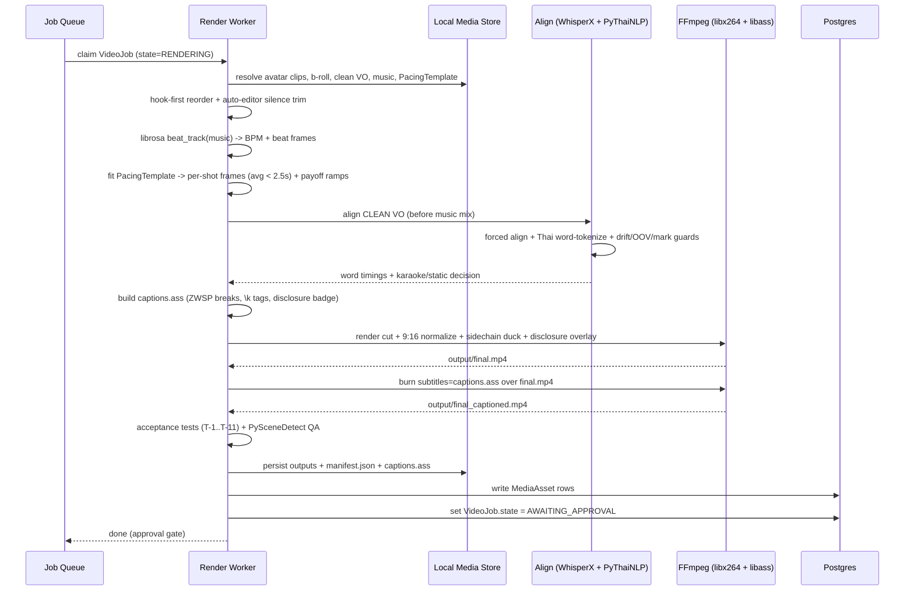

# 4. Creative Editing & Captions Module

> **Scope.** This module consumes the artifacts produced by the Generation Module (section 03) — avatar talking-head clips, product B-roll clips, one **clean Thai VO** track, plus a chosen `PacingTemplate` (section 02) and an optional music bed — and stitches them into a single **TikTok-Shop-compliant Thai vertical short** (9:16, 1080×1920, 30 fps): `output/final.mp4` and `output/final_captioned.mp4`. Everything runs **locally** inside the Compose container; no cloud media APIs.

All commands assume an FFmpeg build described in [4E. Config & Build Requirements](#4e-config--build-requirements). Unless stated otherwise, `fps=30`, `-pix_fmt yuv420p`, `-colorspace bt709`.

---

## 4.0 Data contract (recap from §01/§02)

The worker reads a `VideoJob` and resolves its child rows. Only the fields this module touches are shown.

```python
# Canonical model lives in §01/§02 — reproduced here as the module's input contract.
class Scene(BaseModel):
    id: str
    index: int                       # authoring order from the Script module
    kind: Literal["avatar", "broll"]
    is_hook: bool                     # exactly ONE scene per job is the hook
    is_payoff: bool                   # 0..n payoff/"reveal" moments -> speed ramp
    asset_id: str                     # MediaAsset -> generated clip on local disk
    vo_start_ms: int                  # this scene's span inside the clean VO track
    vo_end_ms: int
    target_duration_ms: int | None    # optional per-shot override from template

class PacingTemplate(BaseModel):
    id: str
    bpm_hint: float | None            # fallback if no music bed
    shot_count: int                   # target number of shots in the cut
    per_shot_ms: list[int]            # beat map: ideal duration of each shot slot
    max_avg_cut_ms: int = 2500        # hard ceiling: sub-2.5s average
    ramp_factor: float = 1.6          # speed multiplier on payoff moments

class VideoJob(BaseModel):
    id: str
    scenes: list[Scene]
    pacing_template_id: str
    vo_asset_id: str                  # the CLEAN VO (pre-music) — caption alignment source
    music_asset_id: str | None
    state: JobState                   # ... -> RENDERING -> AWAITING_APPROVAL
```

**Invariant:** captions are aligned against `vo_asset_id` (clean VO) **before** any music is mixed. Alignment on a music-mixed track drifts badly (see §4B).

---

## 4A. The viral re-cut engine

High-level assembly logic uses **MoviePy** (for readable ordering/trim/ramp bookkeeping and to compute an EDL); the **final render is a single raw FFmpeg filtergraph** for frame-accuracy and speed. `auto-editor` tightens VO silences; `PySceneDetect` is **QA-only** (never in the render path).

### 4A.1 Pipeline order

```
scenes ──▶ (1) hook-first reorder
       ──▶ (1b) auto-editor silence tightening (VO-driven)
       ──▶ (2) librosa beat detection on music bed
       ──▶ (3) apply PacingTemplate -> per-shot target durations, snap to beats
       ──▶ (4) speed ramps on is_payoff shots
       ──▶ (5) 9:16 normalize each source clip to 1080x1920
       ──▶ (6) music bed mix + VO sidechain ducking
       ──▶ (7) hard-cut concat -> final.mp4
```

### 1. Hook-first ordering

Promote the single `is_hook` scene to position 0; preserve the relative order of the rest. Retiming (steps 2–4) happens **after** reorder so the beat map applies to the shipped order.

```python
def hook_first(scenes: list[Scene]) -> list[Scene]:
    hook = next(s for s in scenes if s.is_hook)   # invariant: exactly one
    rest = [s for s in scenes if not s.is_hook]
    return [hook, *rest]
```

> The hook scene keeps its own VO span; because the VO is a single continuous track, reordering scenes means we must **re-slice the VO per scene** (using `vo_start_ms/vo_end_ms`) and re-concatenate audio in the new visual order rather than playing the VO straight through. The audio EDL mirrors the video EDL exactly.

### 1b. VO silence tightening (`auto-editor`)

Before beat-fitting, trim dead air inside each avatar scene's VO span so cuts land on speech, not silence. Run per-clip against the clean VO slice; keep the cut list, don't let auto-editor render the final (we need our own filtergraph).

```bash
auto-editor vo_scene_03.wav \
  --edit audio:threshold=0.04 \
  --margin 0.15sec \
  --export json -o scene_03.edl.json
# We parse scene_03.edl.json for keep-ranges and fold them into the master EDL.
```

### 2. Beat detection + cut-sync (librosa)

```python
import librosa
y, sr = librosa.load(music_path, sr=44100, mono=True)
tempo, beat_frames = librosa.beat.beat_track(y=y, sr=sr, units="frames")
beat_times = librosa.frames_to_time(beat_frames, sr=sr)   # seconds, ascending
bpm = float(tempo)
```

If `music_asset_id is None`, synthesize a beat grid from `PacingTemplate.bpm_hint` (or default 100 BPM): `beat_times = [k * 60/bpm for k in range(N)]`.

**BPM → frames math (the load-bearing part).** At project `fps = 30`:

```
seconds_per_beat = 60 / bpm
frames_per_beat  = round(fps * 60 / bpm) = round(1800 / bpm)

# examples @ fps=30
#   bpm=120 -> 15.0 frames/beat
#   bpm=128 -> 14.06 -> 14 frames/beat
#   bpm=100 -> 18.0 frames/beat
```

**Snap a cut to the nearest beat frame:**

```python
def snap_to_beat_frame(cut_time_s: float, beat_times, fps=30) -> int:
    # nearest beat, then quantize to an integer video frame
    nearest_beat_s = min(beat_times, key=lambda b: abs(b - cut_time_s))
    return round(nearest_beat_s * fps)          # integer frame index
```

Cut boundaries are stored as **frame indices** (not seconds) so FFmpeg trims are frame-exact. Convert back with `t = frame / fps` when emitting `-ss/-t`.

### 3. Apply the PacingTemplate

Distribute `shot_count` slots with durations from `per_shot_ms`, then quantize each shot boundary to a beat frame (step 2). Enforce the sub-2.5s average:

```python
def fit_pacing(shots, template: PacingTemplate, beat_times, fps=30):
    targets = template.per_shot_ms[:len(shots)]
    frames = [snap_to_beat_frame(sum(targets[:i+1]) / 1000, beat_times, fps)
              for i in range(len(shots))]
    durations_ms = _frame_deltas_to_ms(frames, fps)
    avg = sum(durations_ms) / len(durations_ms)
    if avg > template.max_avg_cut_ms:            # 2500 ms hard ceiling
        scale = template.max_avg_cut_ms / avg
        durations_ms = [d * scale for d in durations_ms]
        frames = _re_snap(durations_ms, beat_times, fps)
    return frames
```

**Acceptance:** `mean(per_shot_duration) < 2500 ms`. If a source clip is shorter than its slot, loop-hold the last frame is **forbidden** — instead borrow frames from the neighboring shot or shorten the slot (keeps cuts on-beat and avoids frozen frames).

### 4. Speed ramps on payoff moments

For each `is_payoff` shot, apply a ramp of `template.ramp_factor` (e.g. 1.6×). Video via `setpts`, audio via `atempo` (chain `atempo` if factor > 2.0, since a single `atempo` accepts 0.5–2.0):

```
# video: speed up 1.6x  -> PTS scaled by 1/1.6 = 0.625
setpts=0.625*PTS
# audio: keep pitch, match tempo
atempo=1.6
# factor 3.2 example: atempo=1.6,atempo=2.0
```

Ramp durations are recomputed and **re-snapped to beats** (a ramped shot is shorter, so its out-point moves to the next beat frame).

### 5. 9:16 normalization to 1080×1920 (mixed sources)

Avatar clips are typically already portrait; product B-roll is often landscape/square. Rule set (per source, applied in the filtergraph before concat):

```
# Scale to COVER the 1080x1920 frame, center-crop the overflow (no bars for hero shots):
scale=1080:1920:force_original_aspect_ratio=increase,crop=1080:1920,setsar=1

# For product shots that must NOT be cropped (packshot with edge text),
# scale to FIT then pad with a blurred fill of the same clip:
split[main][bg];
[bg]scale=1080:1920:force_original_aspect_ratio=increase,crop=1080:1920,boxblur=40:8[blur];
[main]scale=1080:1920:force_original_aspect_ratio=decrease[fg];
[blur][fg]overlay=(W-w)/2:(H-h)/2,setsar=1
```

Decision: `crop-cover` for avatar and lifestyle B-roll; `blurred-pad` for packshots flagged `no_crop` in the MediaAsset metadata. All branches end at exactly `1080×1920, SAR 1:1, 30 fps`.

### 6. Music bed with VO ducking (`sidechaincompress`)

Duck the music under the VO so speech is always intelligible. VO drives the sidechain.

```
# [vo] = concatenated clean VO (post silence-trim), [music] = looped/​trimmed bed
[music]volume=0.22[bed];                         # bed base level ~ -13 dBFS
[bed][vo]sidechaincompress=threshold=0.03:ratio=8:attack=5:release=250:makeup=1[ducked];
[ducked][vo]amix=inputs=2:duration=first:weights=1 1,dynaudnorm=f=200:g=5[mix]
```

Mix levels: **VO 0 dB reference, music bed −13 dBFS idle, ducked to ≈ −24 dBFS under speech** (ratio 8:1, 250 ms release for a smooth pump-back). Final loudness normalized toward **−14 LUFS integrated** (TikTok target) via a trailing `loudnorm` pass in the render (§4A.8).

### 7. Hard cuts only (concat)

**No transitions** — no `xfade`, no dissolves. Every shot is a hard cut on a beat frame. Use the FFmpeg **concat filter** (not the demuxer) because inputs have been retimed/normalized and must share one filtergraph:

```
[v0][v1][v2]...[vN]concat=n=N:v=1:a=0[vout]
```

### 4A.8 Concrete final-render filtergraph (single command)

Illustrative 3-shot job: shot 0 = hook (avatar, crop-cover), shot 1 = product packshot (blurred-pad), shot 2 = payoff avatar (1.6× ramp). Clean VO + music bed.

```bash
ffmpeg -y \
  -i hook_avatar.mp4        `# 0: input video` \
  -i product_pack.mp4       `# 1` \
  -i payoff_avatar.mp4      `# 2` \
  -i vo_clean.wav           `# 3: concatenated clean VO in shipped order` \
  -i music_bed.mp3          `# 4` \
  -filter_complex "
    [0:v]trim=0:2.0,setpts=PTS-STARTPTS,
         scale=1080:1920:force_original_aspect_ratio=increase,
         crop=1080:1920,fps=30,setsar=1[v0];

    [1:v]trim=0:1.8,setpts=PTS-STARTPTS,split[p_main][p_bg];
    [p_bg]scale=1080:1920:force_original_aspect_ratio=increase,crop=1080:1920,boxblur=40:8[p_blur];
    [p_main]scale=1080:1920:force_original_aspect_ratio=decrease[p_fg];
    [p_blur][p_fg]overlay=(W-w)/2:(H-h)/2,fps=30,setsar=1[v1];

    [2:v]trim=0:2.4,setpts=0.625*(PTS-STARTPTS),
         scale=1080:1920:force_original_aspect_ratio=increase,
         crop=1080:1920,fps=30,setsar=1[v2];

    [v0][v1][v2]concat=n=3:v=1:a=0[vraw];

    [4:a]volume=0.22,aloop=loop=-1:size=2e9,atrim=0:6.2[bed];
    [bed][3:a]sidechaincompress=threshold=0.03:ratio=8:attack=5:release=250:makeup=1[duck];
    [duck][3:a]amix=inputs=2:duration=first:weights=1 1,
               dynaudnorm=f=200:g=5,
               loudnorm=I=-14:TP=-1.5:LRA=11[aout];

    [vraw]format=yuv420p[vout]
  " \
  -map "[vout]" -map "[aout]" \
  -r 30 -c:v libx264 -preset medium -crf 18 -profile:v high -pix_fmt yuv420p \
  -colorspace bt709 -color_primaries bt709 -color_trc bt709 \
  -c:a aac -b:a 192k -movflags +faststart \
  output/final.mp4
```

`final_captioned.mp4` is produced by a **second pass** that burns the ASS subtitle over `final.mp4` (§4B.5) — kept separate so re-captioning never forces a full re-encode of the cut, and so approval can compare captioned vs. clean.

---

## 4B. Thai captions (the hard part)

Thai has **no spaces between words**; you cannot split on whitespace, and naïve rendering stacks tone marks wrong. Two disciplines: **alignment** (when does each word sound) and **rendering** (how do glyphs stack and wrap).

### 4B.1 Align on the CLEAN VO — never the mixed track

Forced alignment against a music-mixed track drifts (the acoustic model latches onto non-speech energy). **Align on `vo_asset_id` before §4A.6.** The alignment JSON is computed once and reused for both caption variants.

### 4B.2 Alignment stack

1. **ASR + forced alignment:** **WhisperX** with a Thai model, or **Thonburian Whisper** (fine-tuned Thai) as the ASR, then WhisperX's `align()` for word timestamps.
2. **Word segmentation:** WhisperX word boundaries are unreliable for Thai. Re-segment the transcript with **PyThaiNLP** (`newmm` engine) or **deepcut**, then map segment spans back onto WhisperX character/phone timings.

```python
import whisperx
from pythainlp.tokenize import word_tokenize

model = whisperx.load_model("large-v3", device, language="th",
                            asr_options={"initial_prompt": PRODUCT_GLOSSARY})
result = model.transcribe(clean_vo_path)          # segments + text

# Force-align. If NO Thai acoustic align-model is available, WhisperX falls back
# to INTERPOLATION between segment bounds -> drift. Detect & flag (see 4B.3).
align_model, meta = whisperx.load_align_model(language_code="th", device=device)
aligned = whisperx.align(result["segments"], align_model, meta,
                         clean_vo_path, device, return_char_alignments=True)

# Re-tokenize each segment with a Thai word tokenizer (spaces don't exist):
def thai_words(text): return word_tokenize(text, engine="newmm", keep_whitespace=False)
```

### 4B.3 Failure modes to guard against

| Failure | Cause | Guard |
|---|---|---|
| **Interpolation drift** | No Thai acoustic align-model -> WhisperX linearly interpolates word times across a segment | Detect via `meta["type"] != "torchaudio"` **or** per-word confidence; when drift-risk, **downgrade that segment to a static/phrase caption** (no karaoke). |
| **OOV brand/product split** | Tokenizer splits e.g. a brand name mid-word | Feed a **custom dictionary** to PyThaiNLP (`Trie` of product/brand terms from the Script module) + `initial_prompt` glossary to Whisper. |
| **Tone-mark / cluster split** | A word boundary lands between a base char and its combining mark | Post-process: never allow a boundary immediately before a combining code point (U+0E31, U+0E34–0E3A, U+0E47–0E4E). Merge such boundaries left into the base char. |

```python
COMBINING = set(range(0x0E34, 0x0E3B)) | {0x0E31} | set(range(0x0E47, 0x0E4F))
def safe_boundaries(text, cuts):
    return [c for c in cuts if not (c < len(text) and ord(text[c]) in COMBINING)]
```

### 4B.4 Caption strategy: static phrase vs. karaoke word-highlight

- **Persistent top caption (default):** static / phrase-level captions (one tokenized phrase on screen, swapped at phrase boundaries). Robust; unaffected by word-timing drift.
- **Karaoke word-highlight:** only where alignment is **trustworthy** — i.e. a real Thai acoustic model aligned the segment AND every word confidence ≥ threshold (e.g. 0.5). Emit ASS `\k` karaoke tags there; elsewhere fall back to static.

```python
def choose_mode(segment) -> Literal["karaoke", "static"]:
    if segment.align_type != "acoustic":      # interpolated -> not trustworthy
        return "static"
    if min(w.score for w in segment.words) < 0.5:
        return "static"
    return "karaoke"
```

### 4B.5 Rendering: ASS / libass (NOT drawtext)

`drawtext` mis-stacks Thai tone marks — **do not use it for Thai text.** Render via **ASS subtitles through libass**.

**Build requirements:** FFmpeg linked against **libass ≥ 0.17** + **libunibreak** + libass built with **`wrap_unicode`** support (correct Thai line-breaking). Embed a Thai font: **Noto Sans Thai**, **Sarabun**, or a bold TikTok-style weight (installed into the container's fontconfig path, e.g. `/usr/share/fonts/thai/`).

**ZWSP for line-breaking.** Because there are no spaces, insert **U+200B (ZWSP)** at PyThaiNLP word boundaries so libass can wrap between words instead of mid-word:

```python
ZWSP = "​"
def with_break_hints(text: str) -> str:
    return ZWSP.join(word_tokenize(text, engine="newmm", keep_whitespace=False))
```

**ASS generation (pseudo-code).**

```python
def build_ass(aligned_segments, style, out="captions.ass"):
    header = ASS_HEADER.format(
        playres_x=1080, playres_y=1920,
        font=style.font,               # "Noto Sans Thai"
        size=style.size,               # e.g. 84
        primary="&H00FFFFFF",          # white fill
        highlight="&H0000E5FF",        # karaoke sweep color (TikTok yellow)
        outline=4, shadow=2,           # thick outline -> readable on any B-roll
        align=8, margin_v=280,         # 8 = top-center; sits in upper third
    )
    events = []
    for seg in aligned_segments:
        text = with_break_hints(seg.text)          # ZWSP-joined words
        if choose_mode(seg) == "karaoke":
            body = ""
            for w in seg.words:                    # \k is in CENTISECONDS
                cs = max(1, round((w.end - w.start) * 100))
                body += f"{{\\k{cs}}}{with_break_hints(w.word)}{ZWSP}"
        else:
            body = text                            # static phrase
        events.append(dialogue(start=seg.start, end=seg.end, text=body))
    write(out, header + "\n".join(events))
```

**Burn-in (second pass over `final.mp4`):**

```bash
ffmpeg -y -i output/final.mp4 \
  -vf "subtitles=captions.ass:fontsdir=/usr/share/fonts/thai" \
  -c:v libx264 -preset medium -crf 18 -pix_fmt yuv420p \
  -c:a copy -movflags +faststart \
  output/final_captioned.mp4
```

> Note: `subtitles=` (libass) — **not** `drawtext`. `fontsdir` guarantees the embedded Thai font resolves regardless of host fontconfig.

**Combining-mark verification.** Before shipping, assert the rendered glyphs stack correctly for U+0E31, U+0E34–0E3A, and tone marks U+0E48–0E4B (see acceptance test T-3): render a known probe string, compare against a golden frame hash.

---

## 4C. Compliance overlay (AI-generated disclosure)

TikTok Shop requires a **visible "AI-generated" disclosure in the first 3 seconds.** Implement as a **persistent badge in the ASS** for `t = 0 → 3.0s` (kept in the caption layer so it survives the caption pass and is trivially auditable). Rendered top-left, high-contrast, semi-transparent plate.

```
; --- appended to captions.ass ---
[V4+ Styles]
Style: Disclosure,Noto Sans Thai,44,&H00FFFFFF,&H000000FF,&H80000000,&H80000000,-1,0,0,0,100,100,0,0,3,0,0,7,48,48,60,1
[Events]
; 7 = top-left; box border style (3) gives the plate. Thai + EN dual label.
Dialogue: 0,0:00:00.00,0:00:03.00,Disclosure,,0,0,0,,สร้างโดย AI  •  AI-generated
```

Alternative (if the badge must survive even a re-caption that regenerates the ASS): draw it in the **cut pass** filtergraph instead, layered as an image overlay (a pre-rendered PNG plate) gated with `enable='between(t,0,3)'`:

```
[vraw][badge_png]overlay=48:60:enable='between(t,0,3)'[vout]
```

**Choice:** default = ASS badge (single source of truth, no re-encode). Use the PNG-overlay variant only when policy requires the label baked into `final.mp4` itself (not just the captioned variant). The render worker is configured with `DISCLOSURE_IN_BASE = true` for TikTok Shop, so the label is baked into `final.mp4` via the overlay variant, and the ASS badge is omitted to avoid a double label.

---

## 4D. Render worker

A queue worker (async job queue from §01) that turns a `VideoJob` into approved-ready outputs.

### 4D.1 Responsibilities

1. Claim job (`state: RENDERING`), resolve all input `MediaAsset` paths from local storage.
2. Build the **EDL** (hook-first, silence-trim, beat-fit, ramps) via MoviePy bookkeeping.
3. Run alignment on the **clean VO** (§4B) → `captions.ass`.
4. Render `output/final.mp4` (cut + audio mix + disclosure overlay).
5. Render `output/final_captioned.mp4` (burn ASS over `final.mp4`).
6. QA gate (PySceneDetect cut-count check + acceptance tests §4F).
7. Write a `MediaAsset` row for each output; set `state: AWAITING_APPROVAL`.
8. Clean temp; keep inputs + `edl.json` + `captions.ass` for **deterministic re-render**.

### 4D.2 Deterministic re-render

The worker persists a **render manifest** (`render/manifest.json`) capturing every non-source input to the filtergraph: EDL frame boundaries, beat times, ramp factors, mix levels, ASS path, font, FFmpeg version, and a hash of each source asset. Re-running from the manifest with unchanged sources yields a **byte-stable-enough** result (identical filtergraph; `libx264` is deterministic for a fixed preset/CRF/threads — pin `-threads 1` or `x264-params threads=1` when bit-exactness is required for regression tests).

```python
async def run(job: VideoJob):
    tmp = scratch_dir(job.id)                      # /var/tmp/autougc/<job>/
    try:
        await set_state(job, JobState.RENDERING)
        edl   = build_edl(job)                      # 4A.1–4A.4
        align = align_captions(job.vo_asset_id)     # 4B, CLEAN VO
        ass   = build_ass(align, CAPTION_STYLE, tmp/"captions.ass")
        write_manifest(tmp/"manifest.json", edl, align.meta, CONFIG)

        base = ffmpeg_render_cut(edl, out=job.dir/"output/final.mp4")   # 4A.8
        cap  = ffmpeg_burn_ass(base, ass, out=job.dir/"output/final_captioned.mp4")

        run_acceptance(base, cap, align)            # 4F; raises on failure
        for p in (base, cap):
            await write_media_asset(job, p)
        await set_state(job, JobState.AWAITING_APPROVAL)
    except RenderError as e:
        await set_state(job, JobState.FAILED, error=str(e))
        raise
    finally:
        cleanup(tmp, keep=("manifest.json", "captions.ass", "edl.json"))
```

### 4D.3 Local temp handling & cleanup

- Scratch under `/var/tmp/autougc/<job_id>/`; final outputs under `<job_dir>/output/`.
- On success: delete intermediate clip re-encodes; **retain** `manifest.json`, `edl.json`, `captions.ass` (re-render + audit).
- On failure: retain full scratch for debugging, TTL-swept after N days by a housekeeping task.

### 4D.4 Error handling

| Error | Detection | Handling |
|---|---|---|
| Missing/corrupt source clip | `ffprobe` returns error / 0 streams | Fail fast, `FAILED`, surface asset id. |
| No `is_hook` scene / >1 hook | invariant check pre-render | Reject job with validation error (upstream bug). |
| Thai align model absent | `whisperx.load_align_model` raises | Fall back to **all-static captions**, log WARN, continue (video still ships). |
| Beat detection empty (silent/short music) | `len(beat_times) == 0` | Fall back to `bpm_hint` grid. |
| libass missing/old / font unresolved | probe FFmpeg `-filters` for `subtitles`; fontconfig match | Fail render with actionable message (this is a build defect, §4E). |
| FFmpeg non-zero exit | subprocess return code | Capture stderr tail, `FAILED`, retain scratch. |
| Loudness/duration out of spec | acceptance tests (§4F) | `FAILED`; do NOT advance to approval. |

---

## 4E. Config & build requirements

```yaml
render:
  resolution: {w: 1080, h: 1920}
  fps: 30
  pix_fmt: yuv420p
  color: bt709
  video: {codec: libx264, preset: medium, crf: 18, profile: high}
  audio: {codec: aac, bitrate: 192k, target_lufs: -14, true_peak_dbtp: -1.5}
  faststart: true
captions:
  renderer: libass            # NOT drawtext
  font: "Noto Sans Thai"      # or Sarabun / bold TikTok weight
  fontsdir: /usr/share/fonts/thai
  size: 84
  position: top-center        # ASS align 8, margin_v 280
  karaoke_conf_threshold: 0.5
compliance:
  disclosure_text: "สร้างโดย AI  •  AI-generated"
  disclosure_window_s: [0, 3]
  disclosure_in_base: true    # bake into final.mp4 (TikTok Shop)
pacing:
  max_avg_cut_ms: 2500
  default_bpm: 100
```

**FFmpeg build (container) must include:** `--enable-libass` (libass **≥ 0.17**, built with **libunibreak** + **wrap_unicode**), `--enable-libx264`, `--enable-libfreetype --enable-libfribidi --enable-libharfbuzz` (Thai shaping), AAC. Python deps: `moviepy`, `librosa`, `whisperx` (or Thonburian Whisper), `pythainlp`/`deepcut`, `auto-editor`, `scenedetect` (QA), `soundfile`. Thai fonts installed and registered in fontconfig.

---

## 4F. Acceptance criteria & tests

| ID | Criterion | Test |
|---|---|---|
| **T-1** | Output is exactly **1080×1920, 30 fps, yuv420p, +faststart** | `ffprobe` asserts width/height/r_frame_rate/pix_fmt; check `moov` before `mdat`. |
| **T-2** | **Average cut < 2.5 s** and hook is shot 0 | Parse EDL; `mean(shot_ms) < 2500`; assert first shot's scene `is_hook`. |
| **T-3** | **Thai combining marks stack correctly** (U+0E31, U+0E34–0E3A, tone U+0E48–0E4B) | Burn a probe string; compare rendered frame crop against golden hash; no mark overlaps base incorrectly. |
| **T-4** | **Captions within 100 ms of audio** | For sampled words, `|caption_start − aligned_word_start| ≤ 100 ms` on the clean-VO timeline. |
| **T-5** | **No mid-word line breaks / no mid-word tokenizer splits** on brand terms | Assert no ASS line break falls between a base char and a combining mark; brand glossary terms appear intact. |
| **T-6** | **AI-disclosure label present & visible in first 3 s** | Sample frames at t=0.5/1.5/2.9 s; OCR/pixel-presence of disclosure plate; absent at t=4 s (if windowed). |
| **T-7** | **VO intelligible under music** | Measure ducked bed level under speech ≈ −24 dBFS; integrated loudness ≈ −14 LUFS ±1; true peak ≤ −1.5 dBTP. |
| **T-8** | **Karaoke only where trustworthy** | Any segment with interpolated alignment or word conf < 0.5 renders static (no `\k`). |
| **T-9** | **Deterministic re-render** | Re-run from `manifest.json` with pinned threads; output hash matches (or PSNR ≥ 45 dB). |
| **T-10** | **No transitions** | PySceneDetect (QA) cut count == EDL shot count; every boundary is a hard cut. |
| **T-11** | **State machine** | On success job = `AWAITING_APPROVAL` with 2 `MediaAsset` rows (`final.mp4`, `final_captioned.mp4`); on any acceptance failure = `FAILED`, never `AWAITING_APPROVAL`. |

---

## 4G. Assets → final MP4 (sequence diagram)



---

**File:** `/home/user/skills/spec/04-editing-captions-module.md`

**Summary (3 lines):**
1. **Viral re-cut:** MoviePy-planned, raw-FFmpeg-rendered — hook-first, librosa beat-snapped sub-2.5s hard cuts, `setpts`/`atempo` payoff ramps, 1080×1920 crop-cover/blurred-pad normalization, and `sidechaincompress` VO ducking to a −14 LUFS master.
2. **Thai captions done right:** align on the **clean VO** with WhisperX + PyThaiNLP tokenization, guard drift/OOV/mark-split, render via **libass ASS** (not drawtext) with ZWSP break hints, embedded Thai font, and karaoke only where alignment is trustworthy.
3. **Compliance + worker:** AI-disclosure baked into the first 3 s, and a deterministic, manifest-driven render worker that emits `final.mp4` + `final_captioned.mp4`, writes MediaAssets, and advances the job to `AWAITING_APPROVAL` behind the T-1..T-11 acceptance gate.
