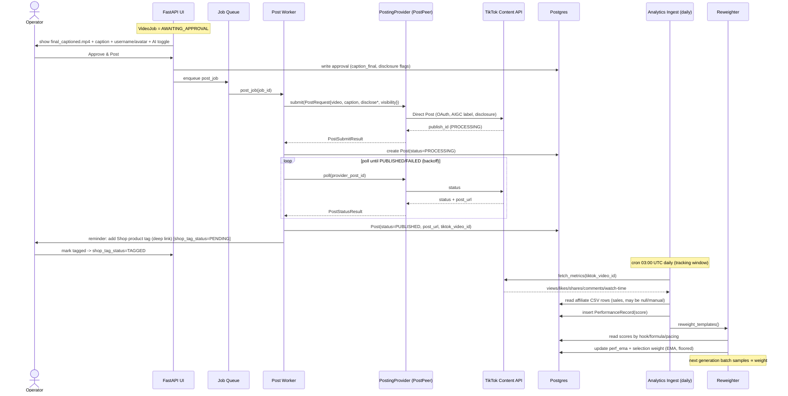

# 5. Posting, Winner-Detection Loop & Analytics

> **Scope.** This section covers everything downstream of a rendered `final_captioned.mp4`: the single human approval gate, publishing to TikTok via a posting-API wrapper, ingesting performance metrics on a schedule, and feeding results back into template selection weights so the pipeline learns what actually sells **for this operator**.
>
> **Dependencies:** `VideoJob`, `Post`, `PerformanceRecord`, `FormulaTemplate`, `HookTemplate`, `PacingTemplate` (data model, §01/02); `PostingProvider` adapter interface (§01). This section extends the `Post` and `PerformanceRecord` schemas with fields specific to posting/analytics and defines the concrete `PostingProvider` contract.

---

## 5A. The approval gate + posting

### 5A.1 The single human gate

The pipeline is fully automated **except one gate**. When rendering finishes, the `VideoJob` transitions to `AWAITING_APPROVAL` and the async worker stops touching that job. Nothing is posted without an explicit operator action.

State transitions relevant to this section (subset of the full `VideoJob` FSM in §02):

```
RENDERING ──► AWAITING_APPROVAL ──► POSTING ──► POSTED ──► TRACKING ──► DONE
                     │  ▲                │
       request re-roll│  │approve         │post failure
                     ▼  │                ▼
                 REROLL_QUEUED       POST_FAILED ──(retry/backoff)──► POSTING
                                          │ audit-not-passed / hard fail
                                          ▼
                                       DRAFT (manual publish fallback, see 5A.6)
```

**UI at the gate** (served by FastAPI + local media storage):

- Inline `<video>` player streaming `final_captioned.mp4` from local storage.
- Rendered **caption + hashtags** (editable text before approval).
- The **AI-disclosure / commercial-content** toggle state (default ON — see 5A.4), editable.
- **Pre-post confirmation panel**: the target TikTok account's `username` + `avatar` (required by TikTok policy — 5A.4). This panel *is* TikTok's mandated confirmation UX; it collapses into this same gate rather than being a second screen.
- Two primary actions: **Approve & Post** / **Approve & Schedule**, and one secondary: **Request Re-roll** (with an optional reason note; re-queues the job through the generation pipeline, incrementing `reroll_count`).

Approval is the *only* trigger for posting. On approve, the API writes an `approval` audit row (`operator_id`, `timestamp`, `caption_final`, `disclosure_flags`) and enqueues a `post_job` task.

### 5A.2 `PostingProvider` adapter interface

The app talks to TikTok **only** through a wrapper vendor so we never operate the raw OAuth/audit surface ourselves. The wrapper sits over TikTok's official **Content Posting API (Direct Post)**.

- **Primary:** PostPeer
- **Alternates:** Ayrshare, Blotato

All three are hidden behind one interface. Selection is config-driven (`POSTING_PROVIDER=postpeer|ayrshare|blotato`); the rest of the app is provider-agnostic.

```python
# posting/provider.py
from __future__ import annotations
from dataclasses import dataclass
from enum import Enum
from typing import Protocol, Optional


class PostVisibility(str, Enum):
    PUBLIC = "PUBLIC_TO_EVERYONE"
    FRIENDS = "MUTUAL_FOLLOW_FRIENDS"
    PRIVATE = "SELF_ONLY"          # only legal state for an UNAUDITED client


class PostStatus(str, Enum):
    PENDING = "PENDING"            # accepted by wrapper, not yet live
    PROCESSING = "PROCESSING"      # TikTok is transcoding
    PUBLISHED = "PUBLISHED"        # live, post_url available
    FAILED = "FAILED"


@dataclass
class PostRequest:
    account_ref: str               # wrapper-side account/profile handle
    video_path: str                # absolute path to final_captioned.mp4 (local)
    caption: str                   # <= 2200 chars incl. hashtags per TikTok
    hashtags: list[str]            # normalized without '#'; merged into caption by adapter
    visibility: PostVisibility
    disclose_commercial: bool      # branded-content / AI disclosure master flag
    disclose_your_brand: bool      # "promoting my own business"
    disclose_branded_content: bool # "promoting another brand" (paid partnership)
    is_ai_generated: bool          # TikTok AIGC label
    schedule_at: Optional[str] = None   # RFC3339 UTC; None = post now
    idempotency_key: str = ""      # dedupe key = f"{video_job_id}:{account_ref}"


@dataclass
class PostSubmitResult:
    provider_post_id: str          # wrapper's id, used for polling
    tiktok_publish_id: Optional[str]   # TikTok publish_id if surfaced
    status: PostStatus


@dataclass
class PostStatusResult:
    status: PostStatus
    post_url: Optional[str]        # canonical tiktok.com/@user/video/<id> when PUBLISHED
    tiktok_video_id: Optional[str]
    fail_reason: Optional[str]     # provider/TikTok error string on FAILED


class PostingProvider(Protocol):
    """Adapter contract. Concrete: PostPeerProvider, AyrshareProvider, BlotatoProvider."""

    def submit(self, req: PostRequest) -> PostSubmitResult: ...
    def poll(self, provider_post_id: str) -> PostStatusResult: ...
    def list_accounts(self) -> list["ProviderAccount"]: ...   # audited? username, avatar_url
    def account_capabilities(self, account_ref: str) -> "AccountCaps": ...
```

Supporting DTOs:

```python
@dataclass
class ProviderAccount:
    account_ref: str
    username: str
    avatar_url: str
    is_audited: bool               # can this account post PUBLIC? (see 5A.5 constraint 1)

@dataclass
class AccountCaps:
    can_post_public: bool
    max_posts_per_day: int         # 5 when unaudited
    supports_schedule: bool
```

### 5A.3 Example posting call (the `post_job` worker)

```python
# posting/worker.py  (async task body, simplified)
async def run_post_job(job_id: str) -> None:
    job = await repo.get_video_job(job_id)
    approval = await repo.get_latest_approval(job_id)
    account = provider.account_capabilities(job.account_ref)

    visibility = (
        PostVisibility.PUBLIC if account.can_post_public
        else PostVisibility.PRIVATE          # audit-not-passed fallback, 5A.5/5A.6
    )

    req = PostRequest(
        account_ref=job.account_ref,
        video_path=job.final_captioned_path,
        caption=approval.caption_final,
        hashtags=approval.hashtags,
        visibility=visibility,
        disclose_commercial=True,            # default ON for shop/UGC content
        disclose_your_brand=approval.disclose_your_brand,
        disclose_branded_content=approval.disclose_branded_content,
        is_ai_generated=True,                # AutoUGC output is AI-generated
        schedule_at=approval.schedule_at,
        idempotency_key=f"{job_id}:{job.account_ref}",
    )

    post = await repo.create_post(job_id=job_id, request=req, status="PENDING")
    try:
        res = provider.submit(req)
    except RateLimitError as e:
        raise Retry(delay=e.retry_after or 60)          # see 5B error handling
    except AuditNotPassedError:
        await repo.update_post(post.id, status="DRAFT_FALLBACK")
        await fsm.transition(job_id, "DRAFT")
        await notify_operator_manual_publish(job_id)
        return

    await repo.update_post(post.id,
        provider_post_id=res.provider_post_id,
        tiktok_publish_id=res.tiktok_publish_id,
        status="PROCESSING")
    await fsm.transition(job_id, "POSTING")
    await enqueue_poll_status(post.id)       # polled by the status poller, 5A.7
```

### 5A.4 AI-disclosure / commercial-content toggle

TikTok requires disclosure when content is commercial and/or AI-generated. The adapter maps our flags onto TikTok's Direct Post fields:

| App field | TikTok Direct Post field | Default for AutoUGC |
|---|---|---|
| `disclose_commercial` | `disable_comment`/branded gate → `brand_content_toggle` master | `true` |
| `disclose_your_brand` | `brand_organic_toggle` (`your_brand`) | `true` (promoting operator's shop) |
| `disclose_branded_content`| `brand_content_toggle` (`branded_content`) | `false` unless paid partnership |
| `is_ai_generated` | AIGC label (`ai_generated_content`) | `true` |

Rules enforced by the adapter before `submit`:

- If `disclose_branded_content` is true, `visibility` **cannot** be `SELF_ONLY` (TikTok rejects private branded content) — surface this at the gate.
- `is_ai_generated` is forced `true` and non-editable: all AutoUGC output is synthetic. (Operator may not disable it.)
- The final toggle state shown at the gate is exactly what is submitted (no silent server-side change).

### 5A.5 HONEST CONSTRAINTS (document these plainly for the operator)

1. **OAuth + 2–4 week audit.** TikTok's Content Posting API requires per-account OAuth **and** an app audit for *public* posting. Until audited, an app can only post **PRIVATE (`SELF_ONLY`)**, capped at **5 posts/user/day**. A wrapper vendor (PostPeer/Ayrshare/Blotato) **may** provide an already-audited client so public posting works immediately — **the operator must confirm this in writing with the vendor.** Do not assume it. `AccountCaps.can_post_public` is the runtime source of truth; if false, we fall back to draft/private (5A.6).

2. **Mandatory pre-post confirmation UX.** TikTok policy requires a confirmation screen showing the posting account's **username + avatar** before publish. We satisfy this by rendering that panel **inside the approval gate** (5A.1) — the operator's "Approve & Post" click is the confirmation. There is no separate confirmation step.

3. **Shop product-tag / affiliate anchor is NOT in any public API.** The TikTok Shop product tag / affiliate anchor that makes a video *shoppable* cannot be attached programmatically through Direct Post or any wrapper. **It stays a manual in-app tap in the TikTok app.** The app must:
   - Set `Post.shop_tag_status = "PENDING"` at publish.
   - On successful publish, surface a **clear reminder** + a **deep link** (`https://www.tiktok.com/@<user>/video/<id>` and, where available, the app deep link `snssdk1233://...`) prompting the operator to open the post and add the product/affiliate tag.
   - Let the operator mark it done → `shop_tag_status = "TAGGED"` (with timestamp). Untagged posts are visually flagged in the dashboard and excluded from "shoppable" analytics.

### 5A.6 Audit-not-passed / hard-fail fallback → DRAFT

If `can_post_public` is false and the operator wants public reach, or if `submit` raises `AuditNotPassedError`:

- Post is stored with `status = "DRAFT_FALLBACK"`, video retained locally.
- `VideoJob → DRAFT`.
- Operator is notified with a manual-publish checklist + the local file path + generated caption to copy. This keeps the pipeline usable before audit clears.

### 5A.7 Status polling

After `submit`, a lightweight poller calls `provider.poll(provider_post_id)` with backoff (e.g. 10s, 20s, 40s… capped at 5 min, max ~30 min) until `PUBLISHED` or `FAILED`:

- On `PUBLISHED`: store `post_url`, `tiktok_video_id`, set `Post.status = "PUBLISHED"`, `published_at = now()`, `VideoJob → POSTED → TRACKING`, and fire the **shop-tag reminder** (5A.5 #3). Enrol the post in analytics ingestion (5B).
- On `FAILED`: `Post.status = "FAILED"`, record `fail_reason`, `VideoJob → POST_FAILED`; apply retry policy (5B error handling).

### 5A.8 Scheduling (optional)

`schedule_at` (RFC3339 UTC) puts a post into a **scheduled queue** instead of posting immediately. A due-poller promotes scheduled posts to the `post_job` worker when `now() >= schedule_at`. Constraints:

- Only allowed when `AccountCaps.supports_schedule` is true (else the app self-schedules locally and posts at the due time).
- Scheduling respects the daily cap (5 when unaudited); over-cap posts roll to the next day and the operator is warned.
- A scheduled post still passed the approval gate first — scheduling never bypasses approval.

---

## 5B. Winner-detection loop

This is the part that turns "we produced a video" into "we produced a video that sells." The loop: **generate variants → post → ingest metrics daily → score → attribute to templates → reweight selection**. Over time the operator's *own* results steer generation.

### 5B.1 Variant generation (batch)

For a single product, generate **N variants** (default `N=4`) that differ primarily by **HookTemplate** and **format**, holding the product constant:

```python
# variants/generate.py
async def generate_variant_batch(product_id: str, n: int = 4) -> list[str]:
    product = await repo.get_product(product_id)
    hooks = await selector.pick_hooks(product, n)          # weighted, see 5B.5
    formulas = await selector.pick_formulas(product, n)    # weighted
    pacings = await selector.pick_pacings(product, n)      # weighted
    job_ids = []
    for i in range(n):
        vj = await pipeline.create_job(
            product_id=product_id,
            hook_template_id=hooks[i].id,
            formula_template_id=formulas[i].id,
            pacing_template_id=pacings[i].id,
            variant_group_id=product_id_batch_uuid,        # ties the cohort together
        )
        job_ids.append(vj.id)
    return job_ids
```

Each variant carries a `variant_group_id` so the cohort can be compared and scored relative to each other, not just in absolute terms.

### 5B.2 Duplicate / unoriginal-content suppression guard

TikTok suppresses near-identical / unoriginal content. Enforce differentiation **before render** and log it:

- **Hard rule:** every variant in a `variant_group` MUST use a **distinct** `HookTemplate`. No repeats within a cohort.
- **Differentiation score:** compute a cheap similarity across variants using (a) hook text cosine similarity (embeddings or trigram Jaccard), (b) first-3s visual/script beat, (c) audio track. Reject/regenerate any pair whose similarity `> SIM_CAP` (default `0.85`).
- **Cap near-identical outputs:** at most 1 variant per (hook_family, format) tuple per product per rolling 14 days.
- **Log what varied:** persist a `variation_manifest` on each job: `{hook_id, format, pacing_id, opening_line, cta, music_ref, sim_scores_vs_cohort}`. This is auditable evidence of differentiation.

### 5B.3 `Post` schema (extends §01)

```python
# models/post.py
class Post(Base):
    id: UUID
    video_job_id: UUID                 # FK VideoJob
    variant_group_id: UUID | None      # cohort tie
    account_ref: str

    # provider / publish
    provider: str                      # postpeer | ayrshare | blotato
    provider_post_id: str | None
    tiktok_publish_id: str | None
    tiktok_video_id: str | None
    post_url: str | None
    status: str                        # PENDING|PROCESSING|PUBLISHED|FAILED|DRAFT_FALLBACK
    visibility: str                    # PUBLIC_TO_EVERYONE | SELF_ONLY | ...
    fail_reason: str | None

    # disclosure snapshot (what was actually submitted)
    disclose_commercial: bool
    disclose_your_brand: bool
    disclose_branded_content: bool
    is_ai_generated: bool

    # shop tagging (manual, 5A.5 #3)
    shop_tag_status: str               # PENDING | TAGGED | NA
    shop_tagged_at: datetime | None
    deep_link: str | None

    # timing
    scheduled_at: datetime | None
    published_at: datetime | None
    created_at: datetime
    updated_at: datetime

    # scoring cache (denormalized latest, source of truth = PerformanceRecord)
    latest_score: float | None
    latest_metrics_at: datetime | None
```

### 5B.4 `PerformanceRecord` schema (extends §01) + ingestion

Metrics are **time-series**: one row per post per poll, so we can see trajectory (a video that keeps climbing beats one that spiked and died).

```python
# models/performance.py
class PerformanceRecord(Base):
    id: UUID
    post_id: UUID                      # FK Post
    captured_at: datetime              # poll timestamp
    source: str                        # tiktok_analytics | shop_affiliate_csv | manual

    # engagement (public analytics)
    views: int
    likes: int
    comments: int
    shares: int
    favorites: int
    avg_watch_time_s: float | None     # if exposed
    full_video_watch_rate: float | None
    reach: int | None
    profile_visits: int | None

    # commercial (mostly PRIVATE — see honest constraint below)
    product_clicks: int | None         # from Shop affiliate dashboard, often manual import
    orders: int | None
    gmv: Decimal | None                # gross merchandise value
    commission: Decimal | None

    # computed
    score: float | None                # per-record score, 5B.6
```

**Honest constraint — sales data is largely private.** TikTok's public analytics APIs expose *engagement* (views/likes/shares/comments and, sometimes, watch-time). **Conversion / sales / GMV are NOT reliably available via API.** We source them from the operator's **TikTok Shop affiliate dashboard**, which frequently means a **manual CSV import** (or a semi-scraped export). The system therefore treats:

- **Engagement** = automated daily pull, always present.
- **Sales (`orders`/`gmv`/`commission`)** = best-effort, may be null, imported via `/import/affiliate-csv`. When present, it **dominates** the score (5B.6) because it is the *real* signal; engagement is only a proxy.

### 5B.5 Scheduled analytics-ingestion job

Runs **daily** per published post for a tracking window (default 14 days post-publish), then tapers to weekly out to 30 days.

```python
# analytics/ingest.py   (scheduled: cron "0 3 * * *" UTC, per-account jitter)
async def ingest_daily() -> None:
    posts = await repo.posts_in_tracking_window(max_age_days=30)
    for post in posts:
        try:
            m = await analytics_provider.fetch_metrics(post.tiktok_video_id,
                                                        account_ref=post.account_ref)
        except RateLimitError as e:
            await backoff_and_requeue(post.id, e.retry_after); continue
        except NotFoundError:                 # deleted/removed video
            await repo.flag_post(post.id, "MEDIA_MISSING"); continue

        sales = await repo.latest_affiliate_row(post.id)   # None if not imported
        rec = PerformanceRecord(
            post_id=post.id, captured_at=now(), source="tiktok_analytics",
            views=m.views, likes=m.likes, comments=m.comments, shares=m.shares,
            favorites=m.favorites, avg_watch_time_s=m.avg_watch_time_s,
            full_video_watch_rate=m.full_video_watch_rate, reach=m.reach,
            product_clicks=(sales.clicks if sales else None),
            orders=(sales.orders if sales else None),
            gmv=(sales.gmv if sales else None),
            commission=(sales.commission if sales else None),
        )
        rec.score = compute_score(rec)                     # 5B.6
        await repo.add_performance_record(rec)
        await repo.update_post(post.id, latest_score=rec.score,
                               latest_metrics_at=rec.captured_at)

    await reweight_templates()                             # 5B.7, once per ingest cycle
```

Idempotency: `(post_id, captured_at::date, source)` is unique — re-runs on the same day upsert rather than duplicate.

### 5B.6 Scoring formula (concrete)

Per-record score, normalized so it is comparable across posts of different view counts.

**Step 1 — engagement rate (proxy signal):**

```
engagement_rate = (likes + 2*comments + 3*shares + 1.5*favorites) / max(views, 1)
watch_factor    = clamp(full_video_watch_rate, 0, 1)        # default 0.5 if null
E = engagement_rate * (0.5 + watch_factor)                  # watch-through amplifies
```

Weights reflect intent depth: a share (3) > comment (2) > favorite (1.5) > like (1).

**Step 2 — commercial rate (real signal, when available):**

```
if orders is not null and views > 0:
    conversion_rate = orders / views
    revenue_per_view = float(gmv or 0) / max(views, 1)
    C = 1000 * conversion_rate + K_REV * revenue_per_view   # K_REV default 0.5
    has_sales = True
else:
    C = 0; has_sales = False
```

**Step 3 — blend (sales dominates when present):**

```
if has_sales:
    score = 0.20 * E_scaled + 0.80 * C_scaled
else:
    score = E_scaled            # engagement-only until sales data arrives
```

Where `E_scaled`, `C_scaled` are min-max normalized against a trailing 90-day distribution of the operator's own posts (z-score → sigmoid to [0,1] also acceptable). Storing raw components lets us rescale later without re-fetching.

**Trajectory bonus (optional, applied at attribution time):** reward sustained growth —
`traj = (views_day7 - views_day1) / max(views_day1, 1)`, add `0.1 * clamp(traj, 0, 3)` to the post's aggregate score. Prevents one-day spikes from beating slow-burn winners.

### 5B.7 Attribution + weight update (closing the loop)

Each `Post` inherits its `VideoJob`'s `hook_template_id`, `formula_template_id`, `pacing_template_id`. We attribute the post's aggregate score to each of those templates and update their **selection weights**.

**Aggregate post score:** latest record score + trajectory bonus (5B.6), using the record at day-7 (or latest available).

**Weight update (exponential moving average per template):**

```python
# analytics/reweight.py
ALPHA = 0.3           # learning rate; higher = faster adaptation, noisier
DECAY = 0.98          # weekly decay pulls unused templates back toward baseline
FLOOR = 0.05          # never let a template's weight hit 0 (keeps exploration alive)

def update_template_weight(tpl, post_score_norm):   # post_score_norm in [0,1]
    # EMA of normalized performance
    tpl.perf_ema = ALPHA * post_score_norm + (1 - ALPHA) * (tpl.perf_ema or 0.5)
    # selection weight = decayed prior + performance, floored
    tpl.weight = max(FLOOR, DECAY * tpl.weight_prior + tpl.perf_ema)
    tpl.samples += 1
    tpl.updated_at = now()
```

Selection in `selector.pick_hooks/formulas/pacings` samples templates **proportional to `weight`** (softmax over weights with temperature `T`, default `T=0.7`). Result: hooks/formulas that actually earned engagement — and especially **sales** — for *this operator* get picked more often; underperformers fade but never vanish (FLOOR keeps exploration).

Attribution is **shared, not double-counted**: a post's score updates the hook, formula, and pacing EMAs independently; we do not credit one template with another's lift. (A future upgrade could use regression/Shapley attribution to disentangle — out of scope for v1.)

### 5B.8 Optional: multi-armed bandit over HookTemplates

A drop-in replacement for the softmax selector when the operator wants faster convergence:

- **Thompson sampling / Beta-Bernoulli** per HookTemplate, where "success" = post score above the operator's median (binarized), "trials" = posts using that hook. Sample `θ ~ Beta(α, β)` per hook, pick the max.
- **UCB1** alternative: `pick argmax( mean_score_i + c*sqrt(ln(total)/n_i) )`, `c` default `1.4`.
- Bandit state lives on the `HookTemplate` (`bandit_alpha`, `bandit_beta` or `bandit_mean`, `bandit_n`); the EMA weights (5B.7) remain the fallback/cold-start prior. Config flag `HOOK_SELECTOR=softmax|thompson|ucb1`.

---

## 5C. Sequence diagram (approve → post → ingest → reweight)



---

## 5D. Error handling

| Failure | Detection | Handling |
|---|---|---|
| **Posting submit fails (transient)** | 5xx / network from provider | Retry with exp backoff (30s→2m→8m, max 5); job stays `POSTING`; on exhaustion → `POST_FAILED`, notify operator. |
| **Rate limit (post)** | `429` / `RateLimitError.retry_after` | Honor `Retry-After`; requeue at that delay; never busy-loop. Respect **5 posts/day** cap when unaudited (pre-check `AccountCaps.max_posts_per_day`). |
| **Audit not passed** | `can_post_public == false` or `AuditNotPassedError` | Fallback to `visibility=SELF_ONLY` **or** `DRAFT_FALLBACK` (operator preference); `VideoJob→DRAFT`; manual-publish checklist. Never silently drop. |
| **Disclosure conflict** | branded_content + SELF_ONLY, or missing required flag | Reject at approval gate with explicit message; do not submit. |
| **Publish times out** | poller exceeds 30 min still PROCESSING | Mark `Post.status=PROCESSING_STALE`; keep a slow re-check (hourly ×24); alert operator. |
| **Video removed by TikTok** | `NotFoundError` during ingest | `Post` flagged `MEDIA_MISSING`; stop ingest; exclude from scoring; alert (possible originality/policy strike → check 5B.2 guard). |
| **Analytics rate limit** | `429` during daily pull | Per-account jitter + backoff; partial-batch OK; unfetched posts retried next cycle (idempotent upsert). |
| **Missing sales data** | affiliate CSV not imported | Score with engagement-only branch (5B.6); dashboard shows "sales unverified" badge; no crash. |
| **Duplicate content risk** | cohort similarity `> SIM_CAP` | Block render, regenerate offending variant; log to `variation_manifest`. |
| **Idempotent double-submit** | same `idempotency_key` | Provider dedup + local unique constraint on `(video_job_id, account_ref)`; return existing Post. |

---

## 5E. Acceptance criteria & tests

**5A — Approval + posting**
- [ ] A job in `AWAITING_APPROVAL` never posts without an operator approve action (test: worker ignores unapproved jobs).
- [ ] Approval gate renders username + avatar (satisfies TikTok pre-post confirmation) — asserted in UI test.
- [ ] `is_ai_generated` is always submitted `true` and cannot be toggled off (unit test on `PostRequest` builder).
- [ ] Branded-content + `SELF_ONLY` combination is rejected before `submit` (unit test).
- [ ] On `PUBLISHED`, `Post.post_url`, `tiktok_video_id`, `published_at` are set and `shop_tag_status = PENDING` with a valid `deep_link` (integration test with provider stub).
- [ ] Operator can mark a post `TAGGED`; untagged posts are flagged in dashboard (test).
- [ ] Unaudited account: adapter forces `SELF_ONLY` and enforces ≤5 posts/day; 6th same-day post is deferred (test with `AccountCaps` stub).
- [ ] `AuditNotPassedError` routes job to `DRAFT` with operator notification, video retained (test).
- [ ] Scheduled post with future `schedule_at` posts only at/after due time and still required prior approval (test).

**5B — Winner loop**
- [ ] `generate_variant_batch(n=4)` yields 4 jobs with **distinct** HookTemplates and a shared `variant_group_id` (test).
- [ ] Two variants with hook similarity `> 0.85` trigger regeneration; `variation_manifest` logs sim scores (test).
- [ ] Daily ingest inserts one `PerformanceRecord` per post per day; same-day re-run upserts (no duplicate) (test on unique constraint).
- [ ] `compute_score` uses engagement-only branch when `orders is null`, and sales-dominant (0.8 weight) branch when present (unit test, both paths).
- [ ] After ingest, a high-scoring HookTemplate's `weight` increases and a low-scoring one's decreases, both ≥ `FLOOR` (test on `update_template_weight`).
- [ ] Selector samples proportionally to weight over many draws (statistical test, tolerance-bounded).
- [ ] Bandit mode (`HOOK_SELECTOR=thompson`) selects the empirically-best hook > baseline rate after ≥30 posts (simulated test).

**5C/5D — Resilience**
- [ ] Provider `429` with `Retry-After` is honored; no more than configured attempts (test with fake clock).
- [ ] Ingest of a `NotFoundError` post flags `MEDIA_MISSING` and does not crash the batch (test).
- [ ] Full happy-path integration (approve → stub post → stub metrics → reweight) mutates at least one template weight end-to-end (integration test).

---

### File

`/home/user/skills/spec/05-posting-winner-loop.md`

**Summary (3 lines):**
1. Defines the single approval gate (which doubles as TikTok's required username/avatar pre-post confirmation), a provider-agnostic `PostingProvider` adapter over PostPeer/Ayrshare/Blotato → TikTok Direct Post, with AI-disclosure toggles, status polling, scheduling, and honest constraints (2–4wk audit → private/5-per-day fallback; Shop product tag stays a manual tap with reminder + deep link).
2. Specifies the winner-detection loop: differentiated variant batches (anti-duplicate guard), extended `Post` + time-series `PerformanceRecord` schemas, a daily analytics-ingestion job, and a concrete engagement-proxy + sales-dominant scoring formula that attributes back to Hook/Formula/Pacing templates via floored EMA weights (optional Thompson/UCB bandit).
3. Includes a Mermaid approve→post→ingest→reweight sequence diagram, a full error-handling matrix (posting failures, rate limits, audit-not-passed→draft, missing sales data), and acceptance criteria/tests covering both the posting path and the learning loop.
