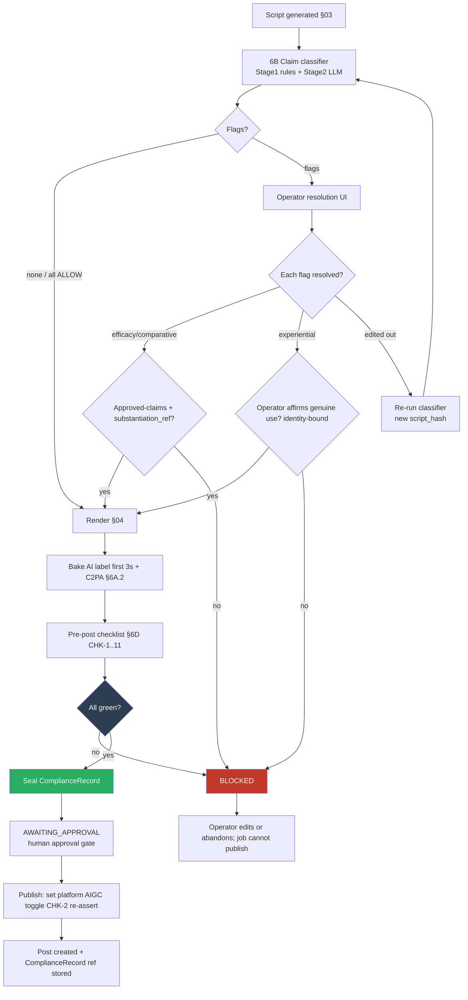

# 6. Compliance & Legal Guardrails Engine

> **Project:** AutoUGC-TH — locally-run (Docker Compose) pipeline that turns a product URL into a post-ready, TikTok-Shop-compliant Thai short video using a reusable AI avatar of the **operator's own consented likeness**.
>
> **This section is the authority on compliance.** The script generator (§03) and editor (§04) MUST call the interfaces defined here; they do not implement their own rules. The canonical data model (`ConsentRecord`, `ComplianceRecord`, `VideoJob`, `Post`) lives in §01 — this section specifies the compliance-relevant fields and the enforcement logic that reads/writes them.

> ⚠️ **NOT LEGAL ADVICE.** This document translates researched regulatory facts (as of 2026-07) into software controls for engineering. It is **not** legal advice and does not create an attorney–client relationship. Rules, dollar amounts, and effective dates change and vary by fact pattern. **Qualified legal counsel (US/FTC, EU, and Thai) MUST review the claim taxonomy, disclosure copy, consent template, and jurisdiction table before production launch and on a recurring cadence thereafter.** Where this spec and counsel disagree, counsel wins; encode their determinations in the versioned rule tables below.

---

## 6.0 Design principles (apply to the whole engine)

1. **Fail safe / fail closed.** Any ambiguity, classifier error, timeout, missing record, or unknown category → **BLOCK**. A job may never reach a postable state on a default/allow path.
2. **Deterministic gate, probabilistic assist.** The final go/no-go is a set of deterministic boolean checks (§6D). LLM classifiers only *raise flags and propose routing*; they never *grant* a pass.
3. **Everything is logged, nothing is mutable.** Every decision writes an append-only `ComplianceRecord` event. The audit trail is the product's core legal defense.
4. **Human accountability on experiential/efficacy claims.** Software can block, but only the identified operator can *affirm* a first-person claim as genuinely true (§6B). That affirmation is captured with identity + timestamp.
5. **Config as versioned data, not code.** Rule tables (claim taxonomy, category rules, disclosure strings, jurisdiction map) are versioned YAML/DB rows with a `ruleset_version`. Every `ComplianceRecord` pins the `ruleset_version` used, so a decision can be reproduced years later.

---

## 6A. TikTok Shop policy compliance (2026)

### 6A.1 Content-form rules → editor (§04) constraints

The editor MUST produce, and the pre-post checker MUST verify, that every shoppable recorded video satisfies:

| ID | Rule | Enforced control | Verifier (auto) |
|----|------|------------------|-----------------|
| `TT-FORM-1` | Real-environment look (not obviously synthetic/void background) | B-roll & avatar composited into a plausible environment scene; ban flat/void backgrounds in the shoppable segment | Background-variance heuristic + scene-preset allowlist |
| `TT-FORM-2` | Camera movement present | Editor injects ≥1 camera move (pan/push/handheld jitter) per shot | Optical-flow motion score ≥ threshold over duration |
| `TT-FORM-3` | Face shown **with** the physical product in frame | Require ≥1 segment where avatar face bbox and product bbox co-occur | Face-detect ∧ product-detect co-occurrence ≥ 1.0s |
| `TT-FORM-4` | ≥3s dynamic content; no static/looping | Min duration gate + inter-frame delta gate; reject looped/frozen frames | Duration ≥ 3.0s AND frame-delta entropy above floor; loop-detector = false |
| `TT-FORM-5` | Avatar = consented, identity-verified real person (the operator) | Avatar asset must reference a valid `ConsentRecord` whose `subject_is_operator = true` and `identity_verified = true` | `consent_valid()` (see §6D) |

**Note on the AI-voice ban (do not over-block):** TikTok's "no AI voice / real-time human required" rule is **livestream-scoped**. AutoUGC-TH produces **recorded** videos, so an AI/cloned voice is **permitted with disclosure** (§6A.2). The pipeline MUST NOT block a recorded job merely for using a cloned/synthetic voice; it MUST instead ensure disclosure + a voice-licensed `ConsentRecord` (`TT-FORM-5`, §6C). Anonymous or third-party likeness/voice is banned → blocked at consent validation.

### 6A.2 AI disclosure (enforced, not optional)

Two independent obligations, both required, checked separately:

| ID | Obligation | Control | Verifier |
|----|------------|---------|----------|
| `TT-DISC-1` | Visible "AI-generated" label baked into the **first 3 seconds** | Editor renders an on-screen label overlay (localized Thai + "AI-generated") spanning `t=0.0s → t≥3.0s`, min size/contrast per §6C.4 | Overlay presence in first 3s verified via render manifest + OCR spot-check |
| `TT-DISC-2` | Platform AIGC / commercial-content disclosure toggle set at post time | Publisher sets the AIGC/branded-content disclosure flag in the post payload | `Post.aigc_disclosure_set = true` asserted before publish |
| `TT-DISC-3` | C2PA provenance metadata attached | Editor embeds C2PA manifest (platform may auto-label from it; belt-and-suspenders) | C2PA manifest present in output container |

**Reach note (encode as operator-facing UI copy, not a control):** Correct labeling does **not** reduce reach. **Non-labeling** triggers Account Health penalties (score 0–1000; severe/repeat can end the shop). Therefore labeling is non-negotiable and cannot be disabled by the operator.

### 6A.3 Category-restricted AI imagery

For sensitive verticals, AI visuals must be **non-embellishing** — they may depict the product accurately but must not exaggerate results, appearance, size, effect, or outcome.

| ID | Category | Rule | Control |
|----|----------|------|---------|
| `TT-CAT-1` | beauty / cosmetics | No AI-embellished before/after, skin-smoothing, or result imagery | Force `embellishment_profile = "none"` on b-roll gen; block result-implying shots |
| `TT-CAT-2` | supplements / health | No AI imagery implying physiological effect | Same; plus claim gate (§6B) hard-blocks efficacy |
| `TT-CAT-3` | baby / maternity | No AI-embellished safety/outcome imagery | Same; conservative visual preset |
| `TT-CAT-4` | electronics | No AI-exaggerated performance/spec visuals | Same; attribute-only overlays |

`VideoJob.category` drives this. **Unknown/unmapped category → treat as restricted (fail safe).**

---

## 6B. The claim-safety gate (sharpest risk)

This is the single highest-liability control in the system. Two overlapping legal exposures:

- **Fake testimonials / deceptive endorsements** — US **FTC Rule on Consumer Reviews and Testimonials (2024)**, civil penalties up to **~$51,744 per violation**, and **Thai OCPB** false-/exaggerated-claim enforcement.
- **Unsubstantiated efficacy/health/whitening/anti-aging claims** — **Thai FDA** (cosmetics/food/health-product advertising control).

**Consent does NOT cure a false claim.** A signed avatar consent does not make a fabricated experiential statement true. The gate operates independently of consent.

### 6B.1 What is allowed vs blocked

| Claim class | Example | Default | Path to allow |
|-------------|---------|---------|---------------|
| **Attribute** (verifiable product fact) | "This serum is 30ml, fragrance-free." | ALLOW (still logged) | Auto-pass if traceable to product data / merchant approved-claims library |
| **Experiential first-person** | "I use this every day and it cleared my skin." | **BLOCK** | Operator explicitly affirms via verification toggle that **they genuinely experienced it** → routes to `OPERATOR_VERIFIED`. Because the avatar *is* the operator, a genuine experience is a lawful first-person endorsement. |
| **Efficacy / health / whitening / anti-aging** | "Whitens skin in 7 days.", "Cures acne." | **BLOCK (hard)** | Only if drawn from a **merchant-supplied approved-claims library** entry **with a logged substantiation reference**. Never auto-invented. Health-disease claims may be categorically disallowed pending counsel. |
| **Comparative / superlative** | "The best in Thailand.", "#1 whitening cream." | **BLOCK** | Requires substantiation reference in approved-claims library. |
| **Guarantee / financial / safety** | "Money-back guaranteed results.", "100% safe." | **BLOCK** | Counsel-reviewed approved-claims entry only. |

**Rule of construction:** the classifier can only ever move a segment toward **BLOCK** or **NEEDS-OPERATOR-VERIFICATION**. It can never auto-approve an experiential/efficacy/comparative/guarantee claim. Auto-pass is reserved for attribute claims with a data source.

### 6B.2 Pipeline placement

The claim gate is a mandatory pipeline stage between script generation (§03) and rendering (§04):

```
§03 script  ──►  [6B claim-classifier]  ──►  flags?
                                              │
                    no flags ─────────────────┘──►  §04 render
                                              │
                    flags ────►  operator resolution UI  ────►  all resolved? ──► §04 render
                                              │                        │
                                              └──────── unresolved ─────┘──► BLOCKED (cannot render)
```

The classifier runs on the **final** script text (post any rewrite). If §03 rewrites after classification, the gate **re-runs** (classification is bound to a script hash; a changed hash invalidates prior results).

### 6B.3 Classifier design

**Hybrid: deterministic rules first, LLM second, human last.**

**Stage 1 — Rule pre-filter (deterministic, cheap, high-recall).**
Regex/keyword lexicons per language (Thai + English) for high-risk trigger terms: whitening (ขาว/ขาวใส/ผิวขาว), anti-aging (ลดริ้วรอย/อ่อนกว่าวัย), cure/treat (รักษา/หาย), guarantee (รับประกัน), superlatives (ดีที่สุด/อันดับ 1), first-person experience markers ("I use", "ฉันใช้", "หลังจากใช้"). Any hit forces the segment into Stage 2 and can never be dropped by Stage 2 to ALLOW without a source.

**Stage 2 — LLM classifier (JSON-structured, per sentence/segment).**
Uses Claude with a strict JSON schema output. Temperature 0. The prompt is versioned (`classifier_prompt_version`).

**Stage 2 output schema (per segment):**
```json
{
  "segment_id": "seg_003",
  "text": "หลังจากใช้ 2 สัปดาห์ ผิวฉันกระจ่างใสขึ้น",
  "class": "EXPERIENTIAL | EFFICACY_HEALTH | COMPARATIVE | GUARANTEE | ATTRIBUTE | NEUTRAL",
  "is_first_person": true,
  "risk": "HIGH | MEDIUM | LOW",
  "decision": "BLOCK | NEEDS_OPERATOR_VERIFICATION | NEEDS_SUBSTANTIATION | ALLOW",
  "matched_rules": ["TH_WHITENING", "EXPERIENTIAL_FIRST_PERSON"],
  "rationale": "First-person efficacy/whitening claim; Thai FDA + FTC exposure."
}
```

**Stage 2 prompt sketch (store in `prompts/claim_classifier.md`, versioned):**
```
SYSTEM:
You are a compliance claim classifier for Thai-market shoppable video scripts.
You classify each segment; you NEVER approve risky claims. Output STRICT JSON only.

Definitions:
- EXPERIENTIAL: a first-person account of using/experiencing the product
  ("I use it", "it worked for me", "my skin cleared").
- EFFICACY_HEALTH: any claim of physiological result, cure, treatment,
  whitening, anti-aging, weight loss, or health benefit.
- COMPARATIVE: best/only/#1/superlative or comparison to others.
- GUARANTEE: promises of results, safety guarantees, refunds tied to results.
- ATTRIBUTE: an objective, verifiable product fact (size, ingredient list,
  price, material, color).
- NEUTRAL: none of the above.

Decision rules (MANDATORY):
- EFFICACY_HEALTH, COMPARATIVE, GUARANTEE  -> NEEDS_SUBSTANTIATION (never ALLOW here).
- EXPERIENTIAL (is_first_person=true)      -> NEEDS_OPERATOR_VERIFICATION.
- ATTRIBUTE                                 -> ALLOW only if it is a plain product
                                               fact; otherwise NEEDS_SUBSTANTIATION.
- Any uncertainty                           -> choose the more restrictive decision.
- Never output ALLOW for EFFICACY_HEALTH/COMPARATIVE/GUARANTEE/EXPERIENTIAL.

Return an array of segment objects matching the schema. JSON only, no prose.

USER:
category: {{category}}
approved_claims_library: {{approved_claim_ids_and_text}}
script_segments: {{segments}}
```

**Stage 3 — Resolution & reconciliation (deterministic).**
The engine reconciles Stage 1 ∪ Stage 2 and takes the **most restrictive** decision per segment. Then:

| Reconciled decision | Routing |
|---------------------|---------|
| `ALLOW` (attribute w/ source) | Auto-pass; log with source ref. |
| `NEEDS_SUBSTANTIATION` | Auto-pass **iff** matched to an `approved_claims_library` entry **with** a non-empty `substantiation_ref`; else **BLOCK**. |
| `NEEDS_OPERATOR_VERIFICATION` | Route to operator UI; operator must toggle **"I genuinely use/experienced this"** (identity-bound). Affirm → pass; decline/no-action → BLOCK. |
| `BLOCK` | Hard block. Operator may edit script (→ re-run gate) but cannot override. |

**Every claim decision writes a `ClaimDecision` event** into the `ComplianceRecord` (§6C.3), including who affirmed, when, and the `substantiation_ref` used.

**Failure handling:** classifier timeout / malformed JSON / model error → the affected segments default to `BLOCK`. No silent pass.

---

## 6C. Consent, likeness & disclosure records

### 6C.1 ConsentRecord (compliance-relevant fields)

Backs **ELVIS Act** tool-liability exposure, **Thai PDPA** (biometric/voice = explicit consent), and forward-compat with the **NO FAKES Act** (build revocation + takedown now).

```jsonc
// ConsentRecord (canonical model in §01; compliance-critical fields shown)
{
  "consent_id": "cns_01H...",
  "subject_name": "Operator legal name",
  "subject_is_operator": true,            // TT-FORM-5 requires true
  "identity_verified": true,              // KYC/ID check completed
  "identity_verification_ref": "kyc_...", // evidence pointer
  "biometric_explicit_consent": true,     // PDPA: face likeness
  "voice_licensed": true,                 // explicit, separate voice grant
  "scope": {
    "media_types": ["avatar_video", "cloned_voice"],
    "categories": ["beauty", "electronics"],   // permitted product verticals
    "territory": ["TH"],
    "usage": ["recorded_shoppable_video"]
  },
  "term": { "start": "2026-01-01", "end": "2027-01-01" },
  "revocable": true,
  "revoked": false,
  "revoked_at": null,
  "takedown_contact": "ops@...",          // NO FAKES-style path
  "signature_ref": "sig_...",             // signed consent artifact
  "ruleset_version": "2026.07.0",
  "created_at": "2026-01-01T00:00:00Z"
}
```

**Validation predicate `consent_valid(job)` (all must hold):**
- `subject_is_operator == true` AND `identity_verified == true`
- `biometric_explicit_consent == true`; if job uses cloned voice → `voice_licensed == true`
- `revoked == false`
- `now` within `[term.start, term.end]`
- `job.category ∈ scope.categories` AND `TH ∈ scope.territory` AND `"recorded_shoppable_video" ∈ scope.usage`

Any false → **BLOCK** and record `consent_invalid` reason.

**Revocation / takedown path (must exist):** revoking a consent (`revoked = true`) MUST (a) immediately fail `consent_valid()` for all future jobs, (b) flag existing `Post`s referencing that consent for takedown/review, and (c) write a revocation event. Provide an operator+subject-facing takedown request endpoint.

### 6C.2 Dual disclosure concept

Two conceptually distinct disclosures — encode both, even though endorser-deception risk is low here because the operator *is* the person:

| Disclosure | Meaning | Legal basis | Where satisfied |
|------------|---------|-------------|-----------------|
| **Medium disclosure** — "AI-generated content" | The content was synthetically generated | EU AI Act Art. 50 (from **2 Aug 2026**), FTC, Thai OCPB visible-label rule | `TT-DISC-1` baked label + `TT-DISC-2` platform toggle + `TT-DISC-3` C2PA |
| **Endorser disclosure** — "this presenter is an AI avatar" | The on-screen presenter is synthetic | EU AI Act Art. 50, FTC endorsement guides | Baked-label copy explicitly states AI avatar; low deception risk since subject = operator, but still labeled |

Disclosure copy (Thai + English) is a versioned string in the ruleset; counsel reviews wording.

### 6C.3 ComplianceRecord (audit trail — immutable)

One per `VideoJob`; append-only event log. This is the legal defense artifact.

```jsonc
{
  "compliance_id": "cmp_01H...",
  "video_job_id": "job_...",
  "ruleset_version": "2026.07.0",
  "classifier_prompt_version": "cc-2026.07.0",
  "script_hash": "sha256:...",            // binds decisions to exact script
  "consent_ref": "cns_...",
  "consent_valid_at_decision": true,

  "disclosure": {
    "label_baked_first_3s": true,         // TT-DISC-1
    "label_render_evidence": "ocr_...",   // OCR/manifest proof
    "platform_toggle_set": true,          // TT-DISC-2 (set at post time)
    "c2pa_embedded": true                 // TT-DISC-3
  },

  "category": "beauty",
  "category_rules_satisfied": true,       // TT-CAT-*

  "claim_decisions": [                     // one per flagged segment
    {
      "segment_id": "seg_003",
      "text_hash": "sha256:...",
      "class": "EFFICACY_HEALTH",
      "final_decision": "BLOCK",
      "resolved": true,
      "resolution": "REMOVED_BY_EDIT",
      "substantiation_ref": null,
      "operator_affirmed": false,
      "actor": null,
      "timestamp": "2026-07-29T..."
    },
    {
      "segment_id": "seg_007",
      "class": "EXPERIENTIAL",
      "final_decision": "NEEDS_OPERATOR_VERIFICATION",
      "resolved": true,
      "resolution": "OPERATOR_VERIFIED",
      "operator_affirmed": true,
      "actor": "user_operator_id",
      "actor_identity_ref": "kyc_...",
      "timestamp": "2026-07-29T..."
    }
  ],

  "checklist_result": { "passed": true, "checks": [ /* §6D rows */ ] },
  "events": [ /* append-only: created, classified, blocked, verified, revoked... */ ],
  "created_at": "2026-07-29T...",
  "sealed_at": "2026-07-29T..."           // set when checklist passes; record frozen
}
```

**Immutability requirements:** append-only `events`; no update/delete of prior events; each event `{ts, actor, type, payload_hash, prev_hash}` forming a hash chain (tamper-evident). Persist beyond `Post` deletion (retain per counsel-defined retention, e.g. term of consent + statute of limitations).

### 6C.4 Baked-label rendering spec (for §04)

- Position: within title-safe area, first-3s overlay, persistent ≥ `t=0.0→3.0s` (may persist longer).
- Copy: localized string set, e.g. Thai `"เนื้อหาที่สร้างด้วย AI"` + `"AI-generated"` (final wording = ruleset value, counsel-approved).
- Legibility: min height ≥ 4% of frame height; contrast ratio ≥ 4.5:1 against backdrop (add scrim if needed).
- Evidence: editor emits a render manifest asserting overlay time-range + a rendered-frame OCR check stored as `label_render_evidence`.

---

## 6D. Compliance checklist gate (pre-post)

A **VideoJob cannot leave `AWAITING_APPROVAL`** (and can never be published) unless **all** checks below are green. This is deterministic and runs on the final rendered artifact + records. Approval gate is the single human touchpoint; even an approving human cannot bypass a red check.

### 6D.1 Checklist rule table (testable)

| ID | Check | Data source | Pass condition | On fail |
|----|-------|-------------|----------------|---------|
| `CHK-1` | AI label present in first 3s | render manifest + OCR | `label_baked_first_3s == true` AND covers `0.0–3.0s` | BLOCK |
| `CHK-2` | Platform disclosure toggle configured | `Post` payload | `platform_toggle_set == true` | BLOCK |
| `CHK-3` | C2PA provenance embedded | output container | `c2pa_embedded == true` | BLOCK |
| `CHK-4` | No unresolved flagged claims | `ComplianceRecord.claim_decisions` | every decision `resolved == true` AND none with `final_decision==BLOCK & resolution∈{unresolved,override}` | BLOCK |
| `CHK-5` | All EFFICACY/COMPARATIVE/GUARANTEE claims have substantiation | `claim_decisions` | each such passed claim has non-empty `substantiation_ref` from approved library | BLOCK |
| `CHK-6` | All EXPERIENTIAL claims operator-verified | `claim_decisions` | each such passed claim has `operator_affirmed==true` + `actor_identity_ref` | BLOCK |
| `CHK-7` | Category AI-imagery rules satisfied | §6A.3 evaluation | `category_rules_satisfied == true`; category is known/mapped | BLOCK |
| `CHK-8` | Consent valid & not revoked | `consent_valid(job)` | predicate true at check time | BLOCK |
| `CHK-9` | Content-form rules met | editor verifiers | `TT-FORM-1..5` all true (≥3s, motion, face+product, real-env, verified avatar) | BLOCK |
| `CHK-10` | Script hash matches classified hash | records | `render.script_hash == ComplianceRecord.script_hash` | BLOCK (re-run gate) |
| `CHK-11` | Ruleset version current & not deprecated | ruleset registry | `ruleset_version` active | WARN→BLOCK if deprecated |

**Aggregate:** `checklist.passed = AND(all rows)`. On pass, seal the `ComplianceRecord` (`sealed_at`) and allow transition `AWAITING_APPROVAL → APPROVED → PUBLISHING`. `CHK-2` is (re)asserted at post time since the toggle is set on the publish payload.

### 6D.2 Gate flow (Mermaid)



---

## 6E. Jurisdiction → control map

| Jurisdiction / Regime | Core obligation | Concrete control(s) in this engine |
|-----------------------|-----------------|------------------------------------|
| **TikTok Shop policy (2026)** | Real-env, motion, face+product, ≥3s dynamic; AI-voice ban is livestream-only; disclosure required; category limits | `TT-FORM-1..5`, `TT-DISC-1..3`, `TT-CAT-1..4`, `CHK-1,2,3,7,9` |
| **US FTC — Testimonials/Reviews Rule (2024), Endorsement Guides** | No fake/unsubstantiated testimonials; ~$51,744/violation; clear AI/endorser disclosure | `6B` claim gate (EXPERIENTIAL → operator-verified; efficacy → substantiation), `CHK-4,5,6`; dual disclosure §6C.2 |
| **EU AI Act — Art. 50 (from 2 Aug 2026)** | Transparency: mark AI-generated content & synthetic media | `TT-DISC-1` baked label (medium), endorser disclosure §6C.2, `TT-DISC-3` C2PA, `CHK-1,3` |
| **Thai OCPB (Consumer Protection)** | Ban false/exaggerated ads; visible AI label | `6B` gate, visible label `TT-DISC-1`, `CHK-1,4,5` |
| **Thai FDA (cosmetics/food/health advertising)** | No unapproved efficacy/whitening/anti-aging/health claims | `6B` EFFICACY_HEALTH → hard block unless approved-claims + substantiation; `TT-CAT-1,2,3`; `CHK-5` |
| **Thai PDPA** | Biometric & voice data → explicit consent | `ConsentRecord.biometric_explicit_consent`, `voice_licensed`; `consent_valid()`; `CHK-8` |
| **ELVIS Act (voice/likeness)** | Tool liability for unauthorized voice/likeness | Consented, identity-verified operator only; `subject_is_operator`, `identity_verified`; ban third-party likeness at `TT-FORM-5` |
| **NO FAKES Act (forward-compat)** | Consent verification + takedown/revocation | Revocation path §6C.1, takedown endpoint, retro flag of published `Post`s |

---

## 6F. Acceptance criteria & tests

Each maps to an automated test. Compliance tests are **release-blocking**; a failing compliance test fails CI.

### 6F.1 Claim gate
- `AC-6B-1` A script with `"หลังจากใช้ผิวขาวขึ้น"` (whitening efficacy) → classified `EFFICACY_HEALTH`, decision `BLOCK`; job cannot render. **Test:** feed fixture, assert render blocked + `ClaimDecision` logged.
- `AC-6B-2` A first-person `"I use this every day"` → `NEEDS_OPERATOR_VERIFICATION`; renders only after identity-bound affirmation; `operator_affirmed==true` + `actor_identity_ref` present.
- `AC-6B-3` Efficacy claim matched to approved-claims library **with** `substantiation_ref` → passes; **without** ref → blocks. (Two fixtures.)
- `AC-6B-4` Attribute claim `"30ml, fragrance-free"` with product-data source → `ALLOW`, auto-pass, logged.
- `AC-6B-5` Classifier returns malformed JSON / times out → all affected segments `BLOCK` (fail-safe). Inject fault, assert no pass.
- `AC-6B-6` Editing out a flagged claim changes `script_hash` → classifier re-runs; stale decision cannot satisfy `CHK-10`.
- `AC-6B-7` Classifier can never emit `ALLOW` for EXPERIENTIAL/EFFICACY/COMPARATIVE/GUARANTEE — property test over generated inputs.

### 6F.2 Disclosure & form
- `AC-6A-1` Rendered output lacking the first-3s AI label → `CHK-1` fails → not postable. OCR/manifest asserted.
- `AC-6A-2` Publish attempted without platform AIGC toggle → `CHK-2` fails at post time; publish aborts.
- `AC-6A-3` C2PA manifest absent → `CHK-3` fails.
- `AC-6A-4` Recorded video with cloned voice + disclosure + `voice_licensed` consent → **allowed** (regression guard: do not over-block recorded AI voice).
- `AC-6A-5` Video <3s or with static/looped frames or no camera motion or no face+product co-occurrence → `TT-FORM-*`/`CHK-9` fails.
- `AC-6A-6` Beauty category with embellished before/after b-roll → `TT-CAT-1`/`CHK-7` fails.
- `AC-6A-7` Unknown/unmapped category → treated as restricted → blocked (fail-safe).

### 6F.3 Consent
- `AC-6C-1` Job whose `category ∉ consent.scope.categories` → `consent_valid()` false → `CHK-8` fails.
- `AC-6C-2` Expired term / territory ≠ TH / `subject_is_operator==false` / `identity_verified==false` → blocked (four cases).
- `AC-6C-3` Cloned-voice job with `voice_licensed==false` → blocked.
- `AC-6C-4` Revoking consent → all subsequent jobs blocked immediately AND existing `Post`s flagged for takedown; revocation event written.

### 6F.4 Audit trail & checklist
- `AC-6D-1` A fully compliant job passes all `CHK-1..11`, `ComplianceRecord` sealed, transitions to `AWAITING_APPROVAL`.
- `AC-6D-2` Any single red check keeps job out of `AWAITING_APPROVAL`; human approver cannot override a red check.
- `AC-6D-3` `ComplianceRecord.events` is append-only; attempt to mutate/delete a prior event fails; hash chain (`prev_hash`) verifies.
- `AC-6D-4` Every decision pins `ruleset_version` + `classifier_prompt_version` + `script_hash`; a sealed record is reproducible.
- `AC-6D-5` `ComplianceRecord` survives deletion of its `Post` (retention policy).

### 6F.5 Fail-safe meta-test
- `AC-META-1` Fuzz: for N randomized scripts/categories/consent states, the system **never** reaches a postable state on a default/error/timeout path. Any pass must be traceable to an explicit green checklist. (Property/invariant test.)

---

### File & summary

**File:** `/home/user/skills/spec/06-compliance-guardrails.md`

**Summary (3 lines):**
1. Defines the enforceable compliance engine: a fail-safe claim-safety gate (LLM+rules classifier that only ever blocks or routes experiential/efficacy claims to identity-bound operator verification or approved-claims substantiation), TikTok content-form + dual AI-disclosure controls, and a deterministic 11-check pre-post gate that alone can release a job from `AWAITING_APPROVAL`.
2. Specifies the immutable, hash-chained `ComplianceRecord` and the consent/likeness `ConsentRecord` (PDPA/ELVIS/NO-FAKES-ready with revocation + takedown), a jurisdiction→control map (TikTok/FTC/EU AI Act/Thai OCPB+FDA+PDPA), and release-blocking acceptance tests.
3. All rule tables are versioned data pinned into every decision; this is **not legal advice** and the taxonomy, disclosure copy, consent template, and jurisdiction map require US/EU/Thai counsel review before launch.
