# 7. Frontend / UX Design + Delivery Plan

> **Section owner:** Frontend eng + Delivery lead
> **Depends on:** §1 Architecture (state machine, job model), §2 Research, §3 Generation, §4 Editing/Captions, §5 Posting/Winner-loop, §6 Compliance
> **Audience:** the build team. This is a developer-ready spec: wireframes, component tree, state model, and the full REST/WS API contract are below, followed by the team delivery plan.

---

## 7A. Frontend / UX Specification

### 7A.0 Design principles

**"One URL in, one approval out."** The operator's entire happy path is: paste a URL, walk away, come back to one approval screen, click **Approve → Post**. Every screen is judged against click-count on that path.

Concrete rules:

1. **Zero-config after first run.** All keys, avatar, consent, and TikTok OAuth are captured once in the Setup Wizard. Steady-state usage never asks for configuration.
2. **The approval gate is the only mandatory human interaction.** Everything before it is autonomous; everything after it (except the manual TikTok-Shop product tag) is autonomous.
3. **Single operator, local app.** No multi-tenant auth, no roles, no sharing. Optional single local password (env `APP_PASSWORD`); if unset, the app is open on `localhost`. No account system, no SSO.
4. **Never block on background work.** The UI is a thin, real-time view over the backend job state machine. The browser tab can be closed and reopened at any point without losing state — all truth lives in Postgres, streamed over WebSocket.
5. **Cost is always visible.** A persistent header chip shows cost-to-date and the budget guard state, because ~$3/video only stays cheap if it's watched.
6. **Compliance is a hard gate, rendered honestly.** The Approve button is physically disabled until the compliance checklist is all-green. No override in v1.

**Stack:** React 18 + TypeScript, Vite, TanStack Query (server cache) + Zustand (local UI state), Tailwind for layout, `wavesurfer`/native `<video>` for preview, a single typed API client. No SSR, no routing framework beyond React Router. Served as static assets by the FastAPI container or a sidecar `nginx`.

---

### 7A.1 Screen 1 — First-Run Setup Wizard

**Purpose:** capture everything the pipeline needs, once, so all later runs are one-click. Shown automatically until `GET /api/setup/status` reports `complete: true`. Resumable — each step persists on completion, so a half-finished wizard survives a restart.

**Steps (linear, with a progress rail):**

| # | Step | Key elements | Actions / validation |
|---|------|--------------|----------------------|
| 1 | **API Keys** | One row per provider: HeyGen, ElevenLabs, fal.ai, Apify **or** Firecrawl (scraper choice), PostPeer, LLM (Anthropic/OpenAI). Masked input + "Test" button per key. | `POST /api/setup/keys` writes to encrypted secret store; "Test" hits `POST /api/setup/test-key/{provider}` which does a cheap live auth call and returns green/red + latency. Cannot advance until all required keys are green. |
| 2 | **Avatar + Voice** | Upload/record consent footage → create reusable HeyGen avatar; upload voice sample → create ElevenLabs voice. Shows creation job progress; renders a 5-sec test clip when ready. | `POST /api/setup/avatar`, `POST /api/setup/voice`. Persists `avatar_id`, `voice_id`. Test clip via `POST /api/setup/avatar/preview`. |
| 3 | **Consent record** | Displays the generated consent text (operator authorizes their likeness/voice for synthetic UGC). Typed-name signature + timestamp + checkbox. | `POST /api/setup/consent` stores an immutable, hashed consent record (see §6). Required — blocks generation legally. |
| 4 | **TikTok connect** | "Connect TikTok" → OAuth popup (via PostPeer or direct). Shows connected handle + token-expiry. | `GET /api/setup/tiktok/oauth-url` → popup → callback `POST /api/setup/tiktok/callback`. Surfaces the **audit-delay warning** (§ risk register): new/unaudited accounts may not post immediately. |
| 5 | **Seed accounts** | Add TikTok handles / hashtags / sound IDs to define the swipe-mining set. Optional niche presets. | `POST /api/setup/seeds`. Feeds §2 mining. Can be edited later in Settings. |
| 6 | **Review + finish** | Summary of all six; "Finish" flips setup to complete. | `POST /api/setup/complete`. |

```
┌──────────────────────────────────────────────────────────┐
│  AutoUGC-TH · First-run setup                    [1/6]    │
│  ●───●───○───○───○───○   Keys Avatar Consent TikTok Seeds │
│──────────────────────────────────────────────────────────│
│  Connect your API keys                                    │
│                                                          │
│  HeyGen        [•••••••••••••••]   [Test]   ✓ 220ms      │
│  ElevenLabs    [•••••••••••••••]   [Test]   ✓ 180ms      │
│  fal.ai        [•••••••••••••••]   [Test]   ✓ 340ms      │
│  Scraper  (○ Apify  ● Firecrawl)                          │
│                [•••••••••••••••]   [Test]   ✗ 401         │
│  PostPeer      [•••••••••••••••]   [Test]   — untested   │
│  LLM           [•••••••••••••••]   [Test]   ✓ 90ms       │
│                                                          │
│                                   [ Back ]  [ Next → ]   │
└──────────────────────────────────────────────────────────┘
```

---

### 7A.2 Screen 2 — Dashboard / Job List

**Purpose:** home base. Every video and its pipeline state at a glance; the one place cost lives.

**Key elements:**
- Persistent header: logo, **cost-to-date chip** ($ spent today / this month vs. budget), **budget-guard state** (OK / warning / hard-stopped), `[ + New Video ]` primary button.
- Job table, one row per video: thumbnail, product name, **current state** (badge colored by state-machine phase), progress bar, cost-so-far, created-at, quick actions.
- **`AWAITING_APPROVAL` rows are pinned to the top and highlighted** — that is where the operator's attention is needed.
- Filter/segment: All · Needs approval · In progress · Posted · Failed.
- Empty state → CTA into New Video.

State badges map 1:1 to the §1 state machine: `QUEUED → RESEARCHING → MINING → SCRIPTING → GENERATING → EDITING → CAPTIONING → AWAITING_APPROVAL → POSTING → POSTED → (WINNER) / FAILED / REJECTED`.

```
┌───────────────────────────────────────────────────────────────────────┐
│ AutoUGC-TH        💰 $18.40 / $150 mo  · guard: OK      [ + New Video ] │
│───────────────────────────────────────────────────────────────────────│
│ [All] [Needs approval •1] [In progress] [Posted] [Failed]              │
│───────────────────────────────────────────────────────────────────────│
│ ▸ ★ Collagen Serum      ⏳ AWAITING_APPROVAL  ▓▓▓▓▓▓▓░ 88%  $2.90  ⟶   │
│───────────────────────────────────────────────────────────────────────│
│   Hair Vitamin Gummies    GENERATING          ▓▓▓▓░░░░ 52%  $1.40  ⟶   │
│   Mini Fan v2             POSTED  · 12k views  ▓▓▓▓▓▓▓▓ ✓    $3.10  ⟶   │
│   Ceramic Pan             FAILED  · scrape 404 ░░░░░░░░ ✗    $0.20  ↻   │
└───────────────────────────────────────────────────────────────────────┘
```

---

### 7A.3 Screen 3 — "New Video" Flow

**Purpose:** the "one URL in." Ideally two clicks: paste, Start.

**Elements:**
- Large URL input (autofocus, paste-to-fill). Inline validation: is it a supported product URL?
- **Optional** disclosure: pick niche / seed set (defaults to the primary seed set from setup), pick avatar look if multiple, target duration. Collapsed by default — the whole point is not to touch it.
- `[ Start ]` → `POST /api/jobs`, transitions to the **live progress view**.

**Live progress view** (same route, job now exists): a vertical stage stepper driven by the WS stream. Each stage shows spinner/check/error, elapsed time, and running cost. Shows intermediate artifacts as they land (scraped product facts, chosen hook template, script draft, first avatar frame) so the operator can see it working. Terminal state `AWAITING_APPROVAL` auto-routes (or shows a prominent CTA) to the Approval Screen.

```
┌────────────────────────────────────────────┐
│  New Video                                  │
│  Product URL                                │
│  [ https://shop.example/collagen-serum   ]  │
│  ⌄ Options (niche: Beauty · seed set: TH-  │
│    Beauty-Top · avatar: default · 30s)      │
│                                   [ Start ] │
└────────────────────────────────────────────┘
        │  after Start ▼
┌────────────────────────────────────────────┐
│  Collagen Serum · building…      $1.20      │
│  ✓ Research        product facts ✓          │
│  ✓ Swipe mining    hook: "POV you found…"   │
│  ✓ Scripting       claim-safe TH draft ✓    │
│  ◐ Generating      avatar + b-roll  01:12   │
│  ○ Editing                                  │
│  ○ Captioning                               │
│  ○ Awaiting approval                        │
└────────────────────────────────────────────┘
```

---

### 7A.4 Screen 4 — THE APPROVAL SCREEN (core UX)

**Purpose:** the single human gate. Everything the operator needs to say yes/no lives on one screen, no scrolling required on a normal laptop. Optimized so a confident "Approve → Post" is one click.

**Layout — two columns:**

**Left (verify):** the final captioned 9:16 video player, portrait, large. Scrubber, loop, muted-by-default with a tap-to-unmute. Download button. Frame-accurate so burned-in Thai captions can be eyeballed.

**Right (decide):**
1. **Compliance checklist** — the hard gate. Each rule from §6 as a line item with ✓/✗ and a short reason. **The Approve button is disabled unless every item is green.** Items include: no medical/absolute claims, all claims map to the approved-claims library, required disclosure present, no restricted keywords, caption length OK, Thai text renders (no tofu boxes).
2. **Script + flagged claims** — the spoken Thai script with any risky phrases highlighted; each flag links to why and to the substituted claim-safe version.
3. **Editable caption + hashtags** — text areas, char counter, hashtag chips. Prefilled by §4; operator can tweak. Saved on change via `PATCH /api/jobs/{id}/caption`.
4. **Actions:**
   - **`Approve → Post`** (primary, green, disabled until all-green): `POST /api/jobs/{id}/approve` → state `POSTING`.
   - **`Request re-roll`**: opens a small menu — reroll which stage? (script / voice / b-roll / re-cut) + optional note. `POST /api/jobs/{id}/reroll`. Returns job to that stage; cost implication shown.
   - **`Reject`**: `POST /api/jobs/{id}/reject`, terminal, frees nothing but archives.

**After posting — manual TikTok-Shop tag reminder:** a modal/toast: "Posted ✓. Now tag the product in TikTok Shop — this is the one manual step." With the **deep link** to the just-posted video in the TikTok app/creator UI (from the post response) and a checklist item the operator ticks (`POST /api/jobs/{id}/tagged`) so the dashboard shows tag-status.

```
┌───────────────────────────── Approve · Collagen Serum ─────────────────────────────┐
│  ┌───────────────┐   COMPLIANCE (all green required)                                │
│  │               │   ✓ No medical / absolute claims                                 │
│  │   9:16        │   ✓ Claims ∈ approved library                                    │
│  │   captioned   │   ✓ Disclosure present ("#โฆษณา")                                 │
│  │   preview     │   ✓ No restricted keywords                                       │
│  │   ▶  0:14/0:30│   ✓ Thai renders (no tofu)                                        │
│  │               │   ─────────────────────────────────────────                       │
│  │               │   SCRIPT   "…ผิวดูอิ่มน้ำขึ้น [ช่วยเรื่องความชุ่มชื้น]…"          │
│  └───────────────┘    ⚑ "ขาวขึ้น" → replaced with claim-safe variant                 │
│  [⬇ download]         CAPTION  [ รีวิวจริง เซรั่มคอลลาเจน… ]  (128/150)             │
│                       #สกินแคร์ #รีวิว #โฆษณา  [+]                                    │
│                                                                                      │
│   [ Reject ]      [ Request re-roll ⌄ ]              [  ✅ Approve → Post  ]          │
└──────────────────────────────────────────────────────────────────────────────────┘
```

---

### 7A.5 Screen 5 — Swipe Library Viewer

**Purpose:** show the mined top-performing videos and the reusable templates extracted from them, honestly caveated.

**Elements:**
- Grid of mined videos: thumbnail, source handle, engagement-proxy metrics.
- **Persistent caveat banner:** "Engagement figures are *proxies* scraped from public data, not verified analytics. Use as directional signal only." (§2 requirement.)
- Detail drawer per video: extracted **`FormulaTemplate`** (overall structure), **`HookTemplate`** (opening pattern), **`PacingTemplate`** (cut rhythm / beat map), each with a "use this in next video" affordance that seeds the New Video flow.
- Filter by seed set / niche / template type. Refresh-mining button (`POST /api/library/refresh`).

```
┌──────────────── Swipe Library ────────────────┐
│ ⚠ Engagement = scraped proxy, directional only │
│ [seed: TH-Beauty-Top ⌄]              [↻ mine]  │
│ ┌────┐ ┌────┐ ┌────┐ ┌────┐                     │
│ │▶ 1M│ │▶820k│ │▶540k│ │▶330k│  …               │
│ └────┘ └────┘ └────┘ └────┘                     │
│ ── detail ─────────────────────────────────    │
│ Hook:   "POV: 3 วันแรกที่ใช้…"  [use →]        │
│ Formula: problem→demo→proof→CTA  [use →]       │
│ Pacing: 1.2s avg cut, hook@0-2s  [use →]       │
└────────────────────────────────────────────────┘
```

---

### 7A.6 Screen 6 — Analytics / Winner Dashboard

**Purpose:** close the loop — which of *the operator's own* posts are winning, and which hooks/formulas drive them (§5 winner-detection).

**Elements:**
- Per-video performance table: views, watch-through proxy, likes/comments/shares, TikTok-Shop clicks/orders if available, cost, ROI-ish view-per-dollar.
- **Winner highlight:** videos flagged `WINNER` by the detection loop.
- **Attribution rollups:** win-rate by `HookTemplate`, by `FormulaTemplate`, by `PacingTemplate` — a leaderboard telling the operator "your 'POV first-3-days' hook wins 3× baseline." Feeds future generation defaults.
- Time-series of cumulative cost vs. cumulative views.

```
┌──────────────── Analytics ────────────────┐
│ Winners ★  · sorted by views/$             │
│ Mini Fan v2   ★  12k  · $3.10 · 3.9k v/$   │
│ Collagen      —   4k  · $2.90 · 1.4k v/$   │
│ ── Hook leaderboard ──────────────         │
│ POV-first-3-days   win-rate 62%  ▓▓▓▓▓▓    │
│ problem→demo       win-rate 41%  ▓▓▓▓      │
│ unboxing           win-rate 18%  ▓▓        │
└────────────────────────────────────────────┘
```

---

### 7A.7 Screen 7 — Settings

**Purpose:** change anything captured at setup + steady-state knobs.

**Tabs:**
- **Providers:** re-enter/rotate keys, re-test, swap scraper (Apify↔Firecrawl), re-create avatar/voice.
- **Budgets / cost guard:** per-video soft cap, daily/monthly hard cap, behavior on breach (pause queue / warn only). Drives the header chip and the guard that halts jobs.
- **Compliance defaults:** required disclosure text/hashtags, restricted-keyword list, strictness, whether re-roll auto-fixes flagged claims.
- **Approved-claims library:** CRUD list of claims the operator is legally comfortable making (Thai + English), each optionally tied to evidence notes. This is the whitelist §6 checks scripts against.
- **Seeds:** edit the swipe-mining seed sets.
- **Account:** optional local password, data export, wipe.

---

### 7A.8 Frontend component tree

```mermaid
graph TD
  App --> Providers[QueryClient + WSProvider + Zustand store]
  App --> Layout
  Layout --> Header[Header: CostChip · GuardBadge · NewVideoBtn]
  Layout --> Router
  Router --> Wizard[SetupWizard]
  Wizard --> W1[KeysStep] & W2[AvatarVoiceStep] & W3[ConsentStep] & W4[TikTokStep] & W5[SeedsStep] & W6[ReviewStep]
  Router --> Dashboard
  Dashboard --> JobTable --> JobRow --> StateBadge & ProgressBar & CostCell
  Router --> NewVideo[NewVideoFlow]
  NewVideo --> UrlForm & OptionsDisclosure & LiveProgress[LiveProgressStepper]
  Router --> Approval[ApprovalScreen]
  Approval --> VideoPreview & ComplianceChecklist & ScriptClaims & CaptionEditor & ActionBar
  ActionBar --> RerollMenu & PostTagReminder
  Router --> Library[SwipeLibrary]
  Library --> ProxyCaveatBanner & MinedGrid & TemplateDrawer
  Router --> Analytics
  Analytics --> PerfTable & WinnerBadges & TemplateLeaderboard & CostViewsChart
  Router --> Settings
  Settings --> ProvidersTab & BudgetTab & ComplianceTab & ClaimsLibraryTab & SeedsTab & AccountTab
  Providers -.->|useJobStream(jobId)| WS[[WebSocket /ws/jobs]]
```

### 7A.9 State management approach

- **Server state = TanStack Query.** All entity data (jobs, library, analytics, settings) is fetched and cached by Query; the WS stream pushes deltas that call `queryClient.setQueryData` for the affected job, so the table and progress views update live without polling. Query is the single source of cache truth.
- **Local UI state = Zustand** (one small store): current route intent, wizard step, caption draft before save, modal open/close, optimistic action flags. Nothing durable lives here.
- **Real-time = one WebSocket** (`/ws/jobs`) multiplexing all job events; the client subscribes to job IDs it cares about. A REST snapshot (`GET /api/jobs`) hydrates on load; the socket keeps it fresh. If the socket drops, Query's polling fallback (interval) keeps the UI correct until reconnect.
- **No global Redux, no client-side business logic.** The backend state machine is authoritative; the frontend renders it and issues intents.

---

### 7A.10 API contract (REST + WebSocket)

Base: `http://localhost:8000/api`. Auth: optional `X-App-Password` header when `APP_PASSWORD` set. JSON throughout. Idempotency-Key accepted on mutating job endpoints.

**Setup**

| Method | Path | Body → Response |
|---|---|---|
| `GET` | `/setup/status` | → `{complete, steps:{keys,avatar,voice,consent,tiktok,seeds}}` |
| `POST` | `/setup/keys` | `{provider, key}` → `{ok}` |
| `POST` | `/setup/test-key/{provider}` | → `{ok, latency_ms, error?}` |
| `POST` | `/setup/avatar` | `{footage_ref}` → `{avatar_id, job_id}` |
| `POST` | `/setup/avatar/preview` | → `{clip_url}` |
| `POST` | `/setup/voice` | `{sample_ref}` → `{voice_id}` |
| `POST` | `/setup/consent` | `{signed_name, ts}` → `{consent_id, hash}` |
| `GET` | `/setup/tiktok/oauth-url` | → `{url}` |
| `POST` | `/setup/tiktok/callback` | `{code}` → `{handle, expires_at, audit_warning?}` |
| `POST` | `/setup/seeds` | `{seed_sets:[…]}` → `{ok}` |
| `POST` | `/setup/complete` | → `{complete:true}` |

**Jobs (the core loop)**

| Method | Path | Purpose | Response |
|---|---|---|---|
| `POST` | `/jobs` | Create a video job — `{product_url, seed_set?, avatar_id?, duration_s?}` | `201 {job_id, state:"QUEUED"}` |
| `GET` | `/jobs` | List (dashboard) — `?state=&limit=&cursor=` | `{jobs:[JobSummary], cursor}` |
| `GET` | `/jobs/{id}` | Full job incl. artifacts, script, flagged_claims, compliance | `Job` |
| `PATCH` | `/jobs/{id}/caption` | Save edited caption/hashtags | `{ok}` |
| `POST` | `/jobs/{id}/approve` | Gate → post. **409 if compliance not all-green.** | `{state:"POSTING"}` |
| `POST` | `/jobs/{id}/reroll` | `{stage:"script\|voice\|broll\|recut", note?}` | `{state, from_stage}` |
| `POST` | `/jobs/{id}/reject` | Terminal reject | `{state:"REJECTED"}` |
| `POST` | `/jobs/{id}/tagged` | Mark TikTok-Shop product tag done | `{tagged:true}` |
| `POST` | `/jobs/{id}/retry` | Re-run a `FAILED` job from last good stage | `{state}` |

`Job` includes: `id, product, state, progress, cost, created_at, video_url, script, flagged_claims[], compliance:{items:[{id,label,pass,reason}], all_green:bool}, caption, hashtags[], post:{tiktok_url, deep_link, tagged}`.

**Library / Analytics / Settings**

| Method | Path | Purpose |
|---|---|---|
| `GET` | `/library` | Mined videos + extracted templates (`?seed_set=&type=`); every payload carries `proxy_caveat:true` |
| `POST` | `/library/refresh` | Trigger a mining run |
| `GET` | `/library/templates/{id}` | One Formula/Hook/Pacing template detail |
| `GET` | `/analytics/videos` | Per-video performance + winner flags |
| `GET` | `/analytics/leaderboard` | Win-rate by hook/formula/pacing |
| `GET`/`PUT` | `/settings/providers` | Read/update provider keys & scraper choice |
| `GET`/`PUT` | `/settings/budget` | Cost guard config |
| `GET`/`PUT` | `/settings/compliance` | Disclosure, restricted keywords, strictness |
| `GET`/`POST`/`DELETE` | `/settings/claims` | Approved-claims library CRUD |

**WebSocket `/ws/jobs`**

Client → server: `{op:"subscribe", job_ids:[…]}` / `{op:"subscribe_all"}`.
Server → client events (all carry `job_id, ts`):

```jsonc
{ "type":"state",    "state":"GENERATING", "prev":"SCRIPTING" }
{ "type":"progress", "stage":"generating", "pct":52, "cost":1.40 }
{ "type":"artifact", "kind":"script|first_frame|hook|product_facts", "ref":"…" }
{ "type":"awaiting_approval" }              // → route operator to Approval
{ "type":"cost",     "job":2.90, "day":18.40, "guard":"OK|WARN|STOP" }
{ "type":"error",    "stage":"mining", "message":"scrape 404", "retryable":true }
{ "type":"posted",   "tiktok_url":"…", "deep_link":"…" }
```

The socket is the only real-time channel; REST provides the reconciling snapshot. Every WS event maps to a Query cache update — no separate client state model.

---
---

## 7B. Delivery Plan

### 7B.1 Team roles → spec sections

| Role | Primary spec sections | Core responsibility |
|---|---|---|
| **Tech Lead / Architect** | §1 (owns), cross-cuts all | State machine, job queue, Docker Compose, contracts, integration glue, review |
| **Backend eng (pipeline/orchestration)** | §1, §5 | FastAPI, async workers, job state transitions, Postgres, PostPeer posting, winner-loop |
| **AI-integration eng** | §2, §3 | LLM scripting, HeyGen avatar reuse, ElevenLabs voice, fal.ai b-roll, prompt/claim pipeline |
| **Video eng** | §4 | FFmpeg re-cut, Thai caption burn-in, pacing/beat-map, render pipeline, golden-file rendering |
| **Frontend eng** | §7 (owns) | React app, all 7 screens, WS client, approval UX |
| **Data / scraping eng** | §2, §5 | Apify/Firecrawl scrapers, swipe mining, template extraction, engagement-proxy, performance ingest |
| **QA / compliance eng** | §6 (owns), tests all | Claim-safety rules, compliance gate, approved-claims logic, test strategy, dry-run mode |

Small team assumption: **4–6 people**; several hats double up (e.g. Backend also covers Video early, Data eng also owns Analytics ingest).

### 7B.2 Phased milestones (MVP-first)

```mermaid
gantt
    title AutoUGC-TH build — MVP-first phasing (dev-weeks)
    dateFormat  X
    axisFormat  %s
    section P0 Skeleton
    Docker+queue+1 provider each   :p0, 0, 2
    section P1 Happy path→render
    URL→scripted→rendered video    :p1, 2, 4
    section P2 Avatar+captions+approval
    Avatar reuse+Thai caps+Approval UI :p2, 6, 4
    section P3 Posting+compliance
    Post via PostPeer+compliance gate :p3, 10, 3
    section P4 Mining+winner loop
    Swipe library+analytics+winners :p4, 13, 4
    section P5 Hardening
    Dry-run,cost guard,polish,e2e  :p5, 17, 3
```



| Phase | Goal (exit criteria) | Lead roles | Dev-weeks |
|---|---|---|---|
| **P0 — Skeleton** | Docker Compose up (FastAPI + Postgres + queue + React shell); one provider integrated per category behind a mock/real toggle; job can be created and walked through fake states. | Tech Lead, Backend, Frontend | **2** |
| **P1 — Happy path to a rendered video (no posting)** | Paste URL → research (real scrape) → claim-safe Thai script → basic generation → FFmpeg render → a downloadable 9:16 file. Single product, no avatar reuse yet, no approval polish. | Backend, AI-integration, Video, Data | **4** |
| **P2 — Avatar reuse + Thai captions + Approval UI** | Reusable HeyGen avatar + ElevenLabs voice wired; Thai caption burn-in renders cleanly (no tofu); the full Approval Screen works incl. re-roll and caption edit. | AI-integration, Video, Frontend | **4** |
| **P3 — Posting + compliance gate** | Approve → auto-post via PostPeer; compliance checklist is a real hard gate over approved-claims library; manual TikTok-Shop-tag reminder + deep link. **This is shippable v1 for the operator.** | Backend, QA/compliance, Frontend | **3** |
| **P4 — Swipe/market mining + winner loop** | Seed-driven mining → Formula/Hook/Pacing templates in the Library; performance ingest → Analytics + winner detection → template leaderboard feeding generation. | Data, Backend, AI-integration | **4** |
| **P5 — Hardening** | Dry-run/no-spend mode, cost guard enforcement, error recovery/retries, golden-file + Thai visual tests green, e2e, first-run wizard polish. | All; QA leads | **3** |

**Realistic total for a working v1:** **P0–P3 ≈ 13 dev-weeks** gets a usable single-operator tool (generate → approve → post with compliance). **Full v1 with mining + winner loop + hardening (P0–P5) ≈ 20 dev-weeks.** With a 4–6 person team running phases with partial overlap, that's **~6–9 calendar weeks to the P3 MVP** and **~10–14 calendar weeks to full v1**. Add a **±30% buffer** for provider/API surprises (avatar quality iterations, TikTok audit delay, Thai rendering fiddliness). Honest range for full v1: **18–26 dev-weeks**.

### 7B.3 Testing strategy

- **Unit:** claim-safety rules, cost accounting, state-machine transitions, caption/hashtag validators, template extractors. Deterministic, no network.
- **Integration:** each provider adapter against a **recorded-fixture / mock server**; job runs stage-to-stage with providers mocked; DB migrations.
- **Golden-file tests for FFmpeg output:** commit reference render outputs; assert frame-hash / SSIM within tolerance for known inputs so re-cut/caption changes don't silently regress. Pin FFmpeg version in Docker.
- **Thai-rendering visual tests:** render sample Thai strings (including combining vowels/tone marks that commonly break) and diff against approved snapshots; explicit **no-tofu** assertion (no `.notdef` glyphs). This is its own suite because Thai shaping is the top render risk.
- **Provider mocking + `DRY_RUN` mode:** a global no-spend mode where every paid provider returns canned fixtures and cost is simulated. Used in CI and by the operator to rehearse the pipeline for $0. Every adapter must honor `DRY_RUN`.
- **E2E (Playwright):** first-run wizard → new video → progress → approval → (mock) post → dashboard reflects POSTED. Runs in dry-run.
- **Compliance regression corpus:** a fixed set of scripts with known-bad claims that must always be caught; failing the corpus blocks release.

### 7B.4 Risk register

| # | Risk | Likelihood | Impact | Mitigation |
|---|---|---|---|---|
| 1 | **Product/character consistency** — avatar or product b-roll looks off/inconsistent across shots | High | High | Reusable pinned HeyGen avatar + seed-locked b-roll; product-fact grounding; approval gate catches bad renders; per-stage re-roll instead of full regen |
| 2 | **Scraper fragility** — Apify/Firecrawl break on site/TikTok layout changes | High | Med | Dual-provider abstraction (swap Apify↔Firecrawl); schema-validate scrapes; graceful `FAILED` with clear reason + retry; fixtures decouple dev from live sites |
| 3 | **Thai lip-sync / caption rendering** — tofu glyphs, bad line-breaks, lip-sync drift | Med | High | Dedicated Thai visual test suite; embed a known-good Thai font; libraqm/HarfBuzz shaping; caption eyeball in approval; keep script segments short |
| 4 | **TikTok audit / posting delay** — new account can't post immediately; API/policy shifts | Med | High | Surface audit-delay warning in wizard; queue-and-retry posting; PostPeer abstraction so posting backend is swappable; don't block render pipeline on post |
| 5 | **Cost overruns** — retries/re-rolls blow past ~$3/video | Med | Med | Per-video + daily/monthly hard cost guard that pauses the queue; cost chip always visible; dry-run rehearsal; re-roll shows cost delta before confirming |
| 6 | **Compliance / false claims** — a medical/absolute claim slips through to a live post | Med | **Very High** | Hard all-green gate (no override in v1); approved-claims whitelist; claim-substitution in scripting; compliance regression corpus; disclosure enforced |
| 7 | **Model/provider price volatility** — a provider raises prices or deprecates a model | Med | Med | Adapter interface per capability so models are swappable; pin versions; track $/video; config-driven model selection, no hardcoding |
| 8 | **Single-operator key-management / local security** — leaked keys, no auth | Low | Med | Encrypted secret store; optional local password; localhost-only bind by default; export/wipe in settings |

### 7B.5 Build vs. buy + where to start

**Buy / integrate (don't build):**
- Avatar + lip-sync → **HeyGen** (reusable avatar is a core primitive; building this is a multi-year effort).
- Voice → **ElevenLabs** (Thai voice quality).
- B-roll gen → **fal.ai** hosted models.
- Scraping → **Apify/Firecrawl** (buy resilience; don't own an anti-bot arms race).
- Posting → **PostPeer** (handles TikTok auth/publish plumbing).
- Job queue, Postgres, FFmpeg → standard OSS.

**Build (the moat / the glue):**
- The **orchestration state machine**, the **claim-safe scripting + approved-claims gate** (§6 — this is the product's trust core), the **Thai caption/re-cut pipeline** tuning, the **template extraction + winner-attribution loop**, and the **one-click approval UX**. These are what make it *AutoUGC-TH* rather than a pile of API calls.

**Where to start (highest leverage first):**
1. **The state machine + job model (§1)** — everything hangs off it; build it first with mock providers so every other team can integrate against a stable contract (P0).
2. **The vertical happy-path slice (P1)** — one real product URL to one rendered file, thin at every stage, proves the integrations and de-risks the riskiest seams (scrape, gen, FFmpeg/Thai) early.
3. Then the **approval gate + compliance (P2–P3)**, because that is the shippable operator value and the legal safety line. Mining, analytics, and winner-loop (P4) are additive optimization — valuable, but the tool earns its keep the moment P3 lands.

---

**File:** `/home/user/skills/spec/07-frontend-ux-delivery-plan.md`

**Summary (3 lines):**
1. **7A** specifies a single-operator local React app built around "one URL in, one approval out": a 6-step setup wizard, a state-machine-driven dashboard, a two-click New Video flow, and a compliance-gated Approval Screen — with full component tree, Query+Zustand+WebSocket state model, and a complete REST/WS API contract.
2. **7B** maps 7 team roles to the spec sections and phases the build MVP-first (P0 skeleton → P1 render → P2 avatar+captions+approval → P3 posting+compliance = shippable v1 → P4 mining/winner-loop → P5 hardening), estimating ~13 dev-weeks to the P3 MVP and ~18–26 for full v1.
3. Testing centers on golden-file FFmpeg renders, Thai no-tofu visual snapshots, provider-mocked integration, and a $0 dry-run mode; the risk register's highest-impact item is a false medical claim reaching a live post, mitigated by a no-override all-green gate over an approved-claims whitelist.
