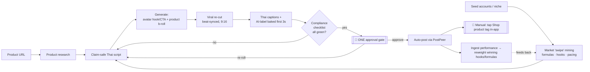

# AutoUGC-TH — Build Specification

**A locally-run web app that turns a single product URL into a post-ready, TikTok-Shop-compliant Thai short video — using a reusable AI avatar of the operator plus AI product b-roll — fully automated except one human "approve the edit" gate.**

> **Status:** Design spec, ready for a build team. This document set is the single source of truth for v1.
> **Disclaimer:** Section 6 (compliance) encodes researched 2026 rules into software requirements but is **not legal advice** — have qualified US and Thai counsel review the consent template, claim-gating, and disclosure copy before launch.

---

## 1. What this is (and the honest verdict)

AutoUGC-TH is a **single-operator, self-hosted content factory** for the Thai TikTok Shop market. The operator pastes a product URL; the system researches the product and the market, writes a Thai script in a proven format, generates the video from a **reusable digital twin of the operator** plus AI product b-roll, cuts it into a viral edit with Thai captions, and — after one approval — auto-posts it to TikTok.

It was designed off a full feasibility study (two rounds of specialist research + a frame-by-frame teardown of a reference video). The load-bearing conclusions that shaped every design decision:

- **It's a hybrid, not one-click magic.** 2026 AI avatars pass as a real person for a **talking head** (~8/10) but **cannot reliably manipulate a specific product in-hand**, and Thai lip-sync is a minor tell. So the avatar carries the **hook + CTA**; **real or AI product b-roll carries the demo**. This split is a hard architectural rule (see §3B).
- **Because the avatar is the operator's own consented likeness, it's legal and TikTok-compliant** — TikTok even sells this capability (Symphony). The strict "no AI voice / real-time human" rules are **livestream-scoped**; recorded shoppable videos are allowed *with disclosure* (see §6A).
- **It's a volume-and-testing engine, not a guaranteed sales machine.** Disclosed AI converts at a discount vs genuine footage; it wins by letting the operator test **many hooks/products cheaply** and double down on winners (see §5B). Conversion is driven by product + hook, not production polish.
- **Two things stay manual by platform limitation:** the operator's single edit-approval, and tapping the TikTok **Shop product tag** in-app (not exposed in any API).

---

## 2. End-to-end flow

**The one-time setup (done once, reused forever):** connect API keys → record a short clip → build the HeyGen Avatar V twin + clone a Thai voice → sign the consent record → connect the TikTok account. After that, every video reuses the stored `avatar_id` + `voice_id`.

---

## 3. The document set

| # | Section | File | Owner role |
|---|---------|------|-----------|
| 1 | **System Overview & Architecture** — components, tech stack, state machine, canonical data model (ER), provider adapter interfaces, Docker deployment | [`01-overview-architecture.md`](./01-overview-architecture.md) | Tech Lead / Architect |
| 2 | **Research Modules** — product URL ingestion + market/"swipe" mining (script/formula/hook/pacing extraction) | [`02-research-modules.md`](./02-research-modules.md) | Data / Scraping eng |
| 3 | **Scripting & Generation** — claim-safe Thai scripting, one-time avatar/voice setup, per-video avatar + b-roll gen with consistency QA | [`03-generation-module.md`](./03-generation-module.md) | AI-integration eng |
| 4 | **Editing & Captions** — beat-synced viral re-cut (FFmpeg/librosa) + Thai captions (WhisperX/PyThaiNLP/libass) | [`04-editing-captions-module.md`](./04-editing-captions-module.md) | Video eng |
| 5 | **Posting & Winner Loop** — approval gate, PostPeer posting, analytics ingestion, hook/formula reweighting | [`05-posting-winner-loop.md`](./05-posting-winner-loop.md) | Backend / Growth eng |
| 6 | **Compliance & Legal Guardrails** — TikTok Shop rules, claim-safety gate, consent/disclosure records, pre-post checklist | [`06-compliance-guardrails.md`](./06-compliance-guardrails.md) | QA / Compliance |
| 7 | **Frontend/UX + Delivery Plan** — screens, API contract, team roles, phased milestones, risks | [`07-frontend-ux-delivery-plan.md`](./07-frontend-ux-delivery-plan.md) | Frontend eng + Delivery Lead |

Read in order. §1 defines the canonical data model and adapter interfaces that every other section references.

---

## 4. Tech stack (locked)

| Layer | Choice | Notes |
|-------|--------|-------|
| Deployment | **Docker Compose**, runs at `localhost` | Single-operator, self-hosted |
| Backend | **Python + FastAPI** | |
| Frontend | **React** (Vite) + TanStack Query + Zustand | One multiplexed WebSocket for live job state |
| Queue | **Celery + Redis** | Durable engine (Temporal) deemed over-engineering for a linear single-user pipeline; revisitable |
| DB | **Postgres** | JSONB/ENUM; SQLite viable for pure-local but Postgres chosen for concurrent workers |
| Media store | Local filesystem or **MinIO** | |
| Avatar | **HeyGen Avatar V** (operator twin) | Reused via `avatar_id` |
| Voice | **ElevenLabs Multilingual v2** (or Botnoi for native Thai) | Reused via `voice_id` |
| Product b-roll | **fal.ai** → Kling 3.0 / Veo 3.1 / Seedance (Queue API) | Seeded from a **Nano Banana Pro** hero image |
| Scraping | **Apify** (TikTok/Shop), **Firecrawl** (generic), **Rainforest** (Amazon), yt-dlp | |
| Thai NLP | **Thonburian Whisper** + **PyThaiNLP** + **WhisperX** + **libass**/Noto Sans Thai | |
| LLM | **Claude** (voice/control) or **Typhoon 2** (Thai-native) | |
| Posting | **PostPeer** (primary) / Ayrshare / Blotato | Over TikTok Content Posting API |

---

## 5. Cost model

| Line item | Per video |
|-----------|-----------|
| Product b-roll generation (the floor; ~dominates) | ~$2.28 |
| Avatar talking-head (reused twin, amortized) | ~$0.30–1.50 |
| Thai VO (ElevenLabs) | ~$0.05–0.15 |
| Hero image, LLM script, captions, assembly | ~$0.06 |
| **Realistic all-in** | **~$2.80–3.90/video**, converging to **~$2.80 at scale** |

One-time costs: avatar/voice setup (a plan tier + an afternoon of source footage), and the TikTok posting-app audit (2–4 weeks, or inherited from the posting-wrapper vendor — confirm with them). See §5 for the audit reality and §1 for the per-video cost-ledger guard.

---

## 6. Cross-section integration notes (reconcile before coding)

The sections were authored in parallel against a shared decision set. A few **naming/contract reconciliations** must be settled by the Tech Lead during §1 ratification:

1. **New entities to ratify in §1's ER model:** `SwipeSource`, `SwipeVideo` (from §2); confirm `GenAttempt`, `CostLedgerEntry`, `ConsentRecord` names (referenced by §3/§6).
2. **Schema extensions:** §5 extends `Post` and `PerformanceRecord` with posting/analytics fields; align field names with §1.
3. **Two shared contracts that must stay in sync:** (a) the **job state machine** in §1 — every section's status values map to it; (b) the **WebSocket event schema** in §7 — every backend worker emits against it.
4. **Compliance is a hard gate:** §6's pre-post checklist is an **all-green, no-override** block on the §7 Approve button. Not advisory.
5. **Signal honesty is a data contract:** §2 marks all mined rankings as `engagement_proxy`; §5's winner-loop is the only place real (operator) sales signal enters. Don't let proxy scores masquerade as conversion.

---

## 7. Delivery summary

MVP-first, phased (full detail in §7):

| Phase | Deliverable | Est. |
|-------|-------------|------|
| P0 | Skeleton, Docker, one provider per layer, state machine | ~1–2 wk |
| P1 | Single-product happy path → rendered video (no posting) | ~3 wk |
| P2 | Avatar reuse + Thai captions + approval UI | ~3 wk |
| P3 | Posting + compliance gate → **shippable MVP** | ~3–4 wk |
| P4 | Swipe/market mining + winner loop | ~3–4 wk |
| P5 | Hardening, dry-run mode, cost guards | ~2–3 wk |

**~13 weeks to a shippable P3 MVP; ~18–26 weeks for full v1** (±30% buffer). Recommended start: build the **state machine + a vertical happy-path slice** first, then the **hook/formula extractor** (highest leverage). Testing includes FFmpeg golden-file tests, Thai "no-tofu" rendering visual tests, provider mocking, and a **$0 dry-run mode**.

---

## 8. Top risks (see §7 for the full register)

1. **Product consistency across b-roll clips** — mitigated by hero-image seeding + QA reroll loop (§3D).
2. **Scraper fragility** (TikTok Shop especially) — maintained Apify actors + Firecrawl fallback + manual upload (§2A).
3. **Thai lip-sync / caption correctness** — hybrid format + align-on-clean-VO + libass (§3B/§4B).
4. **TikTok posting audit delay** — plan for the 2–4 wk audit or a pre-audited wrapper; draft-fallback (§5A).
5. **False-claims liability** — the fail-closed claim-safety gate is non-negotiable (§6B).
6. **Conversion reality** — this is a testing engine; success depends on product/hook selection and the winner loop, not the avatar (§5B).

---

## 9. Glossary

- **Twin / avatar** — the operator's own AI likeness (HeyGen Avatar V), consented and identity-verified; reused across all videos.
- **B-roll** — AI-generated product footage (fal.ai), seeded from a locked hero image; carries the product demo.
- **Swipe library** — the mined corpus of top-performing competitor videos and the FormulaTemplates / HookTemplates / PacingTemplates extracted from them.
- **Engagement proxy** — views/likes/shares; a *proxy* for what works, since real sales data is private.
- **Approval gate** — the single human touchpoint (`AWAITING_APPROVAL` state); also the compliance checkpoint.
- **Winner loop** — posts variants, ingests real performance, reweights hook/formula selection toward what works *for this operator*.
